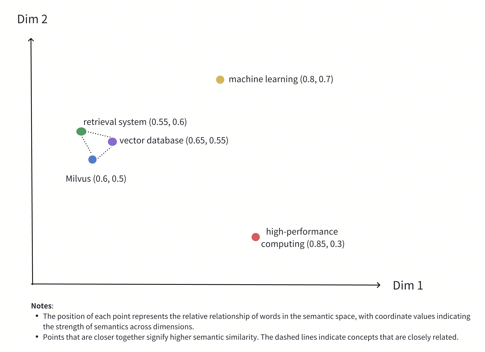
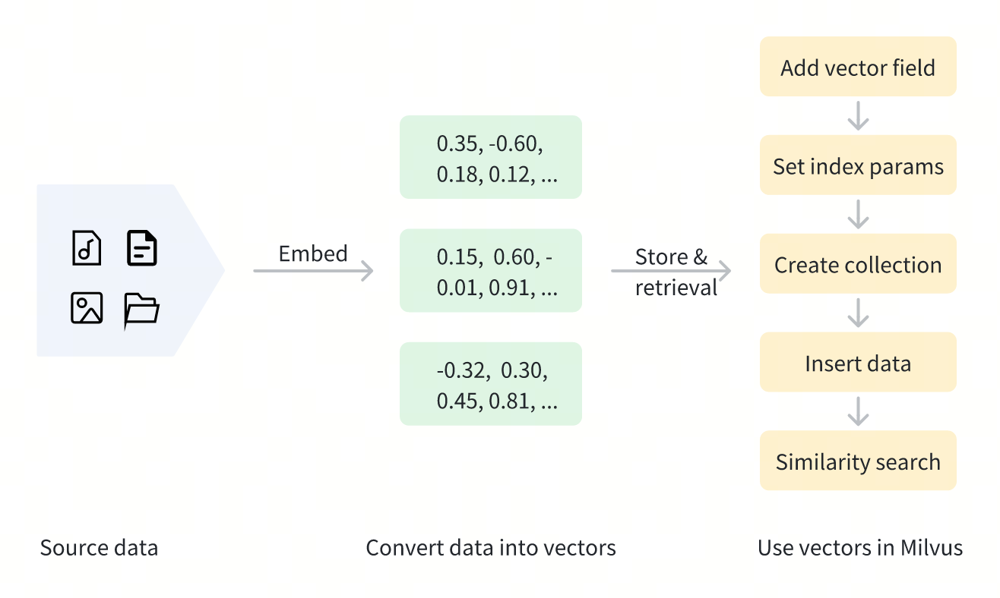

## 数据库筑基课 - 向量类型   
                                                                                            
### 作者                                                                
digoal                                                                
                                                                       
### 日期                                                                     
2025-01-03                                                      
                                                                    
### 标签                                                                  
PostgreSQL , PolarDB , DuckDB , 应用开发者 , 数据库筑基课 , 数据类型 , 向量类型     
                                                                                           
----                                                                    
                                                                                  
## 背景              
[《数据库筑基课 - 大纲》](../202409/20240914_01.md)            
          
<b>本节: 向量类型</b>             
          
## 简介      
向量: 数学上可以简单理解为多维数组, 也称为矩形阵列, 是一种多维的数据结构. 每个方向的长度(值的个数)一样, 例如1维就只有1个方向, 2维有2个方向, 以此类推.    
  
不管有多少维度, 扁平化之后, 在数据库中都表达为一维数组. 例如`3x3`的9宫格向量, 扁平化之后就是9个元素的数组, 只是计算(算距离、或把非结构化数据映射到向量空间内)时可能还会考虑它原来是`3x3`的.  
```  
vector(9)   
  
9个维度, 每个维度可能是一个浮点数, 可以表达的数据空间非常巨大.     
```  
  
在RAG场景中, 使用向量数据库时, 通常分几个步骤:   
- 1 定义向量空间.   
- 2 选择大模型.   
- 3 使用该把非结构化数据映射到向量空间. 通常对于同一个表里的数据, 建议使用统一的大模型对数据进行转换, 因为不同的模型映射的位置可能不一样, 例如喜欢和讨厌很明显是千差万别的意思, 一个模型肯定是将其映射到距离很远的位置, 而如果这2个词才用了不同的模型来转换, 可能会映射到一起.   
- 4 创建向量索引  
- 5 使用大模型将查询文本(例如prompting)转换为向量  
- 6 从向量空间搜索相似向量 以及 对应的文本.   
  
针对不同的数据和需求, 向量类型通常有分为稠密向量、稀疏向量、二进制向量.     
  
索引以及距离算法又分为l2, cosine, l1等, 参考 https://github.com/pgvector/pgvector   
- `<->` - L2 distance  
- `<#>` - (negative) inner product  
- `<=>` - cosine distance  
- `<+>` - L1 distance (added in 0.7.0)  
- `<~>` - Hamming distance (binary vectors, added in 0.7.0)  
- `<%>` - Jaccard distance (binary vectors, added in 0.7.0)  
  
下面简单介绍一下稠密向量、稀疏向量、二进制向量  
  
### 稠密(密集)向量    
参看: https://milvus.io/docs/zh/dense-vector.md  
  
密集向量是广泛应用于机器学习和数据分析的数值数据表示法。它们由包含实数的数组组成，其中大部分或所有元素都不为零。与稀疏向量相比，密集向量在同一维度上包含更多信息，因为每个维度都持有有意义的值。这种表示方法能有效捕捉复杂的模式和关系，使数据在高维空间中更容易分析和处理。密集向量通常有固定的维数，从几十到几百甚至上千不等，具体取决于具体的应用和要求。  
  
密集向量主要用于需要理解数据语义的场景，如语义搜索和推荐系统。  
- 在语义搜索中，密集向量有助于捕捉查询和文档之间的潜在联系，提高搜索结果的相关性。  
- 在推荐系统中，密集矢量有助于识别用户和项目之间的相似性，从而提供更加个性化的建议。  
  
密集向量通常表示为具有固定长度的浮点数数组，如`[0.2, 0.7, 0.1, 0.8, 0.3, ..., 0.5]` 。这些向量的维度通常从数百到数千不等，如 128、256、768 或 1024。每个维度都能捕捉对象的特定语义特征，通过相似性计算使其适用于各种场景。  
  
  
  
上图展示了二维空间中密集向量的表示方法。虽然实际应用中的稠密向量通常具有更高的维度，但这种二维插图有效地传达了几个关键概念。  
- 多维表示：每个点代表一个概念对象（如Milvus、向量数据库、检索系统等），其位置由其维度值决定。  
- 语义关系：点之间的距离反映了概念之间的语义相似性。距离较近的点表示语义关联度较高的概念。  
- 聚类效应：相关概念（如Milvus、向量数据库和检索系统）在空间中的位置相互靠近，形成语义聚类。  
  
下面是一个代表文本 `"Milvus is an efficient vector database"` 的真实稠密向量示例。  
```  
[  
    -0.013052909,  
    0.020387933,  
    -0.007869,  
    -0.11111383,  
    -0.030188112,  
    -0.0053388323,  
    0.0010654867,  
    0.072027855,  
    // ... more dimensions  
]  
```  
  
稠密向量可使用各种嵌入模型生成，如用于图像的 CNN 模型（如ResNet、VGG）和用于文本的语言模型（如BERT、Word2Vec）。这些模型将原始数据转化为高维空间中的点，捕捉数据的语义特征。此外，Milvus 还提供便捷的方法，帮助用户生成和处理密集向量，详见 Embeddings。  
  
一旦数据被向量化，就可以存储在 Milvus 中进行管理和向量检索。下图显示了基本流程。在其他向量数据库中使用流程与之类似, 不过milvus的生态比较健全, 在milvus体系里就可以完成embedding,向量的存储,索引的构建和搜索. (milvus目前对于关系数据的管理比传统数据库例如PostgreSQL要弱, 各有所强.)     
  
  
  
### 稀疏向量   
参看: https://milvus.io/docs/zh/sparse_vector.md  
  
稀疏向量是信息检索和自然语言处理中一种重要的数据表示方法。虽然稠密向量因其出色的语义理解能力而广受欢迎，但在涉及需要<b>精确匹配关键词或短语的应用时，稀疏向量往往能提供更精确的结果。</b>   
  
稀疏向量是高维向量的一种特殊表示形式，其中大部分元素为零，只有少数维度具有非零值。这一特性使得稀疏向量在处理大规模、高维但稀疏的数据时特别有效。常见的应用包括  
- 文本分析：将文档表示为词袋向量，其中每个维度对应一个单词，只有在文档中出现的单词才有非零值。  
- 推荐系统：用户-物品交互矩阵，其中每个维度代表用户对特定物品的评分，大多数用户只与少数物品交互。  
- 图像处理：局部特征表示，只关注图像中的关键点，从而产生高维稀疏向量。  
  
如下图所示，密集向量通常表示为连续数组，其中每个位置都有一个值（如`[0.3, 0.8, 0.2, 0.3, 0.1]` ）。相比之下，稀疏向量只存储非零元素及其索引，通常表示为键值对（如`[{2: 0.2}, ..., {9997: 0.5}, {9999: 0.7}]` ）。这种表示方法大大减少了存储空间，提高了计算效率，尤其是在处理极高维数据（如 10,000 维）时。  
  
稀疏向量通常比稠密向量的维度高很多, 因为不需要存储每个维度的值.    
  
  
  
稀疏向量可以使用多种方法生成，例如文本处理中的TF-IDF（词频-反向文档频率）和BM25。此外，Milvus 还提供了帮助生成和处理稀疏向量的便捷方法。详情请参阅Embeddings。  
  
对于文本数据，Milvus 还提供全文搜索功能，让您可以直接在原始文本数据上执行向量搜索，而无需使用外部嵌入模型来生成稀疏向量。更多信息，请参阅全文搜索。  
  
对于PostgreSQL也可以使用分词插件和GIN索引来进行文本检索, 同时可以使用pg_search这类插件引入bm25的方式进行文本搜索.    
  
### 二进制向量    
参看: https://milvus.io/docs/zh/binary-vector.md  
  
二进制向量是一种特殊的数据表示形式，它将传统的高维浮点向量转换为只包含 0 和 1 的二进制向量。这种转换不仅压缩了向量的大小，还降低了存储和计算成本，同时保留了语义信息。当对非关键特征的精度要求不高时，二进制向量可以有效保持原始浮点向量的大部分完整性和实用性。  
  
二进制向量有着广泛的应用，尤其是在<b>计算效率 和 存储优化</b>至关重要的情况下。在搜索引擎或推荐系统等大规模人工智能系统中，实时处理海量数据是关键所在。通过减小向量的大小，二进制向量有助于降低延迟和计算成本，而不会明显牺牲准确性。此外，二进制向量在移动设备和嵌入式系统等资源受限的环境中也很有用，因为在这些环境中，内存和处理能力都很有限。通过使用二进制向量，可以在这些受限环境中实现复杂的人工智能功能，同时保持高性能。  
  
二进制向量是一种将复杂对象（如图像、文本或音频）编码为固定长度二进制值的方法。在 Milvus 中，二进制向量通常表示为比特数组或字节数组。例如，一个 8 维二进制向量可以表示为`[1, 0, 1, 1, 0, 0, 1, 0]` 。  
  
下图显示了二进制向量如何表示文本内容中关键词的存在。在这个例子中，用一个 10 维二进制向量来表示两个不同的文本（文本 1和文本 2），其中每个维度对应词汇表中的一个词：1 表示文本中存在该词，0 表示文本中没有该词。  
  
  
  
二进制向量具有以下特点。  
- 高效存储：每个维度只需 1 位存储空间，大大减少了存储空间。  
- 快速计算：可以使用 XOR 等位运算快速计算向量之间的相似性。  
- 固定长度：无论原始文本的长度如何，向量的长度保持不变，从而使索引和检索更加容易。  
- 简单直观：直接反映关键词的存在，适合某些专业检索任务。  
  
二进制向量可以通过各种方法生成。  
- 在文本处理中，可以使用预定义的词汇表，根据词的存在设置相应的位。  
- 在图像处理中，感知哈希算法（如pHash）可以生成图像的二进制特征。  
- 在机器学习应用中，可对模型输出进行二进制化，以获得二进制向量表示。  
  
## DEMO    
略  
  
## 扩展问题       
1、哪里可以下载大模型  
- https://ollama.com/  
- https://huggingface.co/   
  
2、哪里下载embedding大模型  
- https://ollama.com/search?c=embedding&o=newest  
  
3、如何部署私有大模型服务  
- 文末  
  
4、如何微调模型  
- 文末  
  
5、如何优化向量搜索性能  
- 文末  
  
6、向量搜索和其他的搜索如何进行结合  
- 文末  
  
## 扩展阅读   
- https://ollama.com/search?c=embedding&o=newest    
- https://milvus.io/docs/zh/dense-vector.md  
- https://milvus.io/docs/zh/binary-vector.md  
- https://milvus.io/docs/zh/sparse_vector.md  
- https://milvus.io/docs/zh/index-vector-fields.md  
- https://milvus.io/docs/zh/single-vector-search.md  
- https://github.com/pgvector/pgvector  
- [《用“大参数模型”和“特定领域内容”fine-tuning提升“小参数模型的RAG性能”》](../202410/20241022_01.md)    
- [《Elasticsearch vs Paradedb pg_search - RAG绝配: PostgreSQL 混合搜索插件(全文检索+语义(向量)检索)》](../202409/20240918_04.md)    
- [《提升RAG召回效果的方法探讨》](../202408/20240823_01.md)    
- [《AI大模型+全文检索+tf-idf+向量数据库+我的文章 系列之4 - RAG 自动提示微调(prompt tuning)》](../202407/20240723_01.md)    
- [《他山之石可以攻玉 | 向量召回IO性能问题解决之道 - 线性化降维(Hilbert & Z-Order)》](../202412/20241213_03.md)    
- [《向量搜索优化3板斧: 空间、性能、召回(recall)》](../202405/20240506_03.md)    
- [《头大! 索引扫描和全表扫描结果不一样, 这向量数据库还能用? 教你一招大幅提升召回率(recall)》](../202404/20240417_01.md)    
- [《穷鬼玩PolarDB RAC一写多读集群系列 | 接入私有化大模型服务》](../202412/20241230_02.md)    
  
