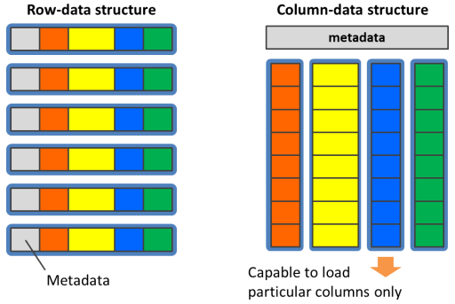
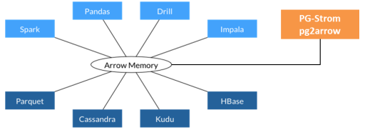
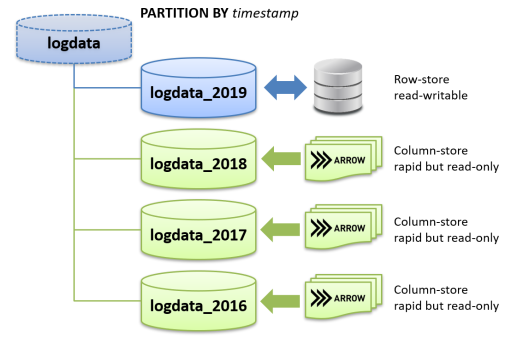
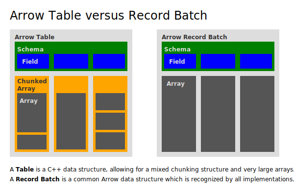

## 数据库筑基课 - 列存之 arrow 面向内存的列存  
                                                                                              
### 作者                                                                  
digoal                                                                  
                                                                         
### 日期                                                                       
2025-01-27                                                      
                                                                      
### 标签                                                                    
PostgreSQL , PolarDB , DuckDB , 应用开发者 , 数据库筑基课 , arrow    
                                                                                             
----                                                                      
                                                                                    
## 背景     
[《数据库筑基课 - 大纲》](../202409/20240914_01.md)              
            
<b>本节: 列存之 arrow 面向内存的列存</b>            
   
    
  
## 一、为什么需要 Arrow？  
  
1、从 JSON 的烦恼说起  
  
想象你是一个快递分拣员，每天要处理成千上万的包裹。但老板偏偏要求：**所有包裹信息必须用纸条手写记录**（就像 Snowflake 系统用 JSON 格式）。你会发现：  
  
- **效率超低**：每次核对信息都要把纸条上的文字一个个辨认、转成电脑数据（JSON 转换消耗大量 CPU. JSON的序列化/反序列化的成本实在是太高了：许多cpu cycle都被浪费在了字符串和其他数据类型之间的转换。不仅仅是cpu，内存的消耗也是十分巨大的，尤其像是Java这样的语言，对内存的压力非常大。）。  
- **容易出错**：纸条上的数字写得潦草，可能导致小数点后几位看不清（使用JSON进行序列化，会导致某些数据类型（浮点数）的精度丢失。）。  
- **体力透支**：每天搬运成堆的纸条，仓库堆满了纸箱（Java 等语言内存消耗大）。  
  
这时你肯定想：**如果能直接用机器可读的电子标签多好！** 这就是 Apache Arrow 诞生的原因之一。  
  
2、在Apache Arrow出现以前, 大数据分析系统基本都有各自不同的内存数据结构，带来一系列的重复工作  
- 从计算引擎上看，算法必须基于项目特有的数据结构、API 与算法之间出现不必要的耦合  
- 从数据获取上看，数据加载时必须反序列化，而每一种数据源都需要单独实现相应的加载器  
- 从生态系统上看，跨项目、跨语言的合作无形之中被阻隔  
  
## 二、Arrow 是什么？  
  
数据处理的"高速公路".   
- 是一种数据格式：arrow 定义了一种在内存中表示tabular data的格式。这种格式特别为数据分析型操作（analytical operation）进行了优化。比如说列式格式（columnar format），能充分利用现代cpu的优势，进行向量化计算（vectorization）。不仅如此，Arrow还定义了IPC格式，序列化内存中的数据，进行网络传输，或者把数据以文件的方式持久化到磁盘/对象存储中。  
- 是开发库：arrow定义的格式是与语言无关的，所以任何语言都能实现Arrow定义的格式。arrow项目为几乎所有的主流编程语言提供了SDK.   
  
Arrow愿景是提供内存数据分析 (in-memory analytics) 的开发平台，让数据在异构大数据系统间移动、处理地更快     
- 减少或消除数据在不同系统间序列化、反序列化的成本  
- 跨项目复用算法及IO工具  
- 推动更广义的合作，让数据分析系统的开发者联合起来
   
通过arrow打通各个数据库产品数据共享, 打破数据孤岛      
   
      
  
**Arrow 就像一套标准快递箱**，专门为快速运输数据设计：      
- **统一规格**：所有快递站（不同软件系统）都使用同一种箱子，装卸货效率飙升（ 跨系统无需数据转换: 1 序列化/反序列化. 2 arrow定义的格式是与语言无关的，所以任何语言都能实现Arrow定义的格式。arrow项目为几乎所有的主流编程语言提供了SDK. ）。  
- **分类摆放**：衣服放左边格子，鞋子放右边格子（列式存储），找东西快 10 倍！     
- **超级坚固**：箱子用特殊材料制成（硬件优化），卡车（CPU）一次能运更多货物(向量化计算（vectorization）)。  
  
Arrow还定义了IPC格式，序列化内存中的数据，进行网络传输，或者把数据以文件的方式持久化到磁盘/对象存储中。  
  
**对比其他工具：**  
- **Protobuf** 像定制礼盒：适合包装复杂礼物（嵌套数据），但拆装麻烦。  
- **Arrow** 像标准化集装箱：专为大批量货物（表格数据）快速运输设计。  
  
## 三、Arrow 的三大超能力   
1. **跨语言通行证**  (标准化 (standardized), 与语言无关 (language-independent))  
   无论你用 Python、Java 还是 C++，Arrow 提供统一工具包，就像各国司机都能看懂的国际交通标志。  
  
2. **向量化计算引擎**    
   传统方式：逐个检查包裹（单条数据处理）。    
   Arrow 方式：整箱包裹 X 光机扫描（批量计算），速度提升百倍！  
  
3. **零拷贝传输**    
   快递车直接换标牌就能发往下一站（内存数据直接传递），省去拆箱重装的麻烦。  
  
## 四、Arrow 和 Parquet/ORC 是什么关系？  
数据存储的两个角度  
- 存储格式：行存 (row-wise/row-based)、列存 (column-wise/column-based/columnar)  
- 主要存储器：面向磁盘 (disk-oriented)、面向内存 (memory-oriented)  
  
Parquet/ORC同样是采用列存，但是都是面向磁盘设计的，Arrow面向内存设计  
  
数据存储格式的设计决定在不同瓶颈下的目的不同  
  
最典型的就是压缩  
- Parquet/ORC: 对于 disk-oriented 场景，更高的压缩率几乎总是个好主意，利用计算资源换取空间可以利用更多的 CPU 资源，减轻磁盘 IO 的压力，支持高压缩率的压缩算法，如 snappy, gzip, zlib 等压缩技术就十分必要  
- Arrow: 对于 memory-oriented 场景，压缩只会让 CPU 更加不堪重负，所以更倾向于直接存储原生的二进制数据  
  
尽管磁盘和内存的顺序访问效率都要高于随机访问，但在磁盘中，这个差异在 2-3 个数量级，而在内存中通常在 1 个数量级内。因此要均摊一次随机访问的成本，需要在磁盘中连续读取上千条数据，而在内存中仅需要连续读取十条左右的数据  
  
想象你要长期保存货物：  
- **Parquet/ORC** 像高密度压缩仓库：    
    - 把衣服抽真空节省空间（高压缩率），适合长期囤货（磁盘存储），但每次取货要解压。  
    - 对于 disk-oriented 场景，更高的压缩率几乎总是个好主意，利用计算资源换取空间可以利用更多的 CPU 资源，减轻磁盘 IO 的压力，支持高压缩率的压缩算法，如 snappy, gzip, zlib 等压缩技术就十分必要  
- **Arrow** 像临时分拣中心：    
    - 货物整齐码放方便随时取用（内存优化），运输车来了直接装货（快速处理），不纠结压缩率。  
    - 对于 memory-oriented 场景，压缩只会让 CPU 更加不堪重负，所以更倾向于直接存储原生的二进制数据  
  
**关键区别：**    
- Parquet/ORC同样是采用列存，但是都是面向磁盘设计的，Arrow面向内存设计 . 但这里不是说parquet/orc效率就不行, 因为parquet/orc格式内也支持分段索引/bloom过滤器等, 可以高速过滤数据. 只是相比于内存中的数据读取效率更低一点. parquet/orc 更适合数据湖产品.     
- 仓库（磁盘）省空间最重要，分拣中心（内存）追求速度第一！     
  
### Arrow 如何改变世界？  
- **打破数据孤岛**：快递公司、航空公司、海运公司共享集装箱标准（跨系统数据互通）。  
- **生态大联盟**：从此开发数据分析工具就像拼乐高，各模块自由组合（复用算法）。  
- **激发硬件潜能**：新型卡车（GPU/新一代 CPU）能更高效运载 Arrow 集装箱。  
  
### 小测验：你会怎么选？  
- 场景 ①：存档十年销售数据 → **Parquet/ORC**（省空间）  
- 场景 ②：实时分析今日订单 → **Arrow**（闪电速度）  
- 场景 ③：训练 AI 模型 → **Arrow**（GPU 最爱列式数据）  
  
现在你是不是已经跃跃欲试，想要用 Arrow 打造自己的数据高铁了？   
  
## 五、支持Arrow的应用  
DuckDB, DataFusion, PostgreSQL 插件、Pandas、Apache Spark、Apache Drill、Apache Flink、TensorFlow / PyTorch、ClickHouse 等.     
- https://duckdb.org/   
- https://datafusion.apache.org/  
- https://github.com/mkindahl/pg_arrow  
- https://heterodb.github.io/pg-strom/fluentd/  
   
物联网/feed log 数据持久化arrow on disk, pg_arrow(arrow foreign table)使用GPU必须计算arrow文件数据  
   
    
    
行列混合分区, arrow分区方法: arrow fdw options - arrow文件名包含虚拟字段值   
   
    
   
## 六、Arrow 的物理布局（Physical Layout） - "如何在内存中表示数组值"    
https://arrow.apache.org/docs/format/Intro.html  
  
  
## 七、Arrow 术语  
https://arrow.apache.org/docs/format/Glossary.html   
    
**Array/Vector（数组/向量）**    
  
一个连续的、一维的值序列，具有已知长度，且所有值具有相同的类型。一个数组由零个或多个<b>缓冲区</b>、若干个值和一个<b>数据类型</b>组成。数组的缓冲区按照列式格式定义的数据类型进行布局。  
  
数组是连续的，即浏览数组中的值时，会遍历一个单独的缓冲区集合，即使一个数组可能由多个不相交的缓冲区组成，或者由多个自身跨越多个缓冲区的子数组组成。  
  
数组是一维的，因为它们是一个<b>槽位</b>或单一值的序列，尽管对于某些数据类型（如结构体structs或联合体unions），一个槽位可能表示多个值。  
  
其定义在[Arrow列式格式](https://arrow.apache.org/docs/format/Columnar.html)文档中。  
  
**Buffer（缓冲区）**    
  
一个具有给定长度的连续内存区域。缓冲区用于存储数组的数据。  
  
缓冲区可以位于CPU内存中，也可以是从文件映射的内存，或者位于设备（例如GPU）内存中等，尽管并非所有Arrow实现都支持这些可能的情况。  
  
**Canonical Extension Type（规范扩展类型）**    
  
一种由Arrow社区标准化的<b>扩展类型</b>，旨在改善不同实现之间的互操作性。  
  
**子数组（Child Array）与父数组（Parent Array）**    
  
在<b>嵌套类型</b>的数组中，父数组对应于<b>父类型</b>，而子数组对应于<b>子类型</b>。例如，一个`List[Int32]`类型的父数组有一个`Int32`类型的子数组。  
  
**子类型（Child Type）与父类型（Parent Type）**    
  
在<b>嵌套类型</b>中，嵌套类型是父类型，而子类型是其参数。例如，在`List[Int32]`中，`List`是父类型，`Int32`是子类型。  
  
**分块数组（Chunked Array）**    
  
一个不连续的、一维值序列，具有已知长度，其中所有值具有相同的类型。由零个或多个<b>数组</b>（称为“块”）组成。  
  
分块数组是非连续的，意味着迭代分块数组中的值可能需要为不同的索引遍历不同的缓冲区。  
  
分块数组是某些实现特有的概念，例如Arrow C++和PyArrow。  
  
**复杂类型（Complex Type）与嵌套类型（Nested Type）**    
  
一种<b>数据类型</b>，其结构依赖于一个或多个其他<b>子数据类型</b>。例如，`List`是一个嵌套类型，它有一个子类型。  
  
当且仅当它们的子类型也相等时，两个嵌套类型才算相等。  
  
**数据类型（Data Type）与类型（Type）**    
  
值可以取的类型，例如`Int8`或`List[Utf8]`。数组的类型决定了其值如何根据Arrow列式格式在内存中布局。  
  
**字典（Dictionary）**    
  
一个与<b>字典编码</b>数组一起使用的值数组。  
  
**字典编码（Dictionary-Encoding）**    
  
一种将值存储为指向字典数组的索引，而不是直接存储值的数组。  
  
**扩展类型（Extension Type）与存储类型（Storage Type）**    
  
扩展类型是用户定义的<b>数据类型</b>，它为现有数据类型添加了额外的语义。这允许那些不支持特定扩展类型的实现，仍然能够处理底层数据类型（即“存储类型”）。  
  
例如，UUID可以表示为一个16字节的固定大小二进制类型。  
  
**字段（Field）**    
  
<b>模式</b>中的一列。由字段名称、<b>数据类型</b>、指示该字段是否可以为空的标志，以及可选的键值元数据组成。表示记录批次中特定列的信息。  
  
**IPC文件格式（IPC File Format）与文件格式（File Format）与随机访问格式（Random-Access Format）**    
  
<b>IPC流格式</b>的扩展，可以用来将Arrow数据序列化到磁盘，然后通过随机访问读取单个记录批次。  
  
**IPC格式（IPC Format）**    
  
一种规范，定义了如何序列化Arrow数据，以便可以在进程/机器之间传输，或持久化到磁盘。  
  
**IPC消息（IPC Message）与消息（Message）**    
  
某个特定内存结构的IPC表示，例如<b>记录批次</b>（record batch）或<b>模式</b>（schema）。它将始终是<b>Flatbuffers协议文件</b>中`MessageHeader`的一个成员。  
  
消息头表示接下来发送的是什么消息  
```  
union MessageHeader {  
  Schema, DictionaryBatch, RecordBatch, Tensor, SparseTensor  
}  
```  
  
**IPC流格式（IPC Streaming Format）与流格式（Streaming Format）**    
  
一种用于流式传输Arrow数据或将数据序列化到文件的协议，由一系列<b>IPC消息</b>组成。  
  
**物理布局（Physical Layout）**    
  
定义"如何在内存中表示数组值"的规范。  
  
**原始类型（Primitive Type）**    
  
一种没有任何子类型的数据类型。  
  
**记录批次（Record Batch）**    
  
在<b>IPC格式</b>中：数据的基本单元。一个记录批次由一组与<b>模式</b>对应的、有序<b>缓冲区</b>组成。  
  
在某些实现中（主要是C++及其绑定）：一个连续的、二维的数据块。一个记录批次由长度相同的<b>数组</b>有序集合组成。  
  
像数组一样，记录批次是连续的，意味着迭代记录批次的行时，会遍历一组单独的缓冲区。  
  
**模式（Schema）**    
  
一个有序的<b>字段</b>集合，带有可选的元数据，用于表达像<b>记录批次</b>或<b>表格</b>中的所有<b>数据类型</b>。  
  
**槽位（Slot）**    
  
数组中的一个单一逻辑值，即“一行”。  
  
**表格（Table）**    
  
一个不连续的、二维的数据块，由一个有序的<b>分块数组</b>集合组成。所有分块数组具有相同的长度，但可能具有不同的类型。不同的列可能会以不同的方式进行分块。  
  
像分块数组一样，表格是非连续的，意味着迭代表格的行时，可能需要为不同的索引遍历不同的缓冲区。  
  
表格是某些实现特有的概念，例如Arrow C++和PyArrow。在Java实现中，例如，表格不是分块数组的集合，而是记录批次的集合。  
  
  
  
  
  
## 参考  
- https://arrow.apache.org/docs/format/Intro.html  
- https://arrow.apache.org/docs/format/Glossary.html   
- https://zhuanlan.zhihu.com/p/652201738     稠密/稀疏向量表达&应用  
- https://datafusion.apache.org/user-guide/introduction.html     arrow应用  
- https://duckdb.org/docs/internals/vector     
- https://heterodb.github.io/pg-strom/arrow_fdw/     
- https://github.com/mkindahl/pg_arrow  
- https://heterodb.github.io/pg-strom/fluentd/  
- https://arrow.apache.org/flight-sql-postgresql/current/     
- https://zhuanlan.zhihu.com/p/339132159  
- https://segmentfault.com/a/1190000044161725  
- https://www.postgresql.org/docs/devel/xtypes.html    
  
