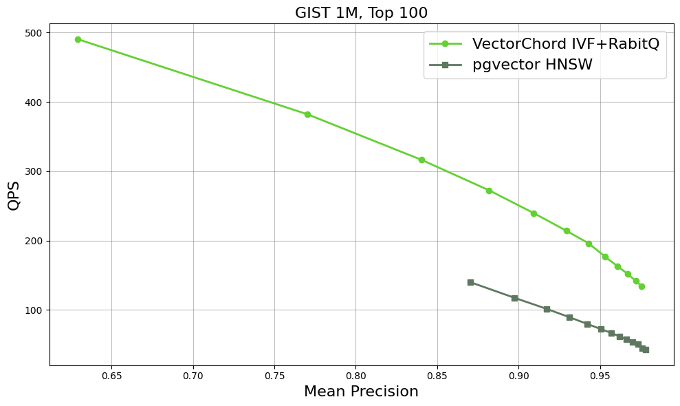
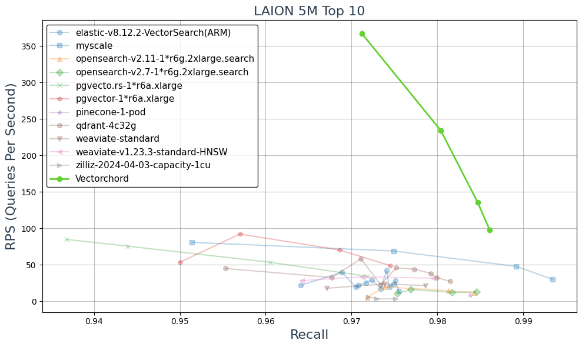
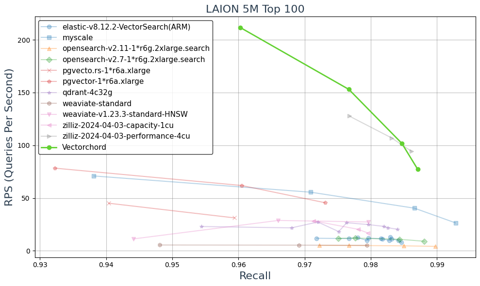

## 向量插件新贵 VectorChord(IVF+ RaBitQ量化), pgvector 和 milvus 都被秒杀了    
              
### 作者              
digoal              
              
### 日期              
2025-04-27              
              
### 标签              
PostgreSQL , PolarDB , DuckDB , VectorChord , IVF , RaBitQ , pgvector , milvus , 近似向量相似搜索 , ANNs   
              
----              
              
## 背景    
  
向量数据库的痛点. 高维稠密向量, 1百万条往上, 会遇到几重瓶颈  
- 建立索引慢  
- 查询速率变慢  
- 召回率变低  
- 消耗内存急剧增加  
  
  
VectorChord 使用如下技术很好的解决了以上问题, 达到的效果超过市面上的专业向量数据库  
- 采用RaBitQ量化, 减少计算量, 32bit -> 1bit , 提升搜索速度. 参考论文: [《AI论文解读 | 向量ANNs方法之 RaBitQ: Quantizing High-Dimensional Vectors with a Theoretical Error Bound for Approximate Nearest Neighbor Search》](../202504/20250427_01.md)   
- ranker阶段时按32bit精度计算, 提升搜索速度的同时不牺牲最终召回精度.    
- ivf 分区, 保证了build索引的速度.    
- 支持GPU, 支持外部build索引, 兼容PostgreSQL数据文件, 可直接导入.   
- 由于ivf的原理所致, 官方建议先生成ivf的中心点集群(如使用kmeans生成), 例如有几十万条数据之后再build index 效果更佳.  
    - For up to 1 million rows: rows / 1000  
    - For over 1 million rows: sqrt(rows)   
  
VectorChord比对milvus, pgvector, es等产品的数据详见  
- https://blog.vectorchord.ai/vectorchord-store-400k-vectors-for-1-in-postgresql
  
更详细的VectorChord项目解读  
- https://deepwiki.com/tensorchord/VectorChord  
  
  
  
  
  
  
  
  
  
除了支持传统的向量检索, VectorChord还支持“向量数组类型”的检索   
```  
vec arr  @# vec query arr  
```  
  
该功能的场景假设:   
- 一段大文本按语义分片后成为多个小段/句子, 每个小段/句子一个向量?  
- 查询时, 将一个query分成若干个观点进行查询, 每个观点一个向量?  
  
参考: https://deepwiki.com/tensorchord/VectorChord/3.2-search-algorithm  
  
Maxsim (Maximum Similarity) Search  
  
The maxsim search operation (`@#)` computes the maximum similarity between sets of vectors. It's particularly useful for scenarios where you need to find the best matching between multiple vectors.  
  
The operation:  
- Takes two arrays of vectors as input  
- For each vector in the second array, finds the minimum distance to any vector in the first array  
- Sums these minimum distances to produce the maxsim score  
  
This is especially useful for applications like multi-vector similarity search and set similarity operations.  
  
下面使用PolarDB 15 开源版本, 测试一下VectorChord  
  
## PolarDB 15 + VectorChord  
  
测试环境使用:  
  
[《维基百科(wikipedia) RAG 优化 | PolarDB + AI》](../202504/20250417_01.md)    
  
  
部署rust    
```    
curl --proto '=https' --tlsv1.2 -sSf https://sh.rustup.rs | sh    
echo ". \"\$HOME/.cargo/env\"" >> ~/.bashrc    
. ~/.bashrc    
    
    
$ rustc --version    
rustc 1.86.0 (05f9846f8 2025-03-31)    
```    
    
配置国内镜像    
```    
echo "    
[source.crates-io]              
replace-with = 'ustc'              
              
[source.ustc]              
registry = \"sparse+https://mirrors.ustc.edu.cn/crates.io-index/\"      
" >> /home/postgres/.cargo/config.toml    
```    
    
下载VectorChord插件代码    
```    
cd /data    
git clone --depth 1 -b 0.3.0 https://github.com/tensorchord/VectorChord  
  
cd /data/VectorChord  
```    
    
编译安装VectorChord插件依赖环境    
```    
cd /data/VectorChord    
    
# pgrx 版本请参考不同版本的  Cargo.toml 文件     
cargo install --locked --version 0.13.1 cargo-pgrx        
cargo pgrx init       # create PGRX_HOME 后, 立即ctrl^c 退出            
cargo pgrx init --pg15=`which pg_config`       # 不用管报警       
    
   Validating /home/postgres/tmp_polardb_pg_15_base/bin/pg_config    
 Initializing data directory at /home/postgres/.pgrx/data-15    
```    
  
安装clang-16 + (依赖)  
```  
cd /data  
wget https://apt.llvm.org/llvm.sh  
sudo apt update  
sudo apt install lsb-release wget software-properties-common gnupg  
sudo chmod +x llvm.sh  
sudo ./llvm.sh  
```  
  
编译安装VectorChord插件    
```   
cd /data/VectorChord   
  
export CC=/usr/bin/clang-19  # Replace with the actual path  
export CXX=/usr/bin/clang++-19 # Replace with the actual path  
  
PGRX_IGNORE_RUST_VERSIONS=y cargo pgrx install --release --pg-config `which pg_config`     
```    
    
配置postgresql.conf    
```    
vi ~/primary/postgresql.conf    
    
shared_preload_libraries='vchord,pg_jieba,pg_bigm,pgml,$libdir/polar_vfs,$libdir/polar_worker'    
```    
    
重启PolarDB for postgresql    
```    
pg_ctl restart -m fast -D ~/primary    
```    
    
在数据库中安装插件    
```    
postgres=# create extension vchord;    
CREATE EXTENSION  
postgres=# \dx  
                                                       List of installed extensions  
        Name         | Version |   Schema   |                                         Description                                           
---------------------+---------+------------+---------------------------------------------------------------------------------------------  
 http                | 1.6     | public     | HTTP client for PostgreSQL, allows web page retrieval inside the database.  
 openai              | 1.0     | public     | OpenAI client.  
 pg_bigm             | 1.2     | public     | text similarity measurement and index searching based on bigrams  
 pg_bulkload         | 3.1.22  | public     | pg_bulkload is a high speed data loading utility for PostgreSQL  
 pg_jieba            | 1.1.0   | public     | a parser for full-text search of Chinese  
 pg_stat_statements  | 1.10    | public     | track planning and execution statistics of all SQL statements executed  
 pg_trgm             | 1.6     | public     | text similarity measurement and index searching based on trigrams  
 pgml                | 2.10.0  | pgml       | Machine Learning and AI functions from postgresml.org  
 pgstattuple         | 1.5     | public     | show tuple-level statistics  
 plpgsql             | 1.0     | pg_catalog | PL/pgSQL procedural language  
 plpython3u          | 1.0     | pg_catalog | PL/Python3U untrusted procedural language  
 polar_feature_utils | 1.0     | pg_catalog | PolarDB feature utilization  
 polar_vfs           | 1.0     | public     | polar virtual file system for different storage  
 sslinfo             | 1.2     | public     | information about SSL certificates  
 vchord              | 0.3.0   | public     | vchord: Vector database plugin for Postgres, written in Rust, specifically designed for LLM  
 vector              | 0.8.0   | public     | vector data type and ivfflat and hnsw access methods  
(16 rows)  
```  
  
使用举例:  
```  
CREATE TABLE items (id bigserial PRIMARY KEY, embedding vector(3));  
INSERT INTO items (embedding) SELECT ARRAY[random(), random(), random()]::real[] FROM generate_series(1, 1000);  
  
  
CREATE INDEX ON items USING vchordrq (embedding vector_l2_ops) WITH (options = $$  
residual_quantization = true  
[build.internal]  
lists = []  
$$);  
  
SET vchordrq.probes TO '';  
SELECT * FROM items ORDER BY embedding <-> '[3,1,2]' LIMIT 5;  
  
  
 id  |             embedding               
-----+-----------------------------------  
 228 | [0.9514653,0.82165444,0.98645663]  
 762 | [0.98221064,0.8921851,0.882103]  
 157 | [0.97980326,0.5610302,0.96323115]  
 963 | [0.98450637,0.5665642,0.9378539]  
  98 | [0.93809456,0.83065367,0.9353343]  
(5 rows)  
```  
  
vec数组  
```  
drop table items;  
CREATE TABLE items (embedding vector(3));  
INSERT INTO items (embedding) SELECT ARRAY[random(), random(), random()]::real[] FROM generate_series(1, 1000);  
  
CREATE INDEX ON items USING vchordrq (embedding vector_l2_ops) WITH (options = $$  
residual_quantization = true  
[build.internal]  
lists = [1000]  
spherical_centroids = false  
$$);  
  
SET vchordrq.probes = 10;  
SELECT * FROM items ORDER BY embedding <-> '[3,1,2]' LIMIT 5;  
  
             embedding                
------------------------------------  
 [0.9953359,0.916331,0.97390026]  
 [0.98834854,0.88819057,0.8903901]  
 [0.98210293,0.85718924,0.83997315]  
 [0.9161198,0.7464408,0.9253586]  
 [0.9961581,0.57789886,0.8373175]  
(5 rows)  
```  
  
更多用法参考:    
- https://docs.vectorchord.ai/reference/  
- https://docs.vectorchord.ai/vectorchord/usage/indexing.html  
  
## 参考  
- https://github.com/tensorchord/VectorChord/blob/main/sql/install/vchord--0.3.0.sql  
- https://docs.vectorchord.ai/  
- https://blog.vectorchord.ai/vectorchord-store-400k-vectors-for-1-in-postgresql  
- https://github.com/tensorchord/VectorChord  
- https://github.com/tensorchord/VectorChord-bm25  
- https://github.com/tensorchord/pg_tokenizer.rs  
  
VectorChord 的目标用户不局限于ANNs, 它还支持tokenize和rerank插件(下次分享), 云服务.    
  
  
  
  
#### [期望 PostgreSQL|开源PolarDB 增加什么功能?](https://github.com/digoal/blog/issues/76 "269ac3d1c492e938c0191101c7238216")
  
  
#### [PolarDB 开源数据库](https://openpolardb.com/home "57258f76c37864c6e6d23383d05714ea")
  
  
#### [PolarDB 学习图谱](https://www.aliyun.com/database/openpolardb/activity "8642f60e04ed0c814bf9cb9677976bd4")
  
  
#### [PostgreSQL 解决方案集合](../201706/20170601_02.md "40cff096e9ed7122c512b35d8561d9c8")
  
  
#### [德哥 / digoal's Github - 公益是一辈子的事.](https://github.com/digoal/blog/blob/master/README.md "22709685feb7cab07d30f30387f0a9ae")
  
  
#### [About 德哥](https://github.com/digoal/blog/blob/master/me/readme.md "a37735981e7704886ffd590565582dd0")
  
  

  
