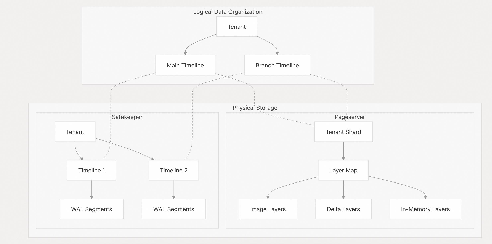

## 德说-第333期, Databricks花10亿美元买开源Neon数据库, 值得吗?   
                          
### 作者                          
digoal                          
                          
### 日期                          
2025-05-06                        
                          
### 标签                          
PostgreSQL , PolarDB , DuckDB , Databricks , AI agent , 大脑 , 记忆 , 工具 , 连接 , Neon Database , 云原生      
                          
----                          
                          
## 背景       
结合Databrick 10亿美金收购PG商业发行版Neon Database, Snowflake 2.5亿美金收购PG商业发行版Crunchy Data. 我们可以看到一个共同点, 两家公司都在布局AI数据库底座赛道. 这里引出2个问题: 为什么要布局AI数据库底座赛道? 为什么都瞄准了PG生态的商业发行版?
   
为什么要布局AI数据库底座赛道?  
- 传统数据库没什么花头了, 增长空间有限, 卷吧卷的要死.
- AI 在大模型推理能力(理性脑, 完成各种推理和任务编排等)的不断成熟, 非推理能力(感性脑, 完成各种最终任务)的精确度不断提高后. AI Agent(智能体)将在千行百业迎来井喷.
- AI智能体说白了就是 理性脑+感性脑+海马体+触角(感官)+控制系统 组成. 其中海马体负责记忆、存储外部知识; 触角负责接收外部系统讯息(类似人类的五官, 但是数字世界的五官比人类可厉害多了, 举个例子人类识别光谱的波段非常窄, 人类听力的频谱也非常窄, 而计算机是无穷的); 控制系统就是可以用来控制物理世界、数字世界的标准接口: 包括ACP、MCP. 
    - [《深入浅出分析 MCP 与 ACP：AI 时代的「连接器」与「协作网」》](../202503/20250318_01.md)  
- 海马体是什么? 就是数据库
   
为什么都瞄准了PG生态的商业发行版?  
- AI Agent对海马体的要求很高, 必须要能处理各种数据, 而不是简单的向量、简单的图、简单的关系、简单的搜索、简单的地理信息数据处理. 而是他们的综合, 甚至未来还可能需要处理更复杂的数据.
- 这些方面只有PG数据库能满足, PG的扩展设计, 使得PG在各个领域都有插件来支持. 包括这些数据的存储、处理、索引加速、计算等, 一应俱全.
- 我在这篇文章中集成了几百个常见的PG插件, 欢迎阅读了解: [《amd64 , 使用Dockerfile+docker build制作PolarDB | PostgreSQL 开源docker镜像, 集成大量插件方便学习, 并推送到阿里云镜像服务》](../202307/20230710_03.md)
    - <b> PG扩展简直无敌: 任意编程语言编写的函数(这就够无敌了)、机器学习、向量、模糊查询、分词搜索、图式数据、文档数据、地理信息、点云、传统关系、数据湖接口、自定义存储接口、自定义索引接口、自定义外部数据访问接口等  </b>
      
    
未来DuckDB也可能会和PG一样, 有机会成为AI Agent的海马体可选项!  
- [《祝贺DuckDB斩获30K star, Roadmap令人兴奋》](../202506/20250610_04.md)  
  
  
---    
    
近期数据库圈又有大买卖了, 有消息称Databricks要花10亿美元买开源Neon数据库.    
  
为什么是Neon? 这背后有什么道道?   
  
## 一、Databricks是什么？  
  
先问问Qwen3   
  
**Databricks（达塔布里克斯）** 是一家专注于大数据和人工智能的科技公司，成立于 2013 年，总部位于美国旧金山。它由 **Apache Spark 的创始人 Matei Zaharia** 创建，致力于提供统一的数据分析与 AI 开发平台。  
  
### 🌟 Databricks 是什么？  
  
简单来说：  
  
> **Databricks 是一个基于 Apache Spark 构建的一体化数据与 AI 平台**，用于处理海量数据、运行机器学习模型、构建实时应用，并支持团队协作。  
  
### 🛠️ 核心功能  
  
| 功能 | 描述 |  
|------|------|  
| **统一平台** | 集成数据工程、数据分析、AI/ML 和运维（MLOps），在一个平台上完成全流程开发。 |  
| **Delta Lake** | 提供高性能、可靠的数据湖存储层，支持 ACID 事务、版本控制、时间旅行等特性。 |  
| **Databricks SQL** | 可视化查询工具，支持大规模数据的交互式分析。 |  
| **MLflow** | 管理机器学习生命周期的开源工具，集成在 Databricks 中。 |  
| **Runtimes** | 提供预配置的 Spark 运行环境，简化开发流程。 |  
| **Auto Loader** | 自动加载流式或批量数据到 Delta Lake 中。 |  
  
### 🚀 主要特点  
  
- **基于 Apache Spark**：性能强大，适合处理 PB 级别的数据。  
- **云原生架构**：支持 AWS、Azure、GCP 多云部署。  
- **易用性高**：提供 Notebook（类似 Jupyter）、SQL 工具、API 接口等多种开发方式。  
- **企业级安全与治理**：支持 RBAC（基于角色的访问控制）、审计日志、数据加密等。  
  
### 📊 应用场景  
  
| 场景 | 示例 |  
|------|------|  
| **大数据分析** | 客户行为分析、销售趋势预测 |  
| **机器学习** | 推荐系统、图像识别、自然语言处理 |  
| **实时数据处理** | 物联网数据流处理、实时监控系统 |  
| **数据仓库替代方案** | 使用 Delta Lake + Databricks 替代传统数仓（如 Snowflake、Redshift） |  
  
  
### 🏢 典型客户  
  
Databricks 被广泛应用于金融、医疗、零售、制造等多个行业，部分知名用户包括：  
  
- **Capital One（资本一号）**  
- **Walmart（沃尔玛）**  
- **Netflix（奈飞）**  
- **Goldman Sachs（高盛）**  
  
### 💼 Databricks 的商业模式  
  
- **SaaS 模式**：按使用量计费（CPU/GPU 小时数）。  
- **企业服务**：提供定制化部署、私有云解决方案、咨询与培训等服务。  
  
### ✅ 总结一句话  
  
> **Databricks 是一个面向企业的大数据与 AI 统一平台，让数据科学家、工程师和分析师能够在同一个环境中高效地处理数据、训练模型并交付价值。**  
  
  
## 二、Databricks 对未来的判断  
要理解Databricks的行为, 只需要了解行为背后的第一性原理是什么.   
  
Databricks要成为大数据与 AI 统一平台, 同时结合它购买Neon database的行为, 倒推出Databricks对未来的判断是什么?  (也就是这个购买事件的第一性原理)     
  
1、一切都将被AI化, AI 智能体会遍地开花的爆发, 数量巨多, 有哪些?   
  
C端, 平均每个人拥有超过1个智能体, 这就是几十亿.   
  
B端, 政府、制造业、金融、游戏、教育等各个领域, 每个领域的企业/机构都需要大量智能体.   
  
2、AI 智能体的本质是什么? 大脑 + 记忆(包括会话记录、私有知识库、配置等) + 工具及连接(通过工具调用连接、使用物理世界的其他产品和其他AI agent)     
  
我在这一期谈过, 详见: [《德说-第325期, AI Agent的本质是什么? 如何快速搭建属于自己的agent》](../202504/20250422_01.md)    
  
我们重点关注“记忆(包括会话记录、私有知识库、配置等)”, 这个实际上就是数据库.  而且记忆不仅仅有向量、还有标准的结构化数据、非结构化数据等等.     
   
以下几篇文章说明了即使是召回, 为了获得更好的召回率, 也不仅仅需要向量类型和向量索引. 更何况是有其他类别字段的过滤条件时. 
- [《为什么用了RAG, 我的AI还是笨得跟猪一样! RAG效果评测与优化》](../202504/20250414_04.md)  
- [《维基百科(wikipedia) RAG 优化 | PolarDB + AI》](../202504/20250417_01.md)  
- [《召回精度提升插件: pg_tokenizer + VectorChord-BM25 reranking》](../202504/20250427_04.md)  
  
  
3、云和数据库都是基础设施, 大多数应用都会部署在云上, 大多数人会使用云数据库 (广义的, 包括任何用管控搭建的数据库服务)    
  
这个话题在这一期也进行了论述: [《德说-第312期, 什么是基础设施? 什么时候用服务OR自建? 为什么DBA会消失? 我对DBA和数据库厂商的建议是什么?》](202503/20250314_02.md)    
  
## 三、Databricks 为什么要购买Neon?   
  
Databricks要在AI 智能体数据库赛道获得增长, 必然需要一个云原生 且 同时支持向量+搜索+结构化+非结构化数据存储的数据库.  这是在点名PostgreSQL吗?    
  
https://github.com/neondatabase/neon  
  
https://deepwiki.com/neondatabase/neon  
  
Neon是开源版Aurora, 具有一切想要的云原生能力(弹性、安全、性能、多租户等).    
  
Neon 是一个开源分布式数据库系统，它使用 100% 的 PostgreSQL 作为计算引擎，同时实现了自定义存储层。它将计算与存储分离，允许两者独立扩展，并支持以下功能：  
- 用于开发、测试和 CI/CD 的数据库即时分支  
- 快速计算配置  
- 多租户存储  
- 云部署中的按使用付费定价模型  
  
该项目提供了一个经过修改的 PostgreSQL，它与分布式存储系统（而非本地文件）协同工作。该存储系统由存储、处理和向计算节点提供数据的组件组成。  
  
  
  
关键组件  
- 代理：处理客户端连接、连接池和 HTTP 上的 SQL  
- 计算节点：修改后的 PostgreSQL 实例，使用 Neon 存储引擎而不是本地文件  
- 页面服务器：存储和管理数据页面，并根据请求将其提供给计算节点  
- Safekeeper：通过共识协议确保 WAL 的持久性  
- 存储控制器：管理存储层的租户放置和分片  
- 远程存储：数据的长期存储（S3、Azure Blob 存储或本地文件）  
- 控制平台：整个系统的管理服务  
  
Neon 使用多租户模型来组织数据，每个租户都有时间线（分支）。  
  
  
  
租户和时间线  
- 租户：逻辑数据库实例，类似于 PostgreSQL 集群  
- 时间线：租户的分支，允许独立开发和测试 (类似github的branch功能)    
- 时间线分支：创建一个从父时间线的特定 LSN（日志序列号）开始的新时间线  
  
存储组织  
- 页面服务器层：数据被组织成不同类型的层：  
    - 镜像层：数据页的完整快照  
    - Delta Layers：数据页的增量变化  
    - 内存层：最近的更改尚未保存到磁盘  
- Safekeeper WAL 存储：按租户和时间线组织的预写日志记录  
  
  
数据流  
  
写入路径  
- 客户端向代理发送 SQL 查询  
- 代理将请求转发到计算节点  
- 计算节点执行查询并生成 WAL 记录  
- WAL 记录被发送到 Safekeeper 以确保持久性  
- Safekeeper达成共识并承认写入  
- Safekeeper 将 WAL 传输到 Pageserver  
- Pageserver 将 WAL 应用于其页面缓存并创建层  
- Layers 最终上传到远程存储  
  
读取路径  
- 客户端向代理发送 SQL 查询  
- 代理将请求转发到计算节点  
- 计算节点需要读取数据库页面  
- 计算节点从页面服务器请求页面  
- 页面服务器从其缓存中提供页面或从层中检索页面  
- 计算节点执行查询并返回结果  
  
为什么要购买Neon?   
  
可能令Databricks看重的是它的   
- 云原生能力, 最终可以打出性价比优势, 满足盈利要求.     
- PG原生的能力, 满足技术要求.
- 时间线(类似github branch)功能, 应用层可以称为记忆分支. 也许在开发过程、特定AI场景有非常大的作用. 它允许 AI 在不同的情境下创建和管理多个“记忆副本”或“记忆路径”，从而实现更灵活、更高效的记忆管理和行为决策。 你可以问问AI: 记忆分支在AI agent中有什么重要作用?   
  
  
  
10亿美元是否值得? 相信Databricks精算过. 我们不必担心. 看看Aurora的财报, 可能10亿美刀算便宜点呢  
  
  
  
  
#### [期望 PostgreSQL|开源PolarDB 增加什么功能?](https://github.com/digoal/blog/issues/76 "269ac3d1c492e938c0191101c7238216")
  
  
#### [PolarDB 开源数据库](https://openpolardb.com/home "57258f76c37864c6e6d23383d05714ea")
  
  
#### [PolarDB 学习图谱](https://www.aliyun.com/database/openpolardb/activity "8642f60e04ed0c814bf9cb9677976bd4")
  
  
#### [PostgreSQL 解决方案集合](../201706/20170601_02.md "40cff096e9ed7122c512b35d8561d9c8")
  
  
#### [德哥 / digoal's Github - 公益是一辈子的事.](https://github.com/digoal/blog/blob/master/README.md "22709685feb7cab07d30f30387f0a9ae")
  
  
#### [About 德哥](https://github.com/digoal/blog/blob/master/me/readme.md "a37735981e7704886ffd590565582dd0")
  
  

  
