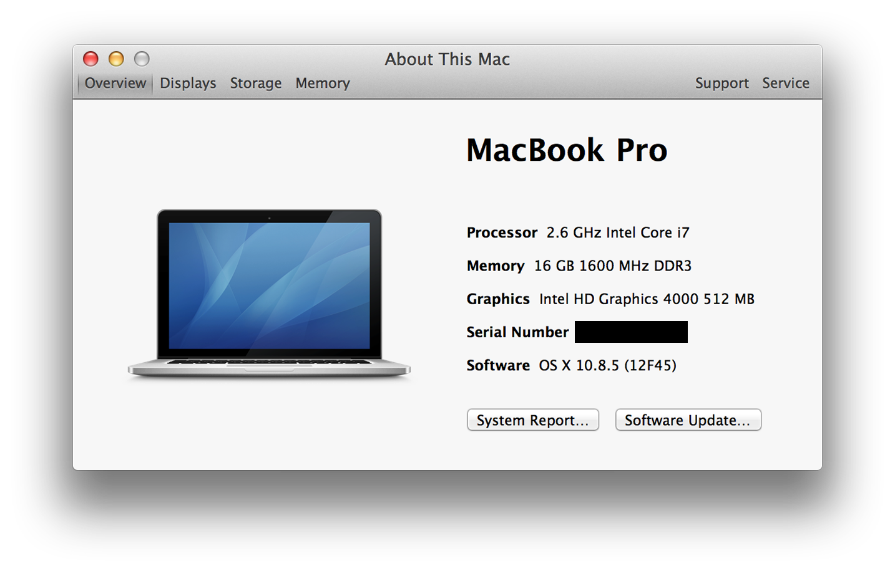
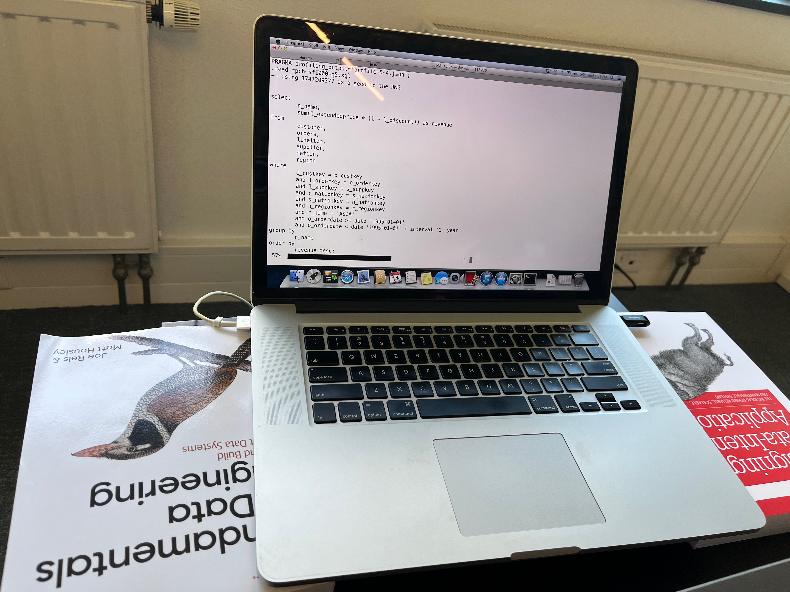

## DuckDB穿越到2012, 见证“大数据”失去的十年   
            
### 作者            
digoal            
            
### 日期            
2025-05-22            
            
### 标签            
PostgreSQL , PolarDB , DuckDB , 大数据 , 矢量计算 , 分布式 , 伪命题    
            
----            
            
## 背景         
2012年的mac book pro(16G内存), 能不能跑SF=1000的TPC-H数据集?   
  
能不能在有限时间把结果跑出来?   
  
速度够不够快?   
  
为什么当时都转向hadoop分布式框架?   
  
大数据跑在hadoop分布式框架上是不是资本推动的一场技术错误?   
  
如果DuckDB穿越到2012会不会完全不一样?   
  
多大是大数据? 为什么 Amazon Redshift 和 Snowflake 中的中位数扫描读取的数据量为 100 MB，而 99.9% 的读取量不到 300 GB。  
  
来看看这篇文章.   
    
以下翻译自原文:  https://duckdb.org/2025/05/19/the-lost-decade-of-small-data.html  
        
TL;DR：我们在 2012 年的 MacBook Pro 上对 DuckDB 进行了基准测试，以决定：我们是否在追逐数据分析的分布式架构上浪费了十年时间？  
  
关于数据其实并没有那么“大”，以及硬件创新速度如何超过有用数据集的增长速度，人们（尤其是我们自己）已经讨论过很多次。我们甚至可能预测在不久的将来会出现数据奇点，届时99%的有用数据集可以在单个节点上轻松查询。正如最近显示的那样，Amazon Redshift 和 Snowflake 中的中位数扫描读取的数据量为 100 MB，而 99.9% 的读取量不到 300 GB。因此，奇点可能比我们想象的更近。  
  
但我们不禁要问，这种发展究竟是从什么时候开始的？像 MacBook Pro 这样随处可见、通常只能运行 Chrome 浏览器的个人电脑，又是什么时候发展成为如今数据处理能力如此强大的？  
  
让我们把目光转向2012年的 Retina MacBook Pro，当时很多人（包括我自己）都因为它华丽的“Retina”显示屏而购买了这款电脑。它销量达数百万台。尽管当时我失业了，但我甚至挥霍了一笔钱升级了16GB的内存。但这台电脑还有另一个经常被遗忘的革命性变化：它是第一款内置固态硬盘 (SSD)和极具竞争力的4核2.6 GHz“Core i7” CPU的MacBook 。再次观看发布会的画面很有意思，他们也确实强调了“全闪存架构”的性能。  
  
  
  
附注：MacBook Air 实际上是第一款配备（可选）内置 SSD 的 MacBook，早在 2008 年就已推出。但遗憾的是，它不具备 Pro 的 CPU 火力。  
  
巧合的是，我的DuckDB 实验室办公室里还有这台笔记本电脑，孩子们现在用它来用大字体输入他们的名字，或者在他们身边的时候在 YouTube 上看《Bluey》节目。但这台旧电脑还能运行现代的 DuckDB 吗？它的性能与现代 MacBook 相比如何？我们可能在 2012 年就经历了如今的数据革命吗？让我们来一探究竟！  
  
## 软件  
首先，操作系统怎么样？为了让对比更公平地反映几十年前的差异，我们实际上将 Retina 的操作系统降级到了 `OS X 10.8.5 “Mountain Lion”`，这个版本是在 2012 年 7 月，比这款笔记本电脑发布仅晚了几周才发布的。虽然 Retina 可以运行 `10.15（Catalina）`，但我们认为，要真正与 2012 年的对比，也应该使用那个时代的操作系统。下面是用户界面的截图，方便我们这些有时会觉得有些过时的人查看。  
  
  
  
继续讨论 DuckDB 本身：在 DuckDB，我们对可移植性和依赖性非常执着。这意味着几乎不需要做任何改动就可以让 DuckDB 在古老的 `Mountain Lion` 上运行：默认构建的 DuckDB 二进制文件向后兼容 `OS X 11.0 (Big Sur)`，但只需更改标志并重新编译就足以让 DuckDB 1.2.2 在 Mountain Lion 上运行。我们也希望使用 2012 年的编译器来构建 DuckDB，但遗憾的是，`C++ 11`在 2012 年太新了，编译器无法完全支持它。无论如何，二进制文件运行良好，也可以通过解决编译器错误来生成。   
  
## 基准测试  
但我们感兴趣的不是综合 CPU 得分，而是综合 SQL 得分！为了测试这台老机器在执行大规模数据处理时的表现，我们使用了目前虽然略显老旧但广为人知的 TPC-H 基准测试，其规模因子为 1000。这意味着两个主表`lineitem`和`orders`分别包含 `60 亿`行和 `15 亿`行数据。当存储为 DuckDB 数据库时，该数据库的大小约为 `265 GB`。  
  
从TPC网站上的审计结果我们可以看出，在单个节点上运行这个规模的基准测试似乎需要花费数十万美元的硬件。  
  
我们对 22 个基准查询分别运行了五次，并取中位运行时间以消除干扰。然而，由于 RAM 大小（16 GB）远小于数据库大小（256 GB），缓冲区管理器中无法缓存大量的输入数据，因此这些运行实际上并非人们所说的“热”运行。  
  
  
  
以下是每个查询的结果（以秒为单位）：  
  
SQL	| time  
---|---  
1	| 142.2  
2	| 23.2  
3	| 262.7  
4	| 167.5  
5	| 185.9  
6	| 127.7  
7	| 278.3  
8	| 248.4  
9	| 675.0  
10	| 1266.1  
11	| 33.4  
12	| 161.7  
13	| 384.7  
14	| 215.9  
15	| 197.6  
16	| 100.7  
17	| 243.7  
18	| 2076.1  
19	| 283.9  
20	| 200.1  
21	| 1011.9  
22	| 57.7  
  
但这些冰冷的数字究竟意味着什么？我们内心深处的感受是，我们真的掌握了数据，这台老电脑居然能用 DuckDB 完成所有基准测试查询！  
  
如果我们仔细观察一下时间，就会发现查询耗时在一分钟到半小时之间。对于这类数据的分析查询来说，这样的等待时间并不算不合理。  
  
哎呀，要是在 2012 年，你肯定要等更长时间才能等到 Hadoop YARN 接手你的任务，结果却在某个时刻向你喷涌而出的堆栈跟踪信息。  
  
## 2023 年改进  
但这些结果与现代 MacBook 相比如何呢？为了进行比较，我们使用了一台现代的 ARM M3 Max MacBook Pro，它恰好放在同一张桌子上。但这两款 MacBook 加起来代表了十多年的硬件发展历程。  
  
仅从GeekBench 5 的基准测试成绩来看，我们发现在使用所有核心的情况下，原始 CPU 速度大约相差 7 倍，单核速度大约相差 3 倍。当然，RAM 和 SSD 的速度也有很大差异。有趣的是，显示屏尺寸和分辨率几乎没有变化。  
  
以下是对比的结果：  
  
SQL	| time_2012 | 	time_2023	| 提速倍数  
---|---|---|---  
1	| 142.2	| 19.6	| 7.26  
2	| 23.2	| 2.0	| 11.60  
3	| 262.7	| 21.8	| 12.05  
4	| 167.5	| 11.1	| 15.09  
5	| 185.9	| 15.5	| 11.99  
6	| 127.7	| 6.6	| 19.35  
7	| 278.3	| 14.9	| 18.68  
8	| 248.4	| 14.5	| 17.13  
9	| 675.0	| 33.3	| 20.27  
10	| 1266.1	| 23.6	| 53.65  
11	| 33.4	| 2.2	| 15.18  
12	| 161.7	| 10.1	| 16.01  
13	| 384.7	| 24.4	| 15.77  
14	| 215.9	| 9.2	| 23.47  
15	| 197.6	| 8.2	| 24.10  
16	| 100.7	| 4.1	| 24.56  
17	| 243.7	| 15.3	| 15.93  
18	| 2076.1	| 47.6	| 43.62  
19	| 283.9	| 23.1	| 12.29  
20	| 200.1	| 10.9	| 18.36  
21	| 1011.9	| 47.8	| 21.17  
22	| 57.7	| 4.3	| 13.42  
  
我们确实看到了显著的加速，各SQL提速 7 到 53 倍。耗时平均值从 218s 提高到 12s，提高了约 20 倍。  
  
## 复现  
二进制文件、脚本、查询和结果均可在 GitHub 上查看。我们还提供了TPC-H SF1000 数据库文件供下载，您无需自行生成。但请注意，该文件很大。  
  
https://github.com/hannes/old-macbook-tpch  
  
http://blobs.duckdb.org/data/tpch-sf1000.db  
  
  
## 讨论  
我们已经见证了十年前的 MacBook Pro Retina 是如何完成一项复杂的分析基准测试的。新款笔记本电脑能够显著提升这些时间。但绝对的加速数字在这里毫无意义。差异纯粹是量变，而非质变。  
  
从用户的角度来看，查询在合理的时间内完成比耗时 10 秒或 100 秒更重要。我们可以用两台笔记本电脑处理几乎相同的数据问题，只是需要愿意多等一会儿。考虑到 DuckDB 的核外（out-of-core）功能(数据可以超出内存)，这一点尤其重要，该功能允许它在需要时将查询中间结果溢出到磁盘。  
  
更有趣的是，早在 2012 年，拥有像 DuckDB 这样的单节点 SQL 引擎是完全可行的，它可以在可控的时间内对 60 亿行的数据库运行复杂的分析 SQL 查询 —— 而这次我们甚至不必将其浸入干冰中。  
  
历史充满了“如果”，如果像 DuckDB 这样的东西在 2012 年就存在会怎样？主要要素都具备，矢量化查询处理早在 2005 年就已发明。现在看来有些愚蠢的数据分析分布式系统转型真的会发生吗？我们基准数据库的数据集大小非常接近 2024 年分析查询输入数据量的 99.9%。虽然视网膜 MacBook Pro 在 2012 年是一款高端电脑，但到了 2014 年，许多其他厂商都转向提供内置 SSD 存储的笔记本电脑，大容量内存也变得更加普及。  
  
所以，是的，我们确实失去了整整十年。  
  
## 参考      
https://duckdb.org/2025/05/19/the-lost-decade-of-small-data.html  
    
