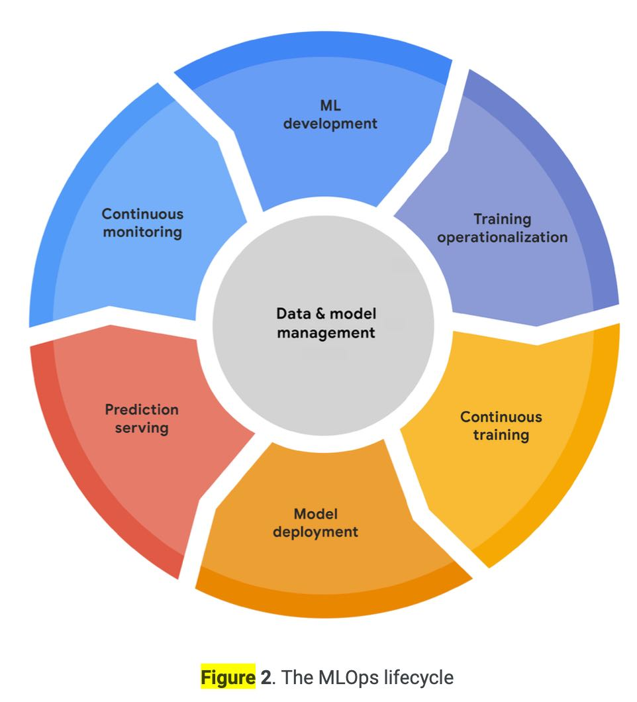
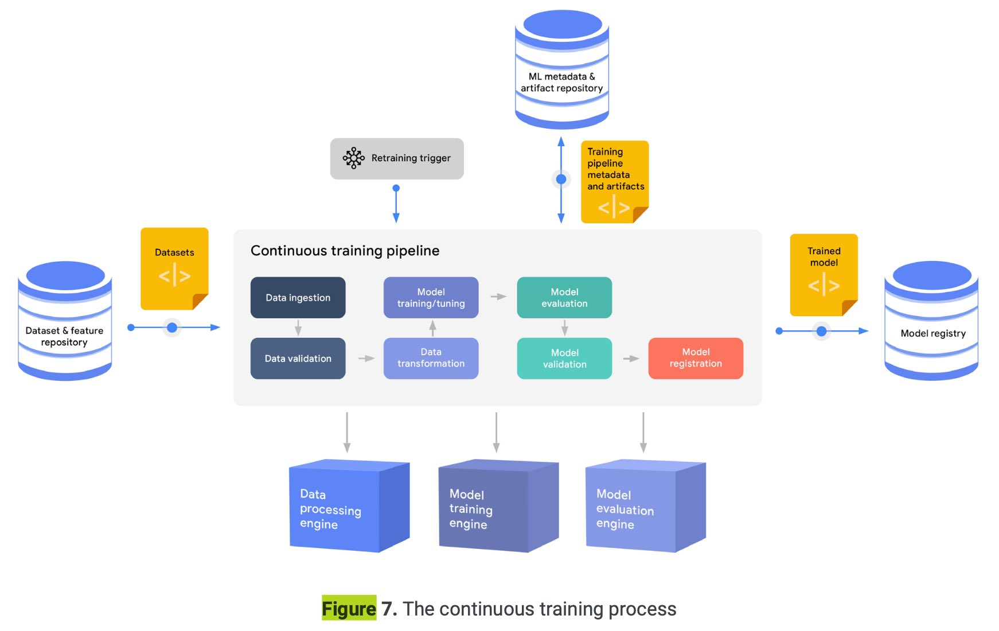
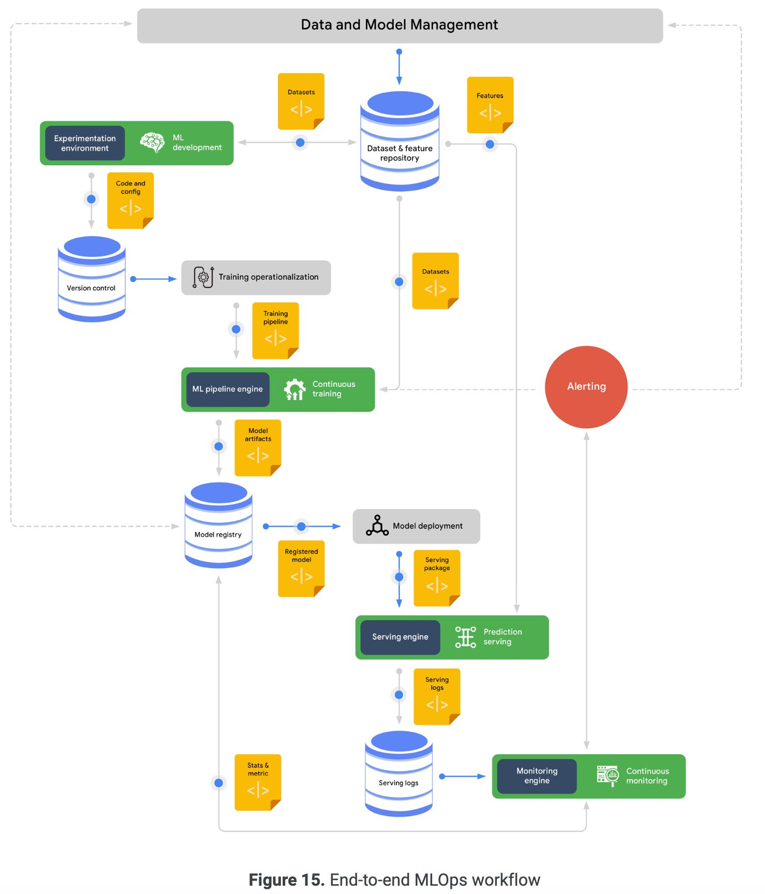

## AI论文解读 | Practitioners guide to MLOps
        
### 作者        
digoal        
        
### 日期        
2025-06-15        
        
### 标签        
PostgreSQL , PolarDB , DuckDB , AI , 论文解读        
        
----        
        
## 背景       
      
https://github.com/Pooja-AI/MLOPS        
        
提示:        
```        
读懂《Practitioners guide to MLOps》这篇论文需要提前掌握哪些基础知识, 请使用中文给我讲一下这些基础知识, 尽量通熟易懂, 可以使用markdown支持的图形增加解释性.        
        
使用中文通熟易懂的解读《Practitioners guide to MLOps》这篇论文, 关键内容请深入讲解, 可以使用markdown支持的图形增加解释性.        
        
使用中文提取《Practitioners guide to MLOps》论文中一些重要的术语并详细解释, 可以使用markdown支持的图形示增加解释性.        
```        
        
## 1 前置知识 
  
好的，没问题。为了透彻理解Google Cloud发布的《MLOps实践指南》，提前掌握一些基础知识确实能让你事半功倍。这份指南的核心目标是介绍如何像管理大型软件项目一样，系统化、自动化地管理机器学习项目。

简单来说，**MLOps = ML (机器学习) + Dev (开发) + Ops (运维)**。所以，你需要的基础知识也主要围绕这三个方面展开。下面我将用通俗易懂的方式，为你讲解这些必备的知识点。

-----

### 1\. 机器学习基础 (The "ML") 🤖

这是所有讨论的起点。指南并不会教你具体的算法，但它默认你了解一个机器学习模型的“一生”是怎样的。

  * **什么是模型 (Model)？**
    你可以把它想象成一个拥有特定技能的大脑。你通过数据（经验）训练它，它就能根据新的输入做出判断或预测。比如，一个能识别猫的模型，就是你看过成千上万张猫的照片后，训练出来的“识猫大脑”。

  * **机器学习的核心流程**
    你需要熟悉从数据到模型的几个关键步骤，因为MLOps就是要将这些步骤自动化。

    1.   **数据准备 (Data Preparation)**：收集、清洗和转换数据，使其适用于模型训练  。
    2.   **模型训练 (Model Training)**：将准备好的数据喂给算法，让模型学习其中的规律  。
    3.   **模型评估 (Model Evaluation)**：使用一些指标（如准确率）来检验模型的效果好坏  。
    4.   **模型部署 (Model Serving/Deployment)**：将训练好的模型放到实际应用中去，让它开始工作，比如在你的手机App里识别图片  。

  * **关键概念：模型衰退 (Model Decay)**
     一个模型上线后并非一劳永逸。随着时间推移，现实世界的情况会变化（例如，用户行为改变），导致模型的预测能力下降   。这就像你学会的知识需要不断更新一样。理解这一点，你就能明白为什么MLOps强调**持续监控 (Continuous Monitoring)** 和 **持续训练 (Continuous Training)**  。

-----

### 2\. 软件开发与运维/DevOps (The "Ops") 🛠️

MLOps 的思想和实践大量借鉴自软件工程领域的 DevOps。如果你了解 DevOps，就等于掌握了 MLOps 的半壁江山。

  * **CI/CD (持续集成/持续交付)**
     这是DevOps的灵魂，也是MLOps自动化的核心工具  。

      *  **持续集成 (CI - Continuous Integration)**：开发人员频繁地将代码改动合并到主仓库。每次合并后，系统会自动构建和测试，确保新代码不会搞砸整个系统  。
      *  **持续部署 (CD - Continuous Delivery/Deployment)**：一旦代码通过所有测试，就自动把它部署到生产环境  。

    你可以通过下面的简化图来理解这个流程，MLOps只是把这个流程应用到了机器学习项目中。

    ```mermaid
    graph TD
        A[开发人员写代码] --> B{"版本控制 (Git)"};
        B --> C[CI: 自动测试];
        C -- 通过 --> D[CD: 自动部署];
        C -- 失败 --> A;
        D --> E[用户使用];
    ```

    *\<center\>图解：CI/CD就像一条自动化生产线，确保从代码到产品发布的流程高效且可靠。\</center\>*

  * **版本控制 (Version Control)**
     你需要知道为什么要用 Git 这样的工具。在MLOps中，**不仅代码需要版本控制，数据、模型配置和训练好的模型本身，也都需要被追踪和管理**  。这样才能保证任何一次实验或模型都是可复现的。

-----

### 3\. 数据工程基础 (The "Data") 💧

 数据是机器学习的“燃料”。没有高质量的、持续供应的燃料，再好的引擎（模型）也无法持续工作。指南明确指出，数据工程是构建机器学习系统的三大支柱之一  。

  * **数据管道 (Data Pipeline)**
     你需要了解数据是如何从原始来源（如数据库、日志）流向模型训练环节的。这个过程通常被称为**ETL**（提取-Extract, 转换-Transform, 加载-Load）  。

  * **特征存储 (Feature Store)**
     这是指南中一个非常重要的概念。你可以把它想象成一个为机器学习准备的“中央食材库”  。

      * **作用**：它统一存储和管理计算好的特征（比如用户的平均消费额、最近登录时间等）。
      * **好处**：
        1.  **复用**：不同团队不用重复开发相同的特征。
        2.   **一致性**：确保模型训练时用的特征和线上预测时用的特征来自同一个地方、用同一种方法计算，这能有效避免一种叫做**训练/服务偏差 (Training-Serving Skew)** 的常见问题  。

### 总结

掌握以下三方面的基础知识，你就能非常顺畅地读懂这篇《MLOps实践指南》了：

| 领域 | 核心概念 | 在MLOps中的作用 |
| :--- | :--- | :--- |
| **机器学习** 🤖 | 模型生命周期、模型评估、模型衰退 | 提供了需要被管理和自动化的核心对象（模型和数据）。 |
| **DevOps** 🛠️ | CI/CD、版本控制、自动化思维 | 提供了实现自动化、标准化和可靠性的核心思想与工具。 |
| **数据工程** 💧 | 数据管道、特征存储 | 确保为机器学习提供源源不断的高质量“燃料”。 |

具备了这些知识，你就能清晰地理解 MLOps 是如何将三者融合，从而建立一套成熟、高效的流程，来交付和维护高质量的机器学习应用的。
  
## 2 解读论文  
  
好的，这篇来自 Google Cloud 的《MLOps 实践指南》是 MLOps 领域非常经典和权威的白皮书。它系统性地描绘了将机器学习从实验阶段推向成熟、可靠的生产化系统所需要的框架、流程和能力。

我将为你深入解读这份指南，从 **“为什么需要MLOps”** 出发，详细拆解 **“MLOps 的完整生命周期”**，并深入讲解其中的 **“核心流程与技术能力”**。

-----

### 一、核心问题：为什么我们需要 MLOps？

传统软件开发有 DevOps，但机器学习（ML）系统有其独特的复杂性，使得直接套用 DevOps 不足。指南开篇就指出了企业在将 ML 模型投入生产时面临的困境：

  *  **部署难**：许多公司的 AI 项目止步于“试点”或“概念验证”阶段，无法真正部署到生产环境  。
  *  **易“腐烂”**：即使模型成功部署，它们也会因为现实世界的数据变化而逐渐失效（即模型衰退），最终因为无法适应环境变化而崩溃  。
  *  **流程乱**：团队工作多为手动、一次性的，组件难以复用，数据科学家和IT团队之间交接困难，缺乏统一的治理和管理流程  。

 MLOps 正是为了解决这些问题而生。它是一套标准化的流程和技术能力，旨在**快速、可靠地构建、部署和运维机器学习系统**  。

这份指南将 ML 系统定义为一个包含三个关键部分的综合体，MLOps 负责将它们有机地粘合起来：

  * **数据工程 (Data Engineering)**：负责提供高质量、可信赖的数据。
  * **机器学习工程 (ML Engineering)**：负责构建、训练和部署模型。
  * **应用工程 (App Engineering)**：负责将模型集成到最终的应用中，并监控业务指标。

  

```mermaid
graph TD
    DataEngineering -- 提供策划好的数据 (Curated data) --> MLEngineering;
    MLEngineering -- 提供部署好的模型 (Deployed model) --> AppEngineering;
    AppEngineering -- 提供应用KPI (Application KPIs) --> MLEngineering;
    AppEngineering -- 提出数据需求 (Data requirements) --> DataEngineering;

    subgraph ML-Enabled System
        DataEngineering
        MLEngineering
        AppEngineering
    end

    style DataEngineering fill:#9f9,stroke:#333,stroke-width:2px
    style MLEngineering fill:#87CEFA,stroke:#333,stroke-width:2px
    style AppEngineering fill:#ffc,stroke:#333,stroke-width:2px
```

*\<center\>图解：构建一个机器学习系统需要数据、模型和应用的紧密协作（改编自 Figure 1）\</center\>*
  
  
  
-----

### 二、MLOps 的生命周期：七个核心迭代过程

 指南将 MLOps 的整个生命周期抽象为七个相互关联、持续迭代的过程  。这七个过程像一个轮盘，持续转动，推动模型不断进化。

```mermaid
graph TD
    subgraph "MLOps Lifecycle (基于 Figure 2)"
        A[ML Development / 机器学习开发] --> B[Training Operationalization / 训练操作化];
        B --> C[Continuous Training / 持续训练];
        C --> D[Model Deployment / 模型部署];
        D --> E[Prediction Serving / 预测服务];
        E --> F[Continuous Monitoring / 持续监控];
        F --> A;
        G[Data & Model Management / 数据与模型管理]
    end
    linkStyle 0,1,2,3,4,5 stroke-width:2px,fill:none,stroke:orange;
    style A fill:#D6EAF8
    style B fill:#D1F2EB
    style C fill:#FCF3CF
    style D fill:#FADBD8
    style E fill:#F5EEF8
    style F fill:#E8DAEF
    style G fill:#E5E7E9,stroke:#333,stroke-width:2px
```
  
  


下面我们来逐一深入讲解每个过程：

#### 1\. **机器学习开发 (ML Development)**

  *  **做什么？**：这是数据科学家进行**实验和探索**的核心阶段   。他们在这里尝试不同的数据、算法和参数，目标是开发出一个效果良好、可复现的模型训练程序（即训练流程的代码） 。
  *  **关键产出**：不是一个一次性的模型，而是一套**形式化的训练流程代码**，以及实验过程中产生的各种元数据和组件  。

#### 2\. **训练操作化 (Training Operationalization)**

  *  **做什么？**：将开发阶段的训练代码**打包成一个可重复执行、可靠的自动化训练管道 (Training Pipeline)**   。这通常涉及到使用 CI/CD 流程来构建、测试和部署这个训练管道  。
  * **关键产出**：一个可以被自动调度的、版本化的训练管道。

#### 3\. **持续训练 (Continuous Training)**

  *  **做什么？**：**自动化地、重复地执行训练管道**   。触发时机可以是固定的时间表（如每天一次）、有新数据时，或者当监控系统发现模型性能下降时  。
  *  **关键产出**：一个经过验证的、可以被注册的**新版模型**  。

#### 4\. **模型部署 (Model Deployment)**

  *  **做什么？**：将注册好的模型打包、测试，并部署到一个可提供预测服务的生产环境中   。这个过程同样可以高度自动化，并且通常采用**渐进式交付（Progressive Delivery）** 的策略，如灰度发布（Canary Deployment）或 A/B 测试，来降低新模型上线的风险  。
  * **关键产出**：一个正在线上运行、提供预测服务的模型应用。

#### 5\. **预测服务 (Prediction Serving)**

  *  **做什么？**：为生产环境中的请求提供模型推断（Inference）结果  。服务形式可以是：
      *  **在线预测**：低延迟的实时请求，如 App 中的推荐  。
      *  **批量预测**：高吞吐的离线数据处理，如批量用户画像分析  。
  *  **关键产出**：预测结果，以及用于监控的**服务日志 (Serving logs)**  。

#### 6\. **持续监控 (Continuous Monitoring)**

  *  **做什么？**：**持续监控已部署模型的效率和效果**，确保其预测质量和业务价值   。这是发现模型衰退的关键环节  。
  *  **核心任务**：检测**数据偏移 (Data Drift)** 和 **概念偏移 (Concept Drift)**   。当训练数据和线上真实数据的分布不一致时，就会发生数据偏移  。
  *  **关键产出**：模型性能指标、异常警报，并可能触发新一轮的持续训练  。

#### 7\. **数据与模型管理 (Data and Model Management)**

  *  **做什么？**：这是一个贯穿所有流程的**中央治理功能**   。它负责管理所有的 ML 资产（数据集、特征、模型、元数据），以确保审计、追溯、合规和复用性  。
  * **核心组件**：
      *  **数据集和特征库 (Dataset and feature repository)**：统一管理数据和特征，避免训练/服务偏差  。
      *  **模型注册表 (Model registry)**：集中管理、版本化和追踪所有生产模型  。
      *  **ML 元数据和工件库 (ML metadata and artifact repository)**：追踪所有实验和流程的“足迹”  。

-----

### 三、深度解读：MLOps 的核心技术与实践

指南不仅描绘了蓝图，还深入到了实现这些流程所需要的核心技术能力和实践细节。

#### 深度解读 1：持续训练 (CT) 的自动化管道

一个典型的自动化持续训练管道，如下图所示，是 MLOps 的引擎。

```mermaid
graph TD
    subgraph "Continuous Training Pipeline (基于 Figure 7)"
        A(Retraining Trigger / 触发器) --> B[Data Ingestion / 数据提取];
        B --> C[Data Validation / 数据验证];
        C --> D[Data Transformation / 数据转换];
        D --> E[Model Training / 模型训练];
        E --> F[Model Evaluation / 模型评估];
        F --> G[Model Validation / 模型验证];
        G -- Meets criteria --> H[Model Registration / 模型注册];
    end
    
    A -- "新数据, 计划任务, 性能下降" --> B;
    H --> I(Model Registry / 模型注册表);
    C -- "发现数据偏移? 中止或告警" --> B;
    G -- "性能达标?" --> H;

    style A fill:#F5B7B1
    style H fill:#A9DFBF
```
   
  
  
*\<center\>图解：一个典型的持续训练管道流程\</center\>*

  *  **数据验证是第一道门**：在训练开始前，管道会自动将新数据与一个“期望的数据模式（Schema）”进行比较   。如果发现数据分布剧烈变化（例如，某个特征消失了），流程会被中止，避免用“脏数据”训练出“坏模型”  。
  *  **模型验证是第二道门**：模型训练和评估后，其性能指标会与基准模型（如当前生产环境中的模型）或预设的性能阈值进行比较   。只有当新模型表现“足够好”时，才会被注册，并被允许进入部署流程  。
  *  **一切皆可追溯**：管道的每一次运行，包括使用的数据版本、超参数、评估结果等所有元数据，都会被记录在案，以实现完全的可复现性和谱系分析（Lineage analysis） 。

#### 深度解读 2：渐进式交付 (Progressive Delivery)

 对于 ML 模型，简单地用新模型替换旧模型风险极高。指南强调了**渐进式交付**的重要性，即逐步将流量引入新模型，同时观察其在真实世界中的表现  。

  *  **Canary 部署 (灰度发布)**：先将一小部分用户流量（如5%）导向新模型，如果其技术指标（如延迟、错误率）和业务指标（如点击率）表现良好，再逐步扩大流量  。
  *  **A/B 测试**：将用户随机分成两组，一组使用旧模型（A），另一组使用新模型（B），在一段时间后统计对比两组的业务指标，以数据驱动的方式决定是否全面上线新模型  。
  *  **Shadow 部署 (影子模式)**：将生产流量同时发送给新旧两个模型，但只有旧模型的预测结果会返回给用户。新模型的预测结果被记录下来用于与旧模型对比分析，而不会影响真实用户。这是一种无风险的线上评估方式  。

#### 深度解读 3：数据与模型治理的核心——特征库与模型注册表

  *  **特征库 (Feature Repository)**：这是解决**训练-服务偏差**的关键武器   。它提供了一个统一的地方，让数据科学家在训练时和系统在线上服务时，都能调用到用同一种逻辑计算出来的特征，从而确保了数据的一致性   。同时，它也极大地促进了特征的复用，提升了效率  。

  *  **模型治理与模型注册表 (Model Governance & Registry)**：当模型数量增多时，手动的管理方式会带来巨大的风险  。模型注册表提供了一个中央控制台，让你能够：

      *  **存储与追溯 (Store)**：追踪模型的每个版本及其沿袭（由哪个数据集、哪次训练产生） 。
      *  **评估 (Evaluate)**：不仅比较模型的离线技术指标，还关联其线上实验的业务指标  。
      *  **审核与放行 (Check & Release)**：建立清晰的审批流程，控制模型的上线过程，确保其满足业务、法律和道德风险的要求  。

-----

### 四、总结：将一切整合起来

《MLOps 实践指南》的核心思想是：**通过借鉴 DevOps 的自动化和标准化理念，建立一套覆盖从数据到模型的完整生命周期的、持续迭代的闭环系统**。
  
  
  
最终，这个系统（如指南中的 Figure 15 所示）将所有独立的流程和能力整合在一起，形成一个强大的工作流。在这个流程中：

  * **开发**在一个受控的环境中进行。
  * **训练**被封装在可自动执行的管道中。
  * **部署**是渐进式的、低风险的。
  * **监控**是持续的，能主动发现问题并触发反馈。
  * 所有的数据、模型和过程元数据都受到**中央治理**。

 采纳这套 MLOps 框架，能帮助企业缩短将 ML 应用推向市场的时间，同时显著提升系统的可靠性、可扩展性和安全性，最终从对机器学习的投资中获得真正的业务价值  。
  
## 3 术语  
  
好的，这篇《MLOps实践指南》中确实定义和使用了许多核心术语。理解这些术语是掌握 MLOps 精髓的关键。以下是我为您提取并详细解释的一些最重要术语，并辅以图形帮助理解。

-----

### 1\. MLOps

 MLOps 是一种面向机器学习（ML）工程的方法论，它将 ML 系统的开发（ML）与 ML 系统的运维（Ops）统一起来   。它是一套标准化的流程和技术能力，用于快速、可靠地构建、部署和运维机器学习系统   。它借鉴了软件工程领域的 DevOps 思想，但又特别处理了机器学习应用的独特复杂性，例如模型和数据的管理  。

简单来说，MLOps 的目标就是让构建和管理机器学习系统变得像管理大型软件项目一样，高效、可靠且自动化。

### 2\. CI/CD (持续集成/持续交付)

 这个概念源于 DevOps，但在 MLOps 中有特定的应用。它指的是一系列自动化流程，用于构建、测试、发布和运维软件系统，在 MLOps 中则特指包括了 ML 模型的系统  。

  *  **CI/CD for ML Training Pipeline (用于训练管道的CI/CD)**: 这指的是一套自动化流程，用于构建、测试和部署机器学习的**训练管道**   。当数据科学家完成训练代码后，CI/CD 系统会接管，自动测试代码，将其打包成一个可执行的管道，并部署到目标环境  。
  *  **CI/CD for Model Deployment (用于模型部署的CI/CD)**: 这指的是另一套自动化流程，当一个新模型被训练并注册后，该流程负责读取模型，将其打包成一个服务，并进行测试和**渐进式交付**（Progressive Delivery）到生产环境  。

### 3\. 训练-服务偏差 (Training-Serving Skew)

 这是一个在生产环境中非常常见的“陷阱”。它指的是**训练时使用的数据**和**线上预测（服务）时使用的数据**之间存在差异，从而导致模型性能下降  。

这种偏差可能由以下原因造成：

  *  **数据源不同**：训练数据和线上服务数据从不同的来源提取，处理逻辑不一致  。
  * **特征工程差异**：在训练和服务的两个阶段，对原始数据的处理和特征提取方式不完全相同。例如，训练时对缺失值用平均值填充，而线上服务时却用了0填充。

 **特征库（Feature Store）** 是解决这个问题的一大利器，因为它能确保训练和服务时从同一个源头获取用同一种方法计算的特征  。

```mermaid
graph TD
    subgraph "训练阶段 (Offline)"
        A[原始数据 A] --> B(特征工程 V1) --> C[训练模型];
    end

    subgraph "服务阶段 (Online)"
        D[原始数据 B] --> E(特征工程 V2) --> F[线上预测];
    end

    C -- 部署 --> F;
    B -- 与E的逻辑不一致 --> G((<font color=red>产生偏差!</font>));

    style G fill:#f9f9f9,stroke:#f00,stroke-width:2px,stroke-dasharray: 5, 5
```

*\<center\>图解：训练和服务阶段的特征处理逻辑不一致是导致偏差的关键原因。\</center\>*

### 4\. 数据偏移 (Data Drift) 与 概念偏移 (Concept Drift)

 这两个术语都用来描述“模型衰退（Model Decay）”，是**持续监控**的核心目标  。

  *  **数据偏移 (Data Drift)**: 指的是用于训练模型的数据集与模型在线上接收用于评分的生产数据之间，出现了越来越大的偏差  。它又可以分为两种：

      *  **模式偏移 (Schema Skew)**: 训练数据和线上服务数据的结构不一致。例如，训练时用的特征在线上消失了，或者线上出现了新的特征  。
      *  **分布偏移 (Distribution Skew)**: 数据结构一致，但特征值的分布发生了显著变化  。例如，训练模型的用户平均年龄是30岁，但现在线上用户的平均年龄变成了20岁。

  *  **概念偏移 (Concept Drift)**: 指的是输入特征与目标（预测结果）之间的关系发生了变化  。例如，在经济形势好的时候，“高收入”可能与“高购买力”强相关，但在经济衰退时，这种关系可能就变弱了，这就是“概念”本身发生了偏移。

  

```mermaid
graph TD
    subgraph "模型衰退 (Model Decay)"
        A["数据偏移 (Data Drift)"]
        B["概念偏移 (Concept Drift)"]
    end
    
    subgraph 数据偏移的类型
        C["模式偏移 (Schema Skew)"]
        D["分布偏移 (Distribution Skew)"]
    end

    A --> C;
    A --> D;
```

*\<center\>图解：数据偏移和概念偏移是导致模型性能下降的主要原因。\</center\>*

### 5\. 特征库 (Feature Repository / Feature Store)

 这是一个统一的、集中的存储库，用于管理、存储和提供机器学习的特征   。它旨在实现特征的标准化、复用和共享  。

**核心价值**:

  *  **避免训练-服务偏差**：通过提供统一的数据源来避免该问题  。
  *  **提高效率**：数据科学家可以直接发现和复用已有的特征，而无需每次都从头开发  。
  *  **提供一致性**：为不同用途（如实验、持续训练、批量预测、在线预测）提供同一套数据实体  。

### 6\. 模型注册表 (Model Registry)

 这是一个中央存储库，用于治理和管理机器学习模型的整个生命周期   。它确保了生产模型的质量，并使模型可以被发现  。

你可以把它想象成一个 **“模型的档案馆”**，主要功能包括：

  *  **注册与版本化**：注册、组织、追踪和版本化所有训练过和部署过的模型  。
  *  **存储元数据**：存储模型的元数据和部署所需的运行时依赖项  。
  *  **模型治理**：支持对模型进行审核、批准、发布和回滚等治理流程  。

### 7\. ML 元数据与工件库 (ML metadata and artifact repository)

 这是一个基础性的能力，用于追踪和存储 MLOps 生命周期中产生的所有**信息（元数据）和产物（工件）**  。

  *  **元数据 (Metadata)**: 是“关于数据的数据”，例如管道的运行ID、触发时间、使用的超参数、评估指标分数等  。
  *  **工件 (Artifacts)**: 是流程中产生的实际文件，例如处理过的数据集、训练好的模型文件、数据模式文件等  。

 这个库是实现**可复现性（reproducibility）** 和 **谱系追踪（lineage tracking）** 的基石，当出现问题时，可以追溯到每一个步骤，进行调试  。

### 8\. 渐进式交付 (Progressive Delivery)

 这是一种在模型部署阶段降低风险的策略，指的不是一次性将新模型推向所有用户，而是逐步、可控地进行  。指南中提到了几种常见的技术：

  *  **Canary 部署 (灰度发布)**: 将一小部分流量（例如5%）导向新模型，观察其表现，如果一切正常，再逐步增加流量  。
  *  **A/B 测试**: 将用户随机分组，同时运行新旧两个模型，通过真实的线上效果对比来决定哪个模型更好  。
  *  **Shadow 部署 (影子部署)**: 将生产流量同时复制给新旧两个模型，但只有旧模型的预测结果会返回给用户。新模型的预测结果被默默记录下来用于分析，对用户完全无感，是一种零风险的线上评估方法  。
  
## 参考        
        
https://github.com/Pooja-AI/MLOPS        
         
https://arxiv.org/abs/2205.02302  
  
https://arxiv.org/pdf/2303.10158  
  
https://cires.org.au/wp-content/uploads/2024/08/Xin-Zheng.pdf  
  
<b> 以上内容基于DeepSeek、Qwen、Gemini及诸多AI生成, 轻微人工调整, 感谢杭州深度求索人工智能、阿里云、Google等公司. </b>        
        
<b> AI 生成的内容请自行辨别正确性, 当然也多了些许踩坑的乐趣, 毕竟冒险是每个男人的天性.  </b>        
  
