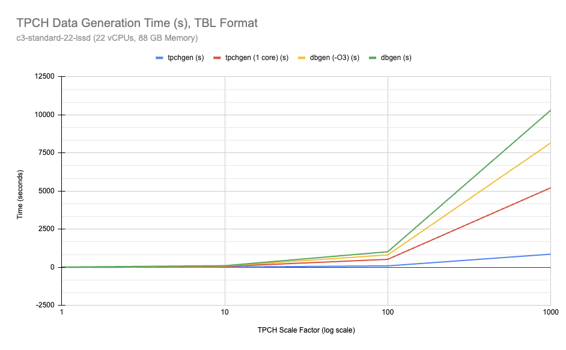

## tpchgen-rs, 居然比DuckDB还快!   
          
### 作者          
digoal          
          
### 日期          
2025-06-17          
          
### 标签          
PostgreSQL , PolarDB , DuckDB , tpch , dbgen , 生成tpch数据 , 内存消耗 , 格式    
          
----          
          
## 背景  
前段时间刚分享了一篇 [《DuckDB 迎来第一波“抄袭者”!》](../202506/20250610_03.md)  说的是一个用Rust写的开源项目`glaredb`, 像极了DuckDB.   
  
今天在其tpch测试的文档中看到另一个Rust写的项目`tpchgen-rs`, 用于生成tpch测试数据集.   
  
TPCH和TPCDS都是测试数据库OLAP性能的标准数据集, 特别常用.  
  
作为趋势, 现在越来越多的数据库支持采用parquet格式在对象存储中存放历史数据, 但是生成tpch/tpcds数据确还是非常麻烦.  
  
DuckDB虽内置tpch/tpcds插件, 但是生成的数据需要先放在DuckDB内置存储中, 还不能直接生成parquet文件, 需要导出一次. 且生成SF巨大的数据可能导致DuckDB OOM.   
  
`tpchgen-rs` 项目解决了这个难题, 可以直接生成parquet文件.  
  
相比DuckDB的生成过程, `tpchgen-rs`更加节省内存, 而且速度更快(快将近十倍).   
  
## tpchgen-rs vs DuckDB  
  
机器: macbook pro m2 16g mem 512g ssd  
  
SF=10   
  
tpchgen-rs 12s vs DuckDB 64s  
  
tpchgen-rs  
```  
$ time tpchgen-cli -s 10 --output-dir sf10-parquet --format=parquet  
  
real	0m12.189s  
user	1m12.524s  
sys	0m4.495s  
  
$ du -sh sf10-parquet  
3.6G	sf10-parquet  
  
$ ll sf10-parquet/  
total 7515824  
-rw-r--r--   1 digoal  staff   2.8K Jun 17 10:19 nation.parquet  
-rw-r--r--   1 digoal  staff   1.4K Jun 17 10:19 region.parquet  
-rw-r--r--   1 digoal  staff    65M Jun 17 10:19 part.parquet  
-rw-r--r--   1 digoal  staff   8.2M Jun 17 10:19 supplier.parquet  
-rw-r--r--   1 digoal  staff   407M Jun 17 10:19 partsupp.parquet  
-rw-r--r--   1 digoal  staff   128M Jun 17 10:19 customer.parquet  
-rw-r--r--   1 digoal  staff   639M Jun 17 10:19 orders.parquet  
drwxr-xr-x  10 digoal  staff   320B Jun 17 10:19 .  
-rw-r--r--   1 digoal  staff   2.4G Jun 17 10:20 lineitem.parquet  
drwxr-x---+ 90 digoal  staff   2.8K Jun 17 10:22 ..  
```  
  
DuckDB  
```  
$ curl https://install.duckdb.org | sh  
$ duckdb 1.db  
D INSTALL tpch;  
D LOAD tpch;  
D .timer on  
D CALL dbgen(sf = 10);  
100% ▕████████████████████████████████████████████████████████████▏   
┌─────────┐  
│ Success │  
│ boolean │  
├─────────┤  
│ 0 rows  │  
└─────────┘  
Run Time (s): real 64.117 user 112.665644 sys 4.259842  
D .q  
  
$ ll 1.db  
-rw-r--r--    1 digoal  staff   2.5G Jun 17 10:18 1.db  
```  
  
怪不得小布老师除了“包分配”(留美JOB)的PG培训, 又看上了Rust培训  
- [《德说-第324期, 技术人才出海"人贩子"模式》](../202504/20250421_01.md)    
- [《德说-第338期, 机会人人平等，但这次只给光脚的loser》](../202505/20250521_01.md)    
  
## 为什么tpchgen-rs这么猛?  
以下翻译自: https://datafusion.apache.org/blog/2025/04/10/fastest-tpch-generator/  
  
TLDR：使用 `tpchgen-rs` 在 1 分钟内搞定`TPC-H SF=100` ，而使用 `dbgen` 则需要 30 分钟以上。  
  
Apache DataFusion社区( https://datafusion.apache.org/ )的 3 名成员使用 Rust 和开源开发构建了tpchgen-rs，这是一个完全开放的 TPC-H 数据生成器，其速度比我们所知的任何其他实现都快 20 倍以上。  
  
现在，在配备 16GB 内存的 Macbook Air M3 上，创建 TPC-H SF=100 数据集仅需 72.23 秒（1.4 GB/秒 😎），而传统系统则dbgen 需要 30 分钟1 （0.05 GB/秒）。在同一台机器上，以Apache Parquet格式创建全部 36 GB 的 SF=100 数据集只需不到 2 分钟，而使用DuckDB则需要 44 分钟。在测试 DataFusion 等分析引擎时，本地运行 TPC-H 查询终于变得方便高效。  
  
  
  
图 1：使用配备 88GB 内存的 22 核 GCP 虚拟机，将比例因子 (SF) 1、10、100 和 1000 的 TPC-H 数据集创建为 8 个(表)独立的 SNAPPY 压缩 parquet 文件所需的时间。比例因子 (SF) 100, tpchgen 耗时 1 分 14 秒， DuckDB耗时 17 分 48 秒。SF=1000, tpchgen耗时 10 分 26 秒，峰值内存占用约 5GB。由于 DuckDB占用 647GB 内存，超过了我们测试机器的 88GB 可用内存，我们无法测量 DuckDB 的运行时间。测试方法请参见 文档 ( https://github.com/clflushopt/tpchgen-rs/blob/main/benchmarks/BENCHMARKS.md )。  
  
这篇博客解释了什么是 TPC-H，以及我们如何将这个老式的 C 语言数据生成器移植到 Rust（ 没错，就是RWIR ( https://www.reddit.com/r/rust/comments/4ri2gn/riir_rewrite_it_in_rust/ ) ），并在几周的兼职工作中优化了它的性能。我们启动这个项目是为了能够在 Apache DataFusion 和 GlareDB ( https://glaredb.com/ )中轻松生成 TPC-H 数据。  
  
### 亲自尝试一下  
该工具在Apache 2.0 许可证下完全开源。请访问tpchgen-rs git库，或在安装 Rust后运行以下命令亲自尝试：  
```  
$ cargo install tpchgen-cli  
  
# create SF=1 in classic TBL format  
$ tpchgen-cli -s 1   
  
# create SF=10 in Parquet  
$ tpchgen-cli -s 10 --format=parquet  
```  
  
### 什么是 TPC-H/dbgen？  
流行的TPC-H基准（通常称为 TPCH）有助于评估数据库系统在OLAP查询（用于构建 BI 仪表板）上的性能。  
  
TPC-H 已成为分析系统事实上的标准。尽管众所周知，由于数据和查询不能很好地代表许多实际用例，TPC-H 存在一些局限性，但大多数分析数据库论文和工业系统仍然使用 TPC-H 查询性能基准作为基准。  
  
该基准测试是在高性能分析系统尚未普及的时代创建的，因此交易处理性能委员会 (Transaction Processing Performance Council) 定义了一套正式的结果验证流程。近年来，由于免费开源数据库系统的广泛普及，用户自行运行并验证 TPC-H 性能已变得十分普遍。  
  
TPC-H 模拟了一个包含八个表的业务环境：REGION、SUPPLIER、CUSTOMER、PARTPART、SUPPORDERS、LINEITEM、NATION和ORDERS。这些表通过规范化模式中的外键链接，代表包含零件、供应商、客户和订单的供应链。基准测试本身包含 22 个 SQL 查询， 包含连接、聚合和排序操作。  
  
2024年PolarDB数据库大学生竞赛也是用的TPCH优化这个课题  
- [《PolarDB for PostgreSQL TPCH 测试与优化tips》](../202406/20240619_01.md)    
- [《性能爽翻了, 在PolarDB plpython中使用DuckDB》](../202411/20241125_02.md)    
- [《穷鬼玩PolarDB RAC一写多读集群系列 | pg_bulkload适配PFS加速批量导入》](../202501/20250102_01.md)    
  
查询针对使用 dbgen（ 一个用C-99之前的方言编写的程序( https://github.com/electrum/tpch-dbgen ) ）创建的数据运行，该程序生成名为TBL 的格式的数据 （如图 2 所示）。它为 8 个表中的每一个表创建特定比例因子（通常缩写为 SF）的数据。表 1 显示了比例因子示例及其对应的数据集大小。比例因子没有理论上的上限。  
```  
103|2844|845|3|23|40177.32|0.01|0.04|N|O|1996-09-11|1996-09-18|1996-09-26|NONE|FOB|ironic accou|  
229|10540|801|6|29|42065.66|0.04|0.00|R|F|1994-01-14|1994-02-16|1994-01-22|NONE|FOB|uriously pending |  
263|2396|649|1|22|28564.58|0.06|0.08|R|F|1994-08-24|1994-06-20|1994-09-09|NONE|FOB|efully express fo|  
327|4172|427|2|9|9685.53|0.09|0.05|A|F|1995-05-24|1995-07-11|1995-06-05|NONE|AIR| asymptotes are fu|  
450|5627|393|4|40|61304.80|0.05|0.03|R|F|1995-03-20|1995-05-25|1995-04-14|NONE|RAIL|ve. asymptote|  
```  
  
图 2 dbgen ：表格LINEITEM的TBL 格式输出示例  
  
比例因子	| 数据大小（TBL）	|数据大小（Parquet）  
---|---|---  
0.1	|103 MB	|31 MB  
1	|1 GB	|340 MB  
10	|10 GB	|3.6 GB  
100	|107 GB	|38 GB  
1000	|1089 GB	|379 GB  
  
表 1：TBL 和Apache Parquet在不同比例因子下的 TPC-H 数据集大小。  
  
### 为什么我们需要一个新的 TPC-H 数据生成器？  
尽管 TPC-H 基准测试存在已知的局限性，但它仍然广为人知，经常用于数据库性能分析。要运行 TPC-H，您必须首先使用 dbgen 加载数据，但这并非理想之选，原因如下：  
- 您必须找到并编译一份已有 15 年历史的 C 程序副本（例如`electrum/tpch-dbgen`）  
- dbgen需要大量时间（图 3）并且不能使用多个CPU核心。  
- 它输出 TBL 格式，通常需要在查询之前加载到数据库中（例如，这里是如何在 Apache DataFusion 中执行此操作 ( https://github.com/apache/datafusion/blob/507f6b6773deac69dd9d90dbe60831f5ea5abed1/datafusion/sqllogictest/test_files/tpch/create_tables.slt.part#L24-L124 ) ）。  
- 该实现对操作环境做出了大量假设，因此很难扩展或嵌入到其他系统中。   
  
  
  
图 3：生成 TBL 格式 TPC-H 数据的时间。蓝色表示tpchgen。红色表示限制为单核。 绿色表示未优化，黄色表示已修改为使用`-O3`优化级别。  
  
由于dbgen非常不方便且耗时太长，因此供应商通常会提供预加载的 TPC-H 数据，例如Snowflake 样本数据、Databricks 样本数据集和DuckDB 预生成数据集。  
  
除了预生成的数据集外，DuckDB 还提供了TPC-H 扩展 ，用于在 DuckDB 中生成 TPC-H 数据集。与当前的替代方案相比，DuckDB 的使用更加便捷，这促使许多研究人员和其他思想领袖使用 DuckDB 来评估新想法。例如，Wan Shen Lim 明确提到，创建 TPC-H 数据集的便捷性是 CMU-799 2025 年春季第一个学生项目选择 DuckDB 的原因之一。  
  
DuckDB TPC-H 扩展虽然有很多好处，但由于以下几个原因，它并不理想：  
- 以专有格式创建数据，需要导出才能在其他系统中使用。  
- 需要大量时间（例如，比例因子 10 需要 17 分钟）。  
- 需要不必要的大量内存（例如，比例因子 10 需要 71 GB）  
  
尽管 DuckDB为更大的因子提供了预先计算的文件，但上述限制使得在笔记本电脑或标准工作站上生成比例因子 100 及以上是不切实际的。  
  
### 为什么使用 Rust？  
实际上，我们使用 Rust 是因为我们希望将数据生成器集成到Apache DataFusion和GlareDB中。然而，我们也认为 Rust 优于 C/C++，因为它的性能相当，但程序员的生产力却高得多（图 4）。这里的生产力指的是易于优化和添加多线程，而不会引入难以调试的内存安全或并发问题。  
  
虽然 Rust 确实允许不安全的内存访问（例如，省略边界检查），但当性能需要时，我们的实现是完全内存安全的。唯一的不安全代码用于跳过已知 ASCII 字符串的 UTF8 验证。  
  
  
  
图 4 ：波士顿大学 MiDAS 2024 年秋季（数据系统研讨会）的 Lamb 系统语言演化理论，录音。特别感谢 KurtFehlhauer  
  
### tpchgen-cli 开发历程  
我们团队在公开的环境下共同完成了这个项目，用了几周的时间。Wan Shen Lim指出了TPC-H 数据集创建便捷的优势 ，并建议我们在 2025 年 2 月 11 日尝试 Java 移植，这启发了这个项目。几天后的2 月 16 日， Achraf 进行了首次提交，Andrew 和 Sean 于 2025 年 3 月 8 日开始提供帮助，我们于 2025 年 3 月 30 日发布了 0.1 版本。  
  
#### 优化单线程性能  
Archaf完成了端到端一致性测试，以确保正确性，并于 2025 年 3 月 15 日进行了初始cli 检查。  
  
在 Macbook Pro M3（2023 年 11 月）上，初始性能数据实际上比移植的原始 Java 实现还要慢😭。这并不奇怪，因为第一个版本的重点是实现字节对字节的兼容移植，并且了解性能缺陷以及如何解决它们。  
  
比例因子	| 时间  
---|---  
1		|0分10.307秒  
10		|1分26.530秒  
100		|14分56.986秒  
  
表 2 ：运行初始 tpchgen-cli的性能，使用以下方法测量 `time target/release/tpchgen-cli -s $SCALE_FACTOR`  
  
有了坚实的基础，我们开始使用 Rust 的底层内存管理来优化代码，以在安全保留内存的同时提升性能。我们花了几天时间研究底层细节，最终实现了一系列教科书般的优化：  
- 避免启动开销，  
- 不 复制字符串（还有更多 PR）  
- Rust 的零开销日期抽象  
- 静态字符串（具有静态生存期，完全安全）  
- 避免虚函数调用开销的泛型  
- 将查找从运行时移至加载时  
  
在撰写本文时，单线程性能现在比初始版本快 2.5 倍至 2.7 倍，如表 3 所示。  
  
比例因子	|时间	|速度快几倍  
---|---|---  
1	|0分4.079秒	|2.5倍  
10	|0分31.616秒	|2.7倍  
100	|5分28.083秒	|2.7倍  
  
表 3：单线程tpchgen-cli性能，测量方法如下`time target/release/tpchgen-cli -s $SCALE_FACTOR --num-threads=1`  
  
#### 多线程  
然后，我们应用了Rust 的无畏并发性 —— 使用一个小型 PR（272 个净新行），我们更新了相同的内存安全代码以使用多个线程运行，并使用tokio 作为线程调度程序消耗有限的内存。  
  
如表 4 所示，进行此更改后，tpchgen-cli 可在 32 秒内生成完整的 SF=100 数据集（即 3.3 GB/秒🤯）。进一步调查显示，在 SF=100 时，我们的生成器实际上是受 IO 限制的（而 dbgen或duckdb 则并非如此）—— 它创建数据的速度比写入 SSD 的速度更快。tpchgen 写入/dev/null 时，可在 25 秒内生成整个数据集（即 4 GB/秒）。  
  
比例因子	| 时间	| 比初始实施速度快几倍	| 比优化的单线程快几倍  
---|---|---|---  
1	| 0分1.369秒	| 7.3倍	| 3倍  
10	| 0分3.828秒	| 22.6倍	| 8.2倍  
100	| 0分32.615秒	| 27.5倍	| 10倍  
100（到/dev/null）	| 0分25.088秒	| 35.7倍	| 13.1倍  
  
表 4：tpchgen-cli（多线程）性能测量结果 `time target/release/tpchgen-cli -s $SCALE_FACTOR`  
  
使用 Rust 和异步流，数据生成器也能完全流式传输：内存占用不会随着数据大小/比例因子 的增加而增加。DuckDB 生成器所需的内存似乎远远超出了开发者笔记本电脑的普遍可用内存，并且内存占用会随着比例因子的增加而增加。tpchgen-cli 在具有 16GB 内存的机器上（假设有足够的存储容量），完全可以创建 SF=10000 或更大的数据。  
  
#### 直接写parquet  
此时，tpchgen-cli可以非常快速地生成 TBL 格式。但是，如上所述，使用 TBL 格式会比较麻烦，因为  
- 没有head  
- 它类似于 CSV，但分隔符是`|`  
- `|`每行在换行符前都以一个额外的分隔符结束🙄  
- 据我们所知，没有哪个系统可以在没有额外配置的情况下读取它们。  
  
接下来，我们添加了对 CSV生成的支持（特别感谢Datalayers 的 niebayes发现并修复了 错误），其速度与 TBL 相同。虽然 CSV 文件比 TBL 更加标准化，但它们在加载之前仍必须进行解析，并且自动类型推断可能无法推断出 TPC-H 基准测试所需的类型（例如浮点数与十进制数）。  
  
更有用的是一种类型化、高效的列式存储格式，例如所有现代查询引擎都支持的 Apache Parquet。因此，我们创建了一个 `tpchgen-arrow` crate 来直接创建Apache Arrow数组，然后又编写了一个 300 行的 PR来将这些数组提供给 Rust Parquet 写入器，同样使用 tokio 进行并行化但内存受限的工作。  
  
这种方法简单、快速且可扩展，如表 5 所示。尽管创建 Parquet 文件的计算成本明显高于 TBL 或 CSV，但 tpchgen-cli 可以在不到 45 秒的时间内创建完整的 `SF=100 parquet` 格式数据集。  
  
比例因子	|生成 Parquet 的时间	| 与 tbl 生成相比的速度  
1	|0分1.649秒	|0.8倍  
10	|0分5.643秒	|0.7倍  
100	|0分45.243秒	|0.7倍  
100（到/dev/null）	|0分45.153秒	|0.5倍  
  
表 5：tpchgen-cli使用以下方法测量的 Parquet 生成性能 `time target/release/tpchgen-cli -s $SCALE_FACTOR --format=parquet`  
  
#### 结论  
在短短几天内，我们与几位数据库专家携手，借助 Rust 的强大功能，构建了一个比现有系统好 10 倍的系统。我们希望它能够激发更多使用 TPC-H 数据集的分析系统研究，并希望人们能够用它来构建更优秀的系统。例如，Sean 已经为 GlareDB 添加了按需建表功能。欢迎加入我们，并通过 https://github.com/clflushopt/tpchgen-rs 提供帮助 。  
  
我们是在 Apache DataFusion 上以不同身份共事时相识的。如果您正在寻找一个志同道合的数据库黑客社区，欢迎加入我们。我们正在将其集成到 DataFusion 中（请参阅apache/datafusion#14608），如果您有兴趣加入我们🎣  
  
关于作者：  
- Andrew Lamb 是InfluxData的一名工程师，也是Apache DataFusion和Apache Arrow的 PMC 成员。  
- Achraf B 是Optable的软件工程师，负责数据基础设施工作。  
- Sean Smith（ 是GlareDB的创始人，专注于构建快速分析数据库。  
  
  
## 参考  
https://glaredb.com/docs/integrations/data-generation/tpch  
  
https://github.com/clflushopt/tpchgen-rs  
  
https://datafusion.apache.org/blog/2025/04/10/fastest-tpch-generator/  
  
