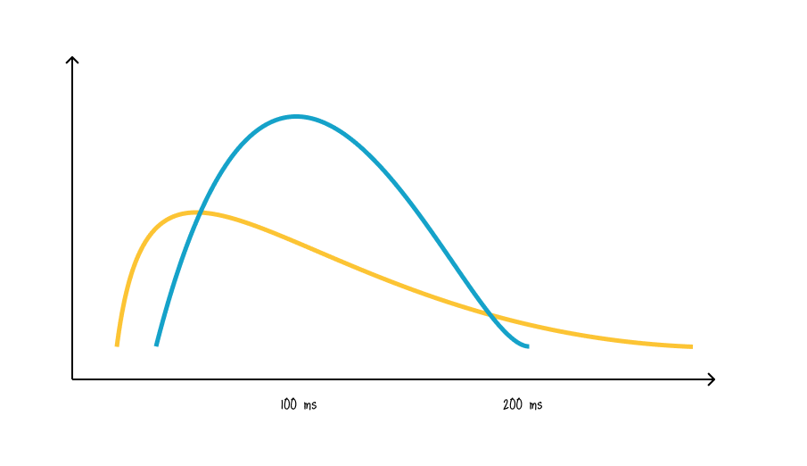

## 数学真美, 可这样估算PostgreSQL SQL响应时间 p95  
          
### 作者          
digoal          
          
### 日期          
2025-06-17          
          
### 标签          
PostgreSQL , PolarDB , DuckDB , AI , 数学 , 数据分布 , SQL响应时间 , p95 , 中位数 , 平均值 , 最大值 , 最小值 , 标准方差 , 和 , 记录条数    
          
----          
          
## 背景    
PostgreSQL pg_stat_statements 原生没有统计SQL执行时间、执行计划时间的p99, p95, p90.   
  
这使得我们很难评估数据库在执行某些SQL、生成某些SQL的执行计划的耗时质量, 很难给出响应速度质量的数据.   
  
对于KV数据库、OLTP数据库, p99, p95, p90其实都是很好的响应速度质量的衡量标准.    
  
好在 pg_stat_statements 插件统计了 : `执行次数、最小值、最大值、平均值、标准方差、总和`    
  
有了这些值, 如果还知道数据分布形态, 就可以根据p99, p95, p90与以上值的关系, 推导出近似的p99, p95, p90.    
  
https://www.postgresql.org/docs/current/pgstatstatements.html  
  
---   
  
先问一下AI, 让AI列出有哪些数据分布形态, 每种形态的算法.    
  
## 已知“记录次数、最小值、最大值、平均值、标准方差、总和”, 如何根据数据分布形态, 求p99, p95, p90低于多少.  先列举有哪些常见的数据分布形态, 然后给出计算公式.  
  
好的，理解您的需求。在已知“记录次数、最小值、最大值、平均值、标准方差、总和”这些汇总统计量的情况下，要计算 P99、P95、P90（即低于多少），关键在于**假设或确定数据的分布形态**。因为这些汇总统计量，尤其是平均值和标准差，对于不同的分布形态有不同的解读，并且无法完全刻画非正态分布的形状。  
  
仅仅知道这些汇总统计量，是无法**精确**计算任意分布的百分位数的。最常见且可操作的方法是**假设数据服从某种常见分布**，然后利用该分布的性质来估算百分位数。  
  
以下列举常见的几种数据分布形态，并给出在**假设其服从该分布**的前提下，如何利用已知信息（如果足够）来计算 P99、P95、P90。  
  
**重要提示：**  
  
* **分布假设是关键：** 在没有原始数据的情况下，任何百分位数的计算都是基于对数据分布形态的假设。如果假设的分布与实际数据分布不符，计算结果将不准确。  
* **非正态分布的局限性：** 对于许多非正态分布，仅仅知道平均值和标准差是不足以确定其完整参数的，因此无法直接计算百分位数。通常还需要其他信息，或者通过迭代拟合来估计参数。  
* **经验法则的限制：** P99、P95、P90 这样的百分位数，通常需要依赖累积分布函数（CDF）的逆函数（分位数函数/PPF）来计算。  
  
  
  
### 常见的几种数据分布形态及百分位数计算方法  
  
#### 1. 正态分布 (Normal Distribution)  
  
* **特点：** 钟形曲线，左右对称，峰值位于均值处。自然界和社会科学中许多现象的分布近似正态。  
* **必要参数：** 均值 ($\mu$) 和标准差 ($\sigma$)。  
* **P99, P95, P90 的求法 (已知 $\mu, \sigma$):**  
    对于正态分布，百分位数与 Z 值（标准分数）密切相关。  
    * **Z 值公式：** $Z = \frac{X - \mu}{\sigma}$  
    * **百分位数公式：** $X_p = \mu + Z_p \times \sigma$  
  
    你需要查找标准正态分布表中对应累积概率的 Z 值：  
    * **P90 对应的 Z 值 ($Z_{0.90}$):** 约 1.282  
    * **P95 对应的 Z 值 ($Z_{0.95}$):** 约 1.645  
    * **P99 对应的 Z 值 ($Z_{0.99}$):** 约 2.326  
  
    **计算公式：**  
    * **P90 = 平均值 + 1.282 * 标准方差**  
    * **P95 = 平均值 + 1.645 * 标准方差**  
    * **P99 = 平均值 + 2.326 * 标准方差**  
  
    **适用性：** 当数据大致对称，且大部分数据集中在平均值附近时，可以考虑使用正态分布假设。  
  
#### 2. 对数正态分布 (Log-Normal Distribution)  
  
* **特点：** 如果一个随机变量 $X$ 的对数 $\ln(X)$ 服从正态分布，则 $X$ 服从对数正态分布。常用于描述非负且偏右的数据，如收入、寿命、金融资产价格等。  
* **必要参数：** 对数形式的均值 ($\mu_L$) 和标准差 ($\sigma_L$)。  
* **从已知数据推导参数：**  
    如果你的“平均值 ($\mu$)”和“标准方差 ($\sigma$)”是原始数据的均值和标准差，可以尝试推导对数形式的参数：  
    $$\sigma_L = \sqrt{\ln\left(1 + \left(\frac{\sigma}{\mu}\right)^2\right)}$$   $$\mu_L = \ln(\mu) - \frac{1}{2}\sigma_L^2$$  
    **注意：** 这种推导假设了原始数据真的是从对数正态分布中抽取的。  
* **P99, P95, P90 的求法:**  
    1.  首先，根据原始数据的平均值 $\mu$ 和标准方差 $\sigma$ 计算出 $\mu_L$ 和 $\sigma_L$。  
    2.  然后，使用与正态分布相同的 Z 值：  
        * $Z_{0.90} \approx 1.282$  
        * $Z_{0.95} \approx 1.645$  
        * $Z_{0.99} \approx 2.326$  
    3.  百分位数公式为：$X_p = e^{\mu_L + Z_p \times \sigma_L}$  
  
    **计算公式：**  
    * **P90 = $e^{(\mu_L + 1.282 \times \sigma_L)}$**  
    * **P95 = $e^{(\mu_L + 1.645 \times \sigma_L)}$**  
    * **P99 = $e^{(\mu_L + 2.326 \times \sigma_L)}$**  
  
    **适用性：** 当数据是非负的，且明显右偏（例如，最小值远小于平均值，平均值远小于最大值，或者直方图呈现右拖尾），可以考虑对数正态分布。  
  
#### 3. 均匀分布 (Uniform Distribution)  
  
* **特点：** 在一个给定区间 $[a, b]$ 内，所有取值的概率密度都是相等的。  
* **必要参数：** 区间下限 $a$ 和上限 $b$。  
* **从已知数据推导参数：**  
    * 平均值 ($\mu$) = $(a+b)/2$  
    * 标准方差 ($\sigma$) = $\sqrt{(b-a)^2/12}$  
    * **问题：** 仅知道平均值和标准差，无法唯一确定 $a$ 和 $b$。但如果你有**最小值**和**最大值**，那么可以直接将它们作为 $a$ 和 $b$。  
* **P99, P95, P90 的求法 (已知 $a, b$):**  
    对于均匀分布，第 $p$ 个百分位数 $X_p$ 等于：  
    $X_p = a + p \times (b - a)$  
  
    **计算公式：**  
    * **P90 = 最小值 + 0.90 * (最大值 - 最小值)**  
    * **P95 = 最小值 + 0.95 * (最大值 - 最小值)**  
    * **P99 = 最小值 + 0.99 * (最大值 - 最小值)**  
  
    **适用性：** 当你知道数据的确切最小值和最大值，并且数据在整个范围内均匀分布（例如，随机数生成器产生的数据），可以考虑均匀分布。  
  
#### 4. 指数分布 (Exponential Distribution)  
  
* **特点：** 描述泊松过程中事件之间的时间间隔。具有“无记忆性”。数据是非负且严重右偏。  
* **必要参数：** 速率参数 $\lambda$。  
* **从已知数据推导参数：**  
    * 平均值 ($\mu$) = $1/\lambda \implies \lambda = 1/\mu$  
    * 标准方差 ($\sigma$) = $1/\lambda \implies \lambda = 1/\sigma$  
    * **注意：** 指数分布的平均值和标准方差在理论上是相等的。如果你的“平均值”和“标准方差”非常接近，且数据是非负、右偏的，可以尝试假设为指数分布，取 $\lambda = 1 / \text{平均值}$。  
* **P99, P95, P90 的求法:**  
    百分位数 $X_p = \frac{-\ln(1-p)}{\lambda}$  
  
    **计算公式：**  
    * **P90 = $-\ln(0.1) / \lambda$**  
    * **P95 = $-\ln(0.05) / \lambda$**  
    * **P99 = $-\ln(0.01) / \lambda$**  
  
    **适用性：** 适用于描述事件发生间隔时间，或寿命数据，特点是数据集中在低值，并快速衰减。  
  
#### 5. 经验分布 (Empirical Distribution) - **推荐方法 (如果有原始数据)**  
  
如果你的“记录次数”很大，并且“平均值、标准方差、最小值、最大值、总和”是来自**原始数据**的统计量，那么最准确的方法是利用**经验分布**来计算百分位数。  
  
* **方法：**  
    1.  **收集原始数据：** 这是最关键的一步。如果仅仅是汇总统计量，无法使用此方法。  
    2.  **排序：** 将所有原始数据点按升序排列。  
    3.  **查找位置：**  
        * P90 位于排序后数据列表的第 $N \times 0.90$ 个位置（N为记录次数）。  
        * P95 位于排序后数据列表的第 $N \times 0.95$ 个位置。  
        * P99 位于排序后数据列表的第 $N \times 0.99$ 个位置。  
        * 如果位置不是整数，通常会进行线性插值，或者取相邻的两个值。  
  
* **优点：** 不需要假设任何特定的理论分布，直接反映数据的真实分布情况。  
* **缺点：** 必须有原始数据。在只有汇总统计量的情况下无法使用。  
  
  
  
### 如何选择合适的分布形态？  
  
在只有汇总统计量而没有原始数据的情况下，选择合适的分布形态是具有挑战性的。你需要根据数据的**上下文背景知识**和这些统计量提供的**有限信息**进行推断：  
  
1.  **最小值和最大值：**  
    * 如果数据范围有限，且集中在某个区间内，可以考虑**均匀分布**（如果数据分布平坦）或**截断正态分布**。  
    * 如果最小值接近0且数据明显右偏（例如，平均值远大于最小值，最大值远大于平均值），则可能倾向于**对数正态分布**或**指数分布**。  
2.  **平均值和标准方差的关系：**  
    * 如果**平均值 $\approx$ 标准方差**，可能暗示**指数分布**（如果数据右偏）。  
    * 如果**平均值 $\approx$ 方差（标准方差的平方）**，可能暗示**泊松分布**（如果数据是计数，且离散）。  
3.  **数据类型：**  
    * **连续数据：** 正态、对数正态、指数、伽马、韦伯等。  
    * **离散数据：** 泊松、二项等。  
4.  **业务理解：** 了解数据代表什么。例如，如果是等待时间，可能适合指数分布；如果是寿命数据，可能适合韦伯分布或对数正态分布。  
  
**最保险的做法：** 如果你无法确定数据的实际分布，而又没有原始数据，那么任何基于假设分布的百分位数计算都带有**很大的不确定性**。在这种情况下，最好**明确指出你所做的分布假设**，并理解这只是一个估算。  
  
**强烈建议：** 如果有可能，尽量获取原始数据。有了原始数据，你可以进行直方图分析、Q-Q 图等可视化手段来判断分布形态，或者直接使用非参数方法计算百分位数，这将是最准确可靠的方式。  
  
---  
  
## 然后, 我们假设响应时间的数据符合正态分布, 使用公式即可求出近似的p99, p95, p90.    
  
下面内容翻译自: https://www.pgmustard.com/blog/approximate-the-p99-of-a-query-with-pgstatstatements  
  
我最近看到一个关于 pg_stat_statements 的功能请求( https://www.pixelstech.net/article/1747708863-openai%3a-scaling-postgresql-to-the-next-level )，希望它能够跟踪查询的百分位数性能，例如 p95（第 95 个百分位数）或 p99（第 99 个百分位数）。  
  
那当然很棒，但目前还无法实现。目前，有一种统计上不太可靠但实际可行的方法（我的专长）可以使用 pg_stat_statements 中的平均值和标准差列来近似计算。  
  
### 为什么需要p99 ？  
当我们想知道我们的用户在不同的查询中的体验如何时，如果我们只根据平均时间来看待问题，我们可能会错过一些问题。  
  
例如，假设一个查询平均耗时 100 毫秒，但有 1% 的时间超过 500 毫秒（其 p99），而第二个查询平均耗时 110 毫秒，但 p99 为 200 毫秒。尽管第一个查询平均速度更快，但很可能会导致用户更加不满。  
  
简化的图表，有两个未标记的轴和两条曲线，一条曲线峰值较早但尾部较长，另一条曲线更呈正态分布，峰值较高但尾部较短  
  
  
  
### 简要回顾统计数据  
标准差( https://en.wikipedia.org/wiki/Standard_deviation )衡量的是与平均值之间的差异量。数值分布越广，标准差就越大。  
  
`pg_stat_statements` 包含 `mean_exec_time`（平均执行时间）和`mean_plan_time`（平均计划时间）列，但没有中位数对应值。我们将用于近似计算的其他列是`stddev_exec_time`和`stddev_plan_time`。  
  
在完全正态分布( https://en.wikipedia.org/wiki/Normal_distribution )的数据集中，p90 比平均值高出`1.28` 个标准差，p95 为`1.65`，p99 为`2.33`。  
  
不过，我们的查询时间可能并非呈正态分布。事实上，许多查询在慢端会有更长的尾部，有些查询则呈现多峰分布（由于数据分布不均匀和查询计划不同等原因，可能会出现聚类）。  
  
话虽如此，尽管我们的许多查询时间并不呈正态分布，但具有高 p99 的查询很可能也具有较高的平均值加上几个标准差，因此，如果我们假设正态分布来近似 p99，则结果应该在方向上是正确的。  
  
### 直接给我查询  
以下是根据近似 p99 时间获取 top50 的查询：  
```  
select	mean_exec_time::int,  
	mean_plan_time::int,  
	stddev_exec_time::int,  
	stddev_plan_time::int,  
	((mean_exec_time + mean_plan_time) +   
	2.33 * sqrt(stddev_exec_time^2 + stddev_plan_time^2))::int   
	as approx_p99,   
	calls,  
	query  
from	pg_stat_statements  
where	calls > 100  
order by approx_p99 desc  
limit 50;  
```  
  
为了近似计算，我们将平均执行时间和计划时间相加，然后加上它们标准差平方和的平方根的 2.33 倍（数学真棒）。如果您想近似不同的百分位数，只需代入 2.33 倍即可。  
  
由于时间统计以毫秒为单位，我喜欢将它们四舍五入为整数，以便于扫描（当然，以牺牲一点精度为代价）。  
  
我还喜欢过滤掉那些执行频率不高的查询，因为我们通常希望专注于更常见的查询。此外，在低流量的情况下，标准差和百分位指标自然意义不大。  
  
如果您运行上述程序并注意到您的计划时间全部为零，您可能需要查看 `pg_stat_statements` `track_planning` 设置，该设置默认为关闭(不统计plan time)。  
  
### 替代方案  
虽然我认为这提供了一个很好的代理指标，并且可能比仅按平均时间排序更有用，但也有一些非常合理的替代方案。  
  
例如，从应用程序或用户的角度监控 p95 和 p99 类型指标可能会更好，例如在 APM（应用程序性能监控）或 RUM（真实用户监控）工具中。  
  
在以数据库为中心的方面，另一个选择是`pg_stat_monitor`扩展，它包含一个直方图功能，可以更准确地计算百分位数。不过，该扩展相对较新（至少与 pg_stat_statements 相比！），因此缺乏实战经验，并且在许多环境中尚未可用。  
  
我之前写过一篇文章介绍`pg_stat_monitor`扩展  
- [《PostgreSQL pg_stat_statements AWR 插件 pg_stat_monitor , 过去任何时间段性能分析 [推荐、收藏]》](../202104/20210415_01.md)    
  
### 结论  
简而言之，我们可以使用 pg_stat_statements 中的平均值和标准差列来近似计算 p95 和 p99 等百分位统计数据。在某些用例中，这比单纯的平均时间更有助于排序（或监控）。  
  
如上所述，这种方法确实存在明显的缺陷，尤其是数据不太可能呈正态分布。因此，最好明确地将其标记为`近似值`。  
  
    
