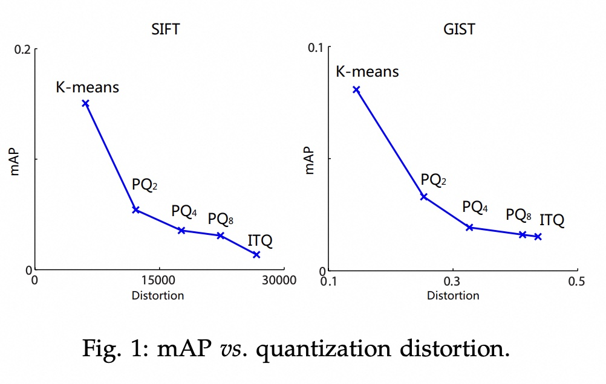
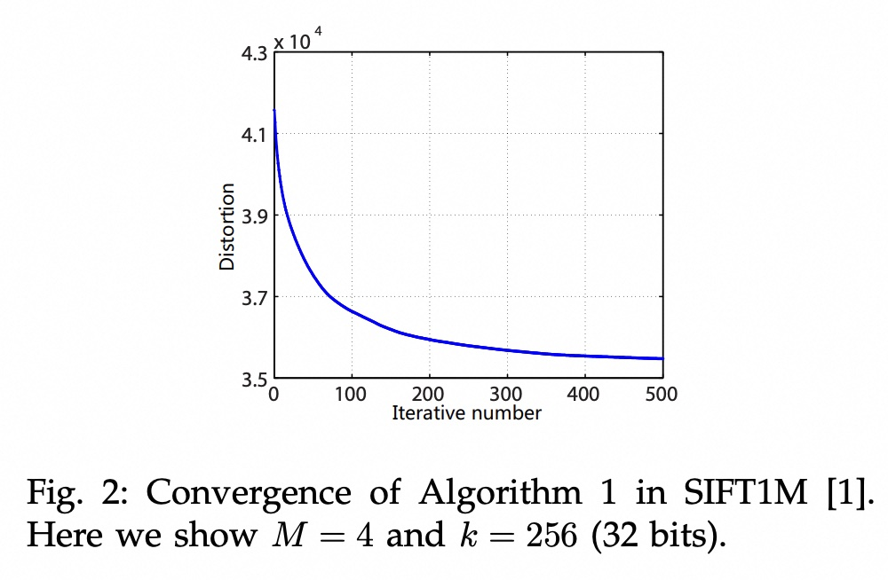

## AI论文解读 | Optimized Product Quantization
        
### 作者        
digoal        
        
### 日期        
2025-06-26        
        
### 标签        
PostgreSQL , PolarDB , DuckDB , AI , 论文解读        
        
----        
        
## 背景  
      
https://www.microsoft.com/en-us/research/wp-content/uploads/2013/11/pami13opq.pdf        
  
      
提示:        
```        
读懂《Optimized Product Quantization》这篇论文需要提前掌握哪些基础知识, 请使用中文给我讲一下这些基础知识, 尽量通熟易懂, 可以使用markdown支持的图形增加解释性.        
        
使用中文通熟易懂的解读《Optimized Product Quantization》这篇论文, 关键内容请深入讲解, 可以使用markdown支持的图形增加解释性.        
        
使用中文提取《Optimized Product Quantization》论文中一些重要的术语并详细解释, 可以使用markdown支持的图形示增加解释性.        
```        
        
## 1 前置知识 
  
好的，为了完全理解《Optimized Product Quantization》(OPQ)这篇论文，你需要掌握一些关于**机器学习、线性代数和信息论**的基础知识。这篇论文的核心是提出一种更优的向量量化方法，以服务于大规模的 **近似最近邻（Approximate Nearest Neighbor, ANN）** 搜索。

我会将所需的基础知识分为三个层面：**应用背景**、**核心概念**和**数学工具**，并尽量用通俗易懂的方式为你讲解。

-----

### 层面一：应用背景 (为什么要做这件事？)

#### 1\. 近似最近邻 (Approximate Nearest Neighbor, ANN) 搜索

想象一下，你有一个包含十亿张图片的巨大图库。现在你上传一张新的图片，想在图库里找到和它最相似的10张图片。

  * **精确搜索 (Exact Search)**：计算你的图片和图库里所有十亿张图片的相似度（距离），然后排序，找出最近的10张。这个方法结果最准，但速度太慢，无法接受。
  * **近似搜索 (ANN)**：不追求100%精确，而是设计一种高效的算法，能**非常快**地找到**足够相似**（很大概率是真正的“最近邻”）的图片。

 OPQ这篇论文研究的技术，就是一种顶级的ANN方法。它通过“压缩”数据（量化）来极大地加速搜索过程  。

```mermaid
graph TD
    subgraph "精确搜索 (慢但准)"
        A[查询向量 Q] --> B1[计算 Q 与 D1 的距离];
        A --> B2[计算 Q 与 D2 的距离];
        A --> B3[...];
        A --> BN[计算 Q 与 D_n 的距离];
        subgraph 所有数据点 D1...Dn
            B1
            B2
            B3
            BN
        end
        BN --> C[排序所有距离];
        C --> D[返回Top-K结果];
    end

    subgraph "近似搜索 (快且效果好)"
        E[查询向量 Q] --> F{高效索引结构};
        F --> G[快速筛选出少量候选];
        G --> H[仅在候选中计算距离并排序];
        H --> I[返回Top-K结果];
    end
```

### 层面二：核心概念 (论文在谈论什么？)

#### 1\. 向量量化 (Vector Quantization, VQ)

这是理解本论文的**核心中的核心**。

 简单来说，向量量化就是一种数据压缩技术，它将高维空间中的点，用有限的几个“代表点”（称为**码字/Codeword**）来近似表示。所有这些代表点的集合，称为**码本 (Codebook)**  。

  * **好比**：我们用“深红色”、“天蓝色”、“草绿色”等有限的词汇来描述世界上成千上万种颜色。每个具体的颜色向量，都会被映射到离它最近的那个代表色上。
  *  **目标**：找到一套最优的码本，使得所有数据点用对应的码字来替代后，信息的损失（即**量化误差/Distortion**）最小   。论文中，这个误差是用原始向量和其替代码字之间的欧氏距离平方和来衡量的  。


```mermaid
graph TD
    subgraph 连续的向量空间
        direction LR
        A1(x1); A2(x2); A3(x3); A4(x4); A5(x5); A6(x6); A7(x7)
    end
    subgraph "有限的码本 (Codebook)"
        direction LR
        C1(码字 c1); C2(码字 c2); C3(码字 c3);
    end

    A1 -- 映射 --> C1;
    A2 -- 映射 --> C1;
    A3 -- 映射 --> C2;
    A4 -- 映射 --> C2;
    A5 -- 映射 --> C2;
    A6 -- 映射 --> C3;
    A7 -- 映射 --> C3;

    linkStyle 0,1,2,3,4,5,6 stroke:#999,stroke-width:2px,fill:none;
```

#### 2\. K-Means 聚类

 K-Means是最经典、最基础的向量量化算法   。给定一堆数据点和希望得到的码字数量`k`，K-Means通过迭代的方式找到`k`个聚类中心（也就是码字），使得所有点到其所属中心（最近的码字）的距离平方和最小。这完美符合VQ的目标  。

#### 3\. 乘积量化 (Product Quantization, PQ)

 这是OPQ要优化的对象，是论文的直接基础。PQ是一种非常巧妙的VQ方法，它解决了传统VQ码本过大的问题  。

  * **问题**：如果我想用 256 个码字来表示数据，K-Means可以轻松做到。但如果我想用 $2^{64}$ (一个巨大的数字) 个码字来获得更高精度呢？存储这么多高维码字是不现实的。
  * **PQ的解决思路**：**分而治之**。
    1.   **分解 (Decompose)**：将一个高维向量（比如128维）切成 `M` 段不重叠的子向量（比如 `M=8` 段，每段16维）  。
    2.   **量化 (Quantize)**：对**每一段**子向量**独立地**进行VQ（比如用K-Means），为每个子空间都生成一个小的码本（比如每个子码本含 `k=256` 个16维的码字）  。
    3.   **组合 (Product)**：一个原始128维向量的码字，就是由它8个子向量各自的码字拼接而成的。最终，总的码本大小是 $k^M = 256^8 = (2^8)^8 = 2^{64}$，这是一个天文数字！但我们只需要存储 $M \\times k$ 个子码字，存储开销非常小  。


```mermaid
graph TD
    subgraph 原始128维向量 x
        direction LR
        x1["子向量 x_1 (16维)"]
        x2["子向量 x_2 (16维)"]
        x3[...]
        x8["子向量 x_8 (16维)"]
    end

    subgraph 8个独立的子码本
        C1["子码本 C_1 (k=256个)"]
        C2["子码本 C_2 (k=256个)"]
        C3[...]
        C8["子码本 C_8 (k=256个)"]
    end
    
    x1 -- VQ --> c1[码字 c_1 from C_1];
    x2 -- VQ --> c2[码字 c_2 from C_2];
    x8 -- VQ --> c8[码字 c_8 from C_8];

    subgraph "最终码字 c (128维)"
        direction LR
        c1'["c_1"]
        c2'["c_2"]
        c3'[...]
        c8'["c_8"]
    end
    
    c1 --> c1';
    c2 --> c2';
    c8 --> c8';

    style C1 fill:#f9f,stroke:#333,stroke-width:2px
    style C2 fill:#f9f,stroke:#333,stroke-width:2px
    style C8 fill:#f9f,stroke:#333,stroke-width:2px
```

 **PQ的问题**：如何“切分”原始向量是至关重要的，但之前的PQ方法通常是随意切分，或者依赖于数据的先验知识   。而这篇论文的**核心贡献**就是找到一个**最优的“切分”（旋转）方法**，来最小化量化误差  。

### 层面三：数学工具 (论文用什么方法解决问题？)

#### 1\. 线性代数

  *  **正交矩阵 (Orthogonal Matrix, R)**：这是论文中实现“最优切分”的关键。一个正交矩阵代表了对向量空间的一种**旋转或翻转**   。它的关键性质是**不改变向量的长度和向量间的距离**。论文通过引入一个正交矩阵`R`来在量化前先“旋转”数据，从而找到一个最优的坐标系，在这个坐标系下再进行PQ切分，效果会更好  。

  *  **奇异值分解 (Singular Value Decomposition, SVD)**：一种强大的矩阵分解技术。在论文的“非参数化解法”中，当固定码本求解最优旋转矩阵`R`时，问题会转化为一个经典的 **“正交普鲁克问题” (Orthogonal Procrustes problem)**   ，而这个问题可以通过SVD得到一个完美的解析解  。

  *  **主成分分析 (Principal Component Analysis, PCA)**：PCA是一种常用的降维和数据预处理技术。它通过SVD或计算协方差矩阵的特征向量，找到数据方差最大的方向。在论文的“参数化解法”中，PCA被用来 **解耦(de-correlate)** 数据的各个维度，以满足其理论推导中的“子空间独立性”条件  。

#### 2\. 概率与统计

  *  **高斯分布 (Gaussian Distribution)**：在“参数化解法”中，论文假设数据服从高斯分布   。这是一个很强的假设，但在该假设下，复杂的量化误差问题可以被极大地简化，从而推导出解析解，并揭示了最优切分应满足的两个准则：**独立性 (independence)** 和 **均衡性 (balance)**  。

  *  **协方差矩阵 (Covariance Matrix, Σ)**：它描述了数据各个维度之间的相关性以及每个维度自身的方差   。这是PCA和参数化解法的重要输入。论文的“均衡性”准则，指的就是让旋转后的各个子空间的协方差矩阵的行列式（可以理解为子空间中数据的“体积”）尽可能相等  。

#### 3\. 优化理论

  *  **迭代优化 / 交替最小化 (Iterative Optimization / Alternating Minimization)**：论文的非参数化解法是一个复杂的优化问题，因为它需要同时优化旋转矩阵`R`和PQ的码本`C`  。这种方法采用的策略是：
    1.   **固定 `R`**，优化 `C` (这步就等同于在旋转后的数据上做一次标准的PQ)  。
    2.   **固定 `C`**，优化 `R` (这步通过SVD解决)  。
    3.   **重复**以上两步，直到结果收敛  。

### 总结

要读懂这篇论文，你的知识储备应该像一个金字塔：

  * **塔顶 (直接相关)**：**Product Quantization (PQ)** 的原理和流程。
  * **中间层 (核心理论)**：**Vector Quantization (VQ)** 的概念、目标（最小化量化误差）以及 **K-Means** 算法。
  * **地基 (数学工具)**：
      * **线性代数**：理解**正交矩阵**为何能代表空间旋转，**SVD**和**PCA**是如何工作的。
      * **概率统计**：了解**高斯分布**和**协方差矩阵**的基本概念。
      * **优化**：知道什么是**迭代优化**思想。

如果你能对上述概念，特别是**VQ**和**PQ**有扎实的理解，再辅以线性代数的基础，就能顺利地抓住这篇论文的核心思想和贡献了。
  
## 2 解读论文 
  
好的，我们来一起用通俗易懂的方式，深入解读《Optimized Product Quantization》(OPQ) 这篇经典的计算机视觉论文。

### 论文速览：一句话讲明白它解决了什么问题

传统的“乘积量化”(PQ) 方法在压缩数据时，如何对高维数据进行“切分”会极大地影响最终效果，但之前的做法比较随意。这篇论文的核心贡献就是，**提出了一套优化方法，通过在切分前先对数据进行“旋转”，来找到一个最佳的切分方式，从而显著降低压缩带来的信息损失，提升搜索精度**。

-----

### 背景知识：理解OPQ前的必修课

要理解OPQ的精妙之处，我们必须先搞懂它的“前身”——向量量化（VQ）与乘积量化（PQ）。

#### 1\. 向量量化 (Vector Quantization, VQ)

想象一下，你有一个巨大的调色盘，上面有无数种颜色。为了方便管理和描述，你决定只挑选出256种“代表色”（比如“中国红”、“蒂芙尼蓝”等）。之后，任何一种颜色，你都用离它最近的那个代表色来称呼。

这个过程就是向量量化：

  * **向量 (Vector)**：每一种具体的颜色，在计算机里就是一个高维向量（如RGB值）。
  * **码本 (Codebook)**：256种“代表色”的集合。
  * **码字 (Codeword)**：码本中的每一个代表色。
  *  **量化误差 (Distortion)**：用代表色替代原始颜色所造成的不精确程度   。所有数据点的误差总和，是我们想极力减小的目标  。

 最经典的VQ算法就是**K-Means**聚类  。

```mermaid
graph TD
    subgraph "连续的向量空间 (原始数据)"
        direction LR
        A1(数据点 x1); A2(x2); A3(x3); A4(x4); A5(x5);
    end
    subgraph "有限的码本 (Codebook)"
        direction LR
        C1(码字 c1); C2(码字 c2);
    end

    A1 -- 映射到最近的码字 --> C1;
    A2 -- 映射到最近的码字 --> C1;
    A3 -- 映射到最近的码字 --> C2;
    A4 -- 映射到最近的码字 --> C2;
    A5 -- 映射到最近的码字 --> C1;

    linkStyle 0,1,2,3,4 stroke:#999,stroke-width:2px,fill:none;
```

#### 2\. 乘积量化 (Product Quantization, PQ)

 VQ虽好，但当码本需要非常大（比如 $2^{64}$ 个码字）以追求更高精度时，直接用K-Means就不可行了，因为内存和时间开销都无法承受   。PQ通过一种“分而治之”的巧妙思想解决了这个问题  。

PQ的步骤如下：

1.   **分解 (Decomposition)**：将一个高维向量（如128维）强制切分成`M`个独立的低维子向量。例如，切成8段，每段16维  。
2.   **独立量化 (Separate Quantization)**：为这8个16维的子空间，分别训练一个小的码本（如每个码本含256个码字） 。
3.   **组合 (Composition)**：一个原始128维向量的最终码字，由它8个子向量的“局部码字”拼接而成  。

 这样一来，我们只需要存储 $8 \\times 256$ 个16维的子码字，就能隐式地表达一个拥有 $256^8 = (2^8)^8 = 2^{64}$ 个码字的巨大码本  。

 **PQ的痛点**：PQ的性能严重依赖于最初的“分解”步骤   。如果某些维度之间有很强的相关性，却被强行切分到不同的子空间，就会造成很大的信息损失。之前的PQ方法通常只是简单地按顺序切分，或者依赖于数据的先验结构（如SIFT特征）  ，这限制了其在通用数据上的表现  。

-----

### OPQ的核心思想：寻找最优的“旋转+切分”

 OPQ认为，在将向量切分开之前，我们应该先对整个数据空间进行一次“旋转”，找到一个最佳的对齐方式，然后再进行切分。这个“旋转”操作由一个**正交矩阵 `R`** 来表示  。

 整个优化目标变成了：**寻找最优的旋转矩阵`R`和最优的子码本 ${\\mathcal{C}^m}$ ，共同使得整体的量化误差最小**  。

$min\_{R,\\mathcal{C}^{1},...,\\mathcal{C}^{M}}\\sum\_{x}||x-c(i(x))||^{2}$ , s.t.  $c\\in\\mathcal{C}={c|Rc\\in\\mathcal{C}^{1}\\times...\\times\\mathcal{C}^{M}, R^{T}R=I}$  

论文提出了两种方法来求解这个具有挑战性的优化问题。

### 解法一：非参数化迭代求解 (Non-Parametric Solution)

 这种方法不依赖任何关于数据分布的假设   。它巧妙地将复杂问题分解为两个交替进行的简单子问题  。

**算法流程：**

1.  **初始化**：随机初始化一个旋转矩阵`R`和各个子码本。
2.   **交替迭代，直至收敛**  ：
      *  **步骤(i)：固定`R`，优化码本**：先把所有数据点通过`R`进行旋转变换（`x̂ = Rx`）  。此时，问题就退化成了标准的PQ问题，我们可以对旋转后的数据`x̂`的每个子空间分别运行K-Means来更新子码本  。
      *  **步骤(ii)：固定码本，优化`R`**：现在我们有了每个数据点`x`对应的最优码字`y`（在旋转空间中）  。目标是找到一个旋转矩阵`R`，使得所有旋转后的数据`Rx`与它们对应的码字`y`尽可能接近。这个问题可以写成 $min\_{R} ||RX - Y||\_F^2$ （其中X和Y是数据和码字矩阵）  ，这是一个经典的 **“正交普鲁克问题” (Orthogonal Procrustes Problem)** ，可以通过 **奇异值分解 (SVD)** 求得精确解 $R=VU^T$  。


```mermaid
graph TD
    A[开始] --> B{初始化 R 和 C};
    B --> C{迭代循环};
    C -- 固定 R --> D["更新码本 C <br> (对Rx做PQ)"];
    D -- 固定 C --> E["更新旋转矩阵 R <br> (解普鲁克问题)"];
    E --> C;
    C -- 收敛? --> F[结束];
```

 这个迭代过程保证了量化误差会不断下降，直至收敛到一个局部最优解  。

### 解法二：基于高斯假设的参数化解法 (Parametric Solution)

 这种方法提供了一种更直接、更具理论洞察力的视角  。

**核心思路：**

1.   **高斯假设**：假设数据服从高斯分布   。这是一个强假设，但它能让复杂的量化误差有一个解析的“下界”公式  。
2.   **最小化误差下界**：通过最小化这个理论上的误差下界，来间接优化`R`  。
3.   **推导出的两大准则**：论文从理论上证明，要使误差下界最小，旋转后的数据子空间必须同时满足  ：
      *  **(i) 独立性 (Independence)**：各个子空间之间应该互不相关。通过 **主成分分析(PCA)** 对数据进行预处理可以实现这一点  。
      *  **(ii) 均衡性 (Balance)**：各个子空间的“方差总量”（具体指协方差矩阵的行列式）应该尽可能相等  。

 **算法：特征值分配 (Eigenvalue Allocation)**  
基于上述两大准则，论文提出了一个非常简洁高效的算法：

1.  对数据进行PCA，得到所有维度的特征值（代表方差）并降序排列。
2.  准备`M`个空的“桶”，每个桶代表一个子空间。
3.   **贪心分配**：依次从大到小取出特征值，每次都把它放入当前“桶内特征值乘积最小”的那个桶里，直到所有特征值分配完毕  。
4.   每个桶里分配到的主成分（特征向量）就共同构成了该子空间，从而定义了最终的旋转矩阵`R`  。

 这个参数化方法不仅自身是一个高效的解决方案，还可以为非参数化方法提供一个比随机好得多的**初始解**  。

### 实验效果与应用

 论文在三个主要应用中验证了OPQ的优越性  ：

1.   **紧凑编码 (Compact Encoding)**：将高维向量压缩成短码（如64位），然后在内存中进行快速的全量距离计算   。实验表明，无论是在合成数据集还是真实数据集（SIFT1M, GIST1M）上，OPQ（包括参数化OPQₚ和非参数化OPQₙₚ）都显著优于之前依赖随机排序或随机旋转的PQ方法，也优于ITQ、TC等其他量化方法  。

2.   **倒排多索引 (Inverted Multi-Indexing)**：PQ可以用来构建具有海量“虚拟”中心点的倒排索引，用于非穷尽搜索   。OPQ通过优化这个核心的PQ量化器，能够提升索引的质量，从而在召回同样数量候选集的情况下，实现更高的搜索精度   。在十亿级别的SIFT1B数据集上，结合了OPQ的方案取得了当时最先进的性能  。

3.   **图像检索中的图像表示压缩**：在现代图像检索流程中，需要将VLAD或Fisher Vector等高维图像特征进行压缩   。由于这些特征经过PCA处理后没有了“自然”结构，传统PQ效果不佳   。论文展示，使用OPQ替代之前方法中使用的随机旋转PQ，可以显著提升图像检索的mAP精度  。

### 总结与启示

《Optimized Product Quantization》这篇论文做出了以下关键贡献：

  *  **指明了关键问题**：首次系统性地指出，空间分解（即如何“切分”向量）对PQ的性能至关重要，而这是一个以往被忽视的问题  。
  * **提供了两种解决方案**：
      * **非参数化方法**：一种实用的、通过迭代优化的方法，能有效降低量化误差。
      * **参数化方法**：一种基于高斯假设的理论分析，揭示了“独立性”和“均衡性”是实现最优PQ的两个核心原则，并提供了一个高效的“特征值分配”算法。
  *  **提升了PQ的实用性**：通过优化，使得PQ不再严重依赖数据的先验知识，成为一种更强大、更通用的高维数据量化和索引工具，在多个计算机视觉任务中都取得了显著的效果提升  。

总而言之，OPQ通过一个看似简单却影响深远的“旋转”操作，极大地释放了乘积量化的潜力，是近似最近邻搜索领域一个里程碑式的工作。
  
## 3 术语  
  
本论文《Optimized Product Quantization》介绍了一种优化乘积量化（PQ）的方法，旨在通过最小化量化失真来提高近似最近邻（ANN）搜索的性能。以下是一些重要的术语及其解释：

### 核心概念

*  **乘积量化 (Product Quantization, PQ)** :
    *  **定义**: 乘积量化是一种有效的向量量化方法。其核心思想是将高维向量空间分解为M个低维子空间的笛卡尔积，然后对每个子空间独立进行量化  。
    *  **特点**: 这种方法能够以非常低的内存和时间成本生成一个指数级大的码本   。如果每个子码本有k个子码字，那么总码本将有 $k^M$ 个码字  。
    *  **应用**: 主要用于紧凑编码进行近似距离计算   ，以及构建倒排多索引进行非穷举搜索  。

*  **向量量化 (Vector Quantization, VQ)** :
    *  **定义**: 向量量化系统将一个D维向量x映射到码本C中的一个码字e  。这种映射被称为量化器。
    *  **目的**: 在近似最近邻搜索中，VQ主要用于构建倒排索引进行非穷举搜索，或将向量编码为紧凑代码进行穷举搜索  。

*  **量化失真 (Quantization Distortion)** :
    *  **定义**: 量化失真是衡量原始向量与量化后码字之间差异的度量  。在论文中，失真E的定义为：
         $E = \frac{1}{n} \sum_{x}||x-c(i(x))||^2$  
         其中 $||\cdot||$ 是欧几里得距离，n是数据样本总数  。
    *  **重要性**: 最小化量化失真对于PQ的性能至关重要，也是优化产品量化器的主要目标   。实验证明，量化失真与ANN搜索精度密切相关  。

### 优化方法

*  **非参数化解决方案 (Non-Parametric Solution)** :
    *  **特点**: 这种解决方案不依赖于任何数据分布假设  。
    *  **方法**: 它将优化问题分解为两个子问题并迭代求解  。
        1.   固定空间分解（R矩阵），优化子码本  。
        2.   固定子码本，优化空间分解（R矩阵）  。
    *  **收敛性**: 算法会收敛，但最终结果可能取决于初始化   。它与“笛卡尔K-means”方法等价  。

*  **参数化解决方案 (Parametric Solution)** :
    *  **特点**: 这种解决方案假设数据遵循参数化的（例如高斯）分布  。
    *  **方法**: 在高斯假设下，量化失真的下界有一个分析形式，仅取决于空间分解矩阵R   。通过最小化这个下界，可以优化R  。
    *  **最优条件**: 当子空间相互独立且所有子空间的方差平衡时，可以实现最小失真  。
    *  **算法**: 基于这些理论，论文提出了“特征值分配（Eigenvalue Allocation）”方法来优化空间分解  。
    *  **作用**: 该方法可以作为非参数化解决方案的一种初始化方法  。

### 相关技术与应用

*  **近似最近邻搜索 (Approximate Nearest Neighbor search, ANN)** :
    * **定义**: 在大规模数据集中快速找到与给定查询向量相似（“最近”）的向量，但不要求找到绝对最近的。
    *  **重要性**: 在图像/视频检索、图像分类和物体/场景识别等计算机视觉问题中至关重要  。

*  **K-means** :
    *  **定义**: 一种经典的聚类算法，在没有码本约束的情况下，通过最小化失真来找到最优码本  。
    *  **与PQ的关系**: PQ的子问题可以由K-means解决  。

*  **迭代量化 (Iterative Quantization, ITQ)** :
    *  **定义**: 一种二值嵌入方法，通过将D维向量映射到旋转超立方体的顶点来最小化失真  。
    *  **特点**: 码字之间的平方欧几里得距离等同于汉明距离  。

*  **紧凑编码 (Compact Encoding)** :
    *  **目的**: 将高维向量编码成短的二进制代码，以减少内存占用并提高搜索速度  。
    *  **距离计算**: 通常通过对称距离计算 (SDC) 或非对称距离计算 (ADC) 来近似向量间的距离  。

*  **倒排多索引 (Inverted Multi-Indexing)** :
    *  **目的**: 一种用于非穷举搜索的方法，通过构建倒排索引来加速查找最近邻  。
    *  **工作原理**: 离线时，为每个码字分配一个包含其最近邻向量的短列表；在线时，查询会找到若干最近码字并检索其对应的短列表  。

### 关于图形说明：
 很抱歉，我无法直接生成图片或图形。论文中提供了图1、图2等，展示了mAP与量化失真的关系以及算法的收敛性，这些图可以直观地帮助理解各项指标和算法表现   。例如，图1展示了K-means、ITQ和不同M值的PQ（ $PQ_2, PQ_4, PQ_8$ ）在SIFT和GIST数据集上mAP与失真之间的关系，表明失真越小，mAP越高   。图2展示了非参数化OPQ算法的收敛曲线，说明随着迭代次数的增加，失真逐渐降低  。
  
  
  
  
  
如果您能提供图片，我可以尝试描述图片中的关键信息，但无法直接生成。
  
## 参考        
         
https://www.microsoft.com/en-us/research/wp-content/uploads/2013/11/pami13opq.pdf  
        
        
<b> 以上内容基于DeepSeek、Qwen、Gemini及诸多AI生成, 轻微人工调整, 感谢杭州深度求索人工智能、阿里云、Google等公司. </b>        
        
<b> AI 生成的内容请自行辨别正确性, 当然也多了些许踩坑的乐趣, 毕竟冒险是每个男人的天性.  </b>        
  
  
