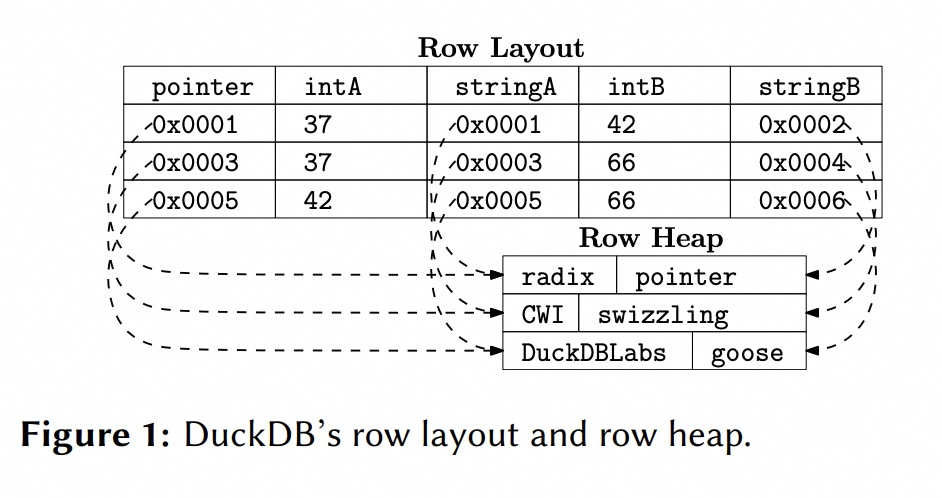
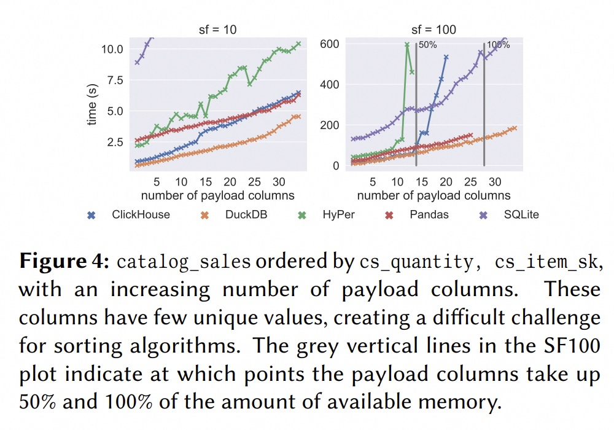

## AI论文解读 | Efficient External Sorting in DuckDB
        
### 作者        
digoal        
        
### 日期        
2025-07-14       
        
### 标签        
PostgreSQL , PolarDB , DuckDB , AI , 论文解读        
        
----        
        
## 背景  
      
https://ceur-ws.org/Vol-3163/BICOD21_paper_9.pdf        
  
      
提示:        
```        
读懂《Efficient External Sorting in DuckDB》这篇论文需要提前掌握哪些基础知识, 请使用中文给我讲一下这些基础知识, 尽量通熟易懂, 可以使用markdown支持的图形增加解释性.        
        
使用中文通熟易懂的解读《Efficient External Sorting in DuckDB》这篇论文, 关键内容请深入讲解, 可以使用markdown支持的图形增加解释性.        
        
使用中文提取《Efficient External Sorting in DuckDB》论文中一些重要的术语并详细解释, 可以使用markdown支持的图形示增加解释性.        
```        
        
## 1 前置知识 
  
好的，为了更好地理解《Efficient External Sorting in DuckDB》这篇论文，你需要掌握一些数据库系统、算法和计算机体系结构相关的基础知识。下面我将用通俗易懂的中文为你逐一讲解，并配合图示来帮助理解。

-----

### 理解论文所需的基础知识图谱

要读懂这篇关于DuckDB高效外部排序的论文，你需要了解以下几个核心领域的知识：

1.  **宏观概念：数据库系统是如何工作的**
2.  **核心问题：什么是内部排序与外部排序**
3.  **关键算法：论文中涉及的排序方法**
4.  **底层技术：实现高效排序的技巧**

下面我们来逐一分解。

-----

### 1\. 宏观概念：数据库系统是如何工作的

#### 1.1 内存数据库 (In-Memory) vs. 磁盘数据库 (Disk-Based)

 这是理解本论文出发点的关键。论文开篇就提到了这两者的区别  。

  *  **内存数据库**：假设所有数据都能放进计算机的内存（RAM）中进行处理  。

      * **优点**：速度极快，因为内存的读写速度比硬盘快成千上万倍。
      *  **缺点**：内存容量有限且昂贵。当数据量超过内存大小时，程序就会崩溃或变得极慢   。Pandas、ClickHouse、HyPer在处理内存放不下的数据时就遇到了这个问题  。

  * **磁盘数据库**：设计之初就考虑了数据远大于内存的情况，核心数据存储在硬盘（HDD或SSD）上，计算时只把需要的部分读入内存。

      * **优点**：可以处理海量数据。
      *  **缺点**：速度较慢，因为频繁地从硬盘读写数据会产生巨大的I/O（输入/输出）开销  。

 **论文的出发点**：传统的内存数据库在数据稍大时就“罢工”，而传统磁盘数据库又太慢。随着现代笔记本配备了高速SSD（NVMe固态硬盘）  ，磁盘I/O速度大大提升，那么我们能否设计一个系统，在数据放不进内存时，性能下降得不那么厉害（即“优雅降级”，graceful degradation  ），这就是DuckDB这篇论文要解决的问题。

#### 1.2 行式存储 (Row-Based) vs. 列式存储 (Columnar)

数据库内部存储数据的方式会极大地影响其性能。

  * **行式存储**：数据按行连续存放。这对于需要一次性获取整行所有信息的场景（如OLTP，在线交易处理）非常高效。

    ```
    表: 用户信息
    ID | 姓名 | 年龄 | 城市
    ---+------+------+------
    1  | 张三 | 25   | 北京
    2  | 李四 | 30   | 上海

    磁盘上的存储方式:
    [1, "张三", 25, "北京", 2, "李四", 30, "上海"]
    ```

  * **列式存储**：数据按列连续存放。这对于分析类查询（如OLAP，在线分析处理）非常高效，因为这类查询通常只关心少数几列。

    ```
    磁盘上的存储方式:
    [1, 2], ["张三", "李四"], [25, 30], ["北京", "上海"]
    ```

 **与论文的关系**：分析型数据库（如DuckDB, ClickHouse）通常采用列式存储。但在排序（Sorting）这类操作中，需要同时移动多个列的数据（比如按年龄排序，那么ID、姓名、城市也要跟着一起动），此时列式存储会导致大量的随机内存访问，效率反而不高   。因此，论文提出，在排序时，最好将数据从列式布局临时转换成行式布局来处理，这样效率更高  。

-----

### 2\. 核心问题：内部排序与外部排序

这是整篇论文的核心。

  * **内部排序 (Internal Sorting)**：待排序的全部数据都能一次性装入内存。这时可以使用各种高效的排序算法，如快速排序、归并排序等。

  * **外部排序 (External Sorting)**：待排序的数据量远大于内存容量，无法一次性读入。

      * **核心思想**：分而治之（Divide and Conquer）。

    

    1.   **分块排序（Sort）**：将大文件分成N个小块，每个小块的大小可以被内存容纳。将每个小块依次读入内存，使用内部排序算法（论文中提到用基数排序  ）进行排序，然后将排好序的小块写回磁盘，成为一个“有序块”。
    2.  **多路归并（Merge）**：内存中开辟一小块区域作为输入缓冲区。从N个“有序块”中，每个块各读取一小部分数据到输入缓冲区。然后，在这些数据中找到最小（或最大）的一个，输出到结果文件中。这个过程不断重复，直到所有有序块都被合并成一个大的有序文件。

**图解外部排序流程**：

```mermaid
graph TD
    A["大数据文件 (在磁盘上)"] --> B{内存};
    B --> C[分块读入内存];
    C --> D["块内排序 (e.g., Radix Sort)"];
    D --> E["生成多个有序块 (写回磁盘)"];
    subgraph 外部归并阶段
        E1[有序块1] --> F{内存缓冲区};
        E2[有序块2] --> F;
        E3[有序块3] --> F;
        EN[...] --> F;
        F --> G[K路归并];
        G --> H["最终的有序文件 (在磁盘上)"];
    end

    style B fill:#f9f,stroke:#333,stroke-width:2px
    style F fill:#f9f,stroke:#333,stroke-width:2px
```

 **与论文的关系**：DuckDB实现了一个**并行化**的外部排序器   。它能无缝地从内部排序过渡到外部排序   。当内存充足时，它表现得像一个高性能的内存排序器；当内存不足时，它会自动启动外部排序机制，将部分数据“溢出”（spill）到磁盘，同时借助并行计算来最大化效率  。

-----

### 3\. 论文中涉及的关键排序算法

#### 3.1 归并排序 (Merge Sort)

  *  **瀑布式归并 (Cascade Merge)**：最常见的归并方式，每次合并两个有序块，然后将合并后的结果再与下一个有序块合并，像瀑布一样一层一层地进行。这种方式在内存中效率很高  。
  *  **K路归并 (K-way Merge)**：一次性合并K个有序块，而不是两个。这在外部排序中很关键，因为它可以显著减少对磁盘的读写次数  。

 **与论文的关系**：尽管K路归并对于外部排序有优势，但论文作者认为瀑布式归并在内存排序场景下更优，且为了不牺牲内存排序的性能，他们最终选择了**并行的瀑布式归并**   。对于最后一步可能出现的并行瓶颈（只有一个线程合并最大的两个块），他们使用了**Merge Path**技术来并行化  。

#### 3.2 基数排序 (Radix Sort)

这是一种非比较型排序算法，它不对元素进行比较，而是通过检查元素的各个“位”来进行排序。对于固定长度的整数或者可以转换成整数的数据，它的速度通常比比较型排序（如快排、归并）要快。

 **与论文的关系**：DuckDB在外部排序的第一个阶段（分块排序）时，就是由多个线程并行地对自己分到的数据块使用基数排序  。这为后续的归并阶段提供了高效产生的有序块。

-----

### 4\. 底层技术：实现高效排序的技巧

#### 4.1 指针摇摆 (Pointer Swizzling)

这是理解论文如何处理**变长数据**（如字符串）外部排序的**最核心、最精妙**的技术。

  * **问题**：在内存中，我们通常用“指针”（Pointer）来指向一个数据（比如字符串）的内存地址。例如，一行数据可能是 `[37, 0xABCDE, 66]`，其中`0xABCDE`就是一个指向字符串"DuckDBLabs"的内存地址。

  *  **挑战**：当这行数据需要被写入磁盘时，这个内存地址`0xABCDE`就失效了！因为下次把它读回内存时，操作系统不可能保证还把它放在完全相同的位置。这就是指针无法直接存盘的原因  。

  *  **解决方案：Pointer Swizzling**  
    它的本质是**将绝对的内存地址，转换为相对的偏移量（Offset）**。

| 状态 | 内存中 (In-Memory) | 准备写入磁盘时 (Swizzled) |
| :--- | :--- | :--- |
| **表示方式** | 使用**指针**，指向内存中某个绝对地址。 | 使用**偏移量**，表示数据相对于某个基准点的距离。 |
| **例子** | `[37, ptr_to_heap, 66]` | `[37, offset_in_block, 66]` |
| **优势** | 访问速度快。 | 位置无关，可以安全地写入磁盘再读回，偏移量依然有效。 |

**图解Pointer Swizzling**
 *内存中的布局（图1）*    

```
Row Layout (固定大小)         Row Heap (变长数据)
[ptr_1] ---> "CWI"
[ptr_2] ---> "DuckDBLabs"
[ptr_3] ---> "goose"
```

 *Swizzling后准备写入磁盘的布局（图3）*     

```
Row Layout (固定大小)         Row Heap (变长数据)
[offset_0] ----> "CWI"
[offset_3] ----> "DuckDBLabs"
[offset_12]---> "goose"
// ptr_1被换成了0，表示字符串从heap块的第0个字节开始
// ptr_2被换成了3，表示字符串从heap块的第3个字节开始
// ...以此类推
```

当数据从磁盘读回内存时，系统再进行一次“逆操作”（unswizzling），将偏移量重新计算成新的内存指针。通过这个技术，DuckDB优雅地解决了变长数据（如字符串）的外部排序问题。

#### 4.2 二进制字符串比较 (Binary String Comparison)

  *  **问题**：如果要按多个列排序（`ORDER BY col_A, col_B`），传统的比较方式是：先比较`col_A`，如果相等，再比较`col_B`... 这样来回跳转，效率不高  。
  *  **解决方案**：将多个排序列（key columns）编码成一个**单一的、定长的二进制序列**   。这样，比较两个复合键就简化成了比较两个二进制字符串（用`memcmp`这类函数一次性完成），非常快，并且可以直接用于基数排序  。  <b>(PS: 这个编码会不会导致顺序错误? 例如'ab','c'和'a','bc'合并后都是abc. 即使末尾加个分隔符, 也有可能出现类似问题, 例如逗号为分隔符时 'a,b','c'和'a','b,c'都会合并成'a,b,c', 除非先做一次转义.)  </b>    

 **与论文的关系**：DuckDB采用了这种技术来加速比较过程，这是其高性能的关键之一。对于变长的字符串，他们只编码一个前缀（prefix），只有前缀相同时才去比较完整的字符串  。

### 总结

要完全理解这篇论文，你需要：

1.  **知道背景**：内存数据库快但不灵活，磁盘数据库灵活但慢，DuckDB想取两者之长。
2.  **理解问题**：数据大于内存时，必须用“分块排序、多路归并”的外部排序思想。
3.  **掌握核心技术**：
      * **并行化**：用多核CPU加速排序的各个阶段。
      * **Pointer Swizzling**：通过“地址 -\> 偏移量”的转换，解决了变长数据（字符串）在内外存之间交换的难题。
      * **二进制编码**：将多列排序变成一次性的二进制比较，极大提升了比较效率。

带着这些基础知识再去阅读原文，你会发现论文的脉络非常清晰，它所做的每一个决策都是为了在保证内存性能的同时，实现向外部存储的“优雅降级”。
  
## 2 解读论文 
  
好的，我们来一起深入解读这篇优秀的论文——《Efficient External Sorting in DuckDB》。

这篇论文的核心思想是：在今天这个硬件（特别是高速SSD）已经非常先进的时代，数据分析系统不应该在处理略大于内存的数据时就“崩溃”或“慢如蜗牛”。它应该能够实现性能的“优雅降级”（Graceful Degradation）。DuckDB通过一个精巧的、可无缝切换内外存的并行排序器，完美地证明了这一点。

下面，我将为你分步解析这篇论文的精髓。

-----

### 引言：论文到底要解决什么痛点？

 在数据科学领域，很多人习惯在自己的笔记本电脑上进行交互式分析   。这些电脑内存通常有限（比如16GB） 。

1.  **痛点一：内存系统的“悬崖”**
     像Pandas、ClickHouse等很多高性能分析工具，几乎完全依赖内存进行计算  。当数据能放进内存时，它们快如闪电。但一旦数据大小超过内存限制，它们通常只有两种结果：

      *  直接报错“内存不足”（Out of Memory） 。
      *  切换到一个效率极低的“外部执行”模式，导致查询时间从几秒钟暴增到几十分钟，性能呈“悬崖式”下跌   。这对用户来说体验极差  。

2.  **痛点二：传统磁盘系统的“迟缓”**
     传统的磁盘数据库虽然能处理海量数据，但它们的设计哲学导致其在分析类负载上通常比内存系统慢很多  。

 **DuckDB的破局之道**：论文作者认为，随着现代笔记本普遍配备高速NVMe SSD   ，磁盘读写的成本已大幅降低   。内存与“外部存储”之间的性能鸿沟不应该那么巨大  。

>  **核心论点**：我们可以设计一个排序算子（Operator），它在内存充足时性能卓越，在内存不足时能平滑、无缝地利用磁盘，实现性能的“优雅降级”，而不是“悬崖式”下跌  。

-----

### 第一部分：高效关系型排序的设计与实现

 排序的成本主要来自两个方面：**值的比较**和**数据的重排**  。DuckDB针对这两点都做了极致优化。

#### 1\. 优化“比较”成本：二进制字符串编码

当需要按多个列排序时（`ORDER BY col_A, col_B`），传统的做法效率低下：

  *  **做法一**：先比`col_A`，相等再比`col_B`。这会导致CPU在不同列的数据之间来回跳转，缓存命中率低  。
  *  **做法二**：先按`col_A`全排一遍，再在`col_A`值相同的组内按`col_B`排。这需要多次遍历数据  。

**DuckDB的对策：**
 他们采用了一种自System R时代就存在但如今鲜有系统使用的技术——**二进制字符串编码**  。

  *  **原理**：将所有用于排序的列（Key Columns）按照指定的顺序（升序/降序）和类型，编码成一个**单一的、固定长度的二进制序列**  。
  *  **效果**：对这个复合键的比较，从多次、多类型的复杂比较，简化为了一次简单的、按字节进行的内存比较（`memcmp`），速度极快，并且可以直接用于高效的**基数排序**（Radix Sort） 。
  * **细节处理**：
      *  对于变长的字符串，只编码其固定长度的前缀，仅在当两个字符串前缀相同时，才去比较完整的字符串  。
      *  `NULL`值通过在每个编码值前附加一个字节来特殊处理  。

#### 2\. 优化“重排”成本：为排序采用行式布局

 分析型数据库大多采用**列式存储**，但在排序时，所有被查询的列（Payload Columns）都需要根据排序列的顺序进行移动   。在列存模式下，这意味着对每一列都要进行一次随机内存访问，当列数很多时，开销巨大  。

**DuckDB的对策：**
 论文认为，排序和连接（Join）、聚合（Aggregation）一样，本质上是**行式操作**   。因此，在排序开始前，DuckDB会把数据从列式布局转换成一种**内部行式布局**  。

```mermaid
graph TD
    subgraph "排序前 (列式布局)"
        A["列1: 年龄<br>[25, 30, 22]"]
        B["列2: 姓名<br>[A, B, C]"]
        C["列3: 城市<br>[X, Y, Z]"]
    end
    
    D{转换成行式布局}

    subgraph "排序中 (DuckDB内部行式布局)"
        R1["行1: [25, A, X]"]
        R2["行2: [30, B, Y]"]
        R3["行3: [22, C, Z]"]
    end

    A & B & C --> D --> R1 & R2 & R3
```

  *  **布局设计**：这种行式布局是固定大小的，便于快速重排   。对于变长数据（如字符串），行内只存放一个指向“堆”（Heap）的指针，真实数据存放在堆中   。在内存排序时，只需要交换这些固定大小的行，而无需移动堆里庞大的字符串数据  。

-----

### 第二部分：并行与外部排序的无缝结合（论文精华）

#### 1\. 并行排序 (Parallel Sorting)

 DuckDB利用了其“Morsel-Driven”并行框架，将排序任务分发给多个CPU核心  。

1.   **并行分块与排序**：多个线程并行地从源数据中获取数据块（Morsel），并使用**基数排序**对自己分得的数据块进行局部排序  。这会产生多个有序的数据块。
2.   **并行归并**：随后，系统需要将这些有序块合并成最终的单一有序结果   。DuckDB选择**瀑布式归并**（每次合并两个），因为它在内存中效率更高  。并且，这个归并过程也是并行的。当有许多小块时，多个线程可以同时进行多组合并。
3.   **最终归并的并行化**：当只剩下最后两个大块需要合并时，常规方法只能用一个线程处理，会成为瓶颈   。DuckDB使用了一种名为 **Merge Path** 的技术，通过预计算两个大块的交叉点，将最终的合并任务也切分成多个独立的子任务，交由多个线程并行完成  。

#### 2\. 外部排序 (External Sorting)

这是论文最核心的创新，实现了从内存到磁盘的“无缝”过渡。

**关键思想：不主动写盘，而是由缓冲管理器（Buffer Manager）决定。**
 DuckDB不设一个独立的、庞大的“外部排序”代码逻辑。它的排序算子只管向缓冲管理器申请内存   。当内存耗尽时，缓冲管理器会根据LRU（Least Recently Used）策略，自动将一些不常用的、排好序的数据块“溢出”（Spill）到磁盘上  。

**核心技术：指针摇摆 (Pointer Swizzling)**
 这个机制之所以能“无缝”，全靠**指针摇摆**技术解决了变长数据（如字符串）的存盘问题  。

  *  **问题**：内存中的指针（一个内存地址）在写入磁盘后就失效了  。
  * **解决方案**：当缓冲管理器决定将一个数据块写入磁盘时，DuckDB会执行“Swizzling”操作（见论文图3）：     
      *  将指向“堆”数据的**绝对内存指针**，转换成一个**8字节的块内偏移量**  。
      *  将行内指向具体字符串的指针，转换成一个相对于该行所属堆数据起始点的**相对偏移量**  。

**图解Pointer Swizzling**

```mermaid
graph TD
    subgraph "内存中 (In-Memory)"
        A["Row: [int A, <b>ptr_to_heap</b>, ...]<br>ptr_to_heap指向0xABCD"]
        B["Heap at 0xABCD: ['string1', 'string2']"]
        A --> B
    end

    C{"Buffer Manager决定写盘<br>执行Swizzling"}

    subgraph "磁盘上 (On-Disk Block)"
        D["Row: [int A, <b>offset_in_block</b>, ...]<br>offset指向heap数据在本块内的起始位置"]
        E["Heap Data in Block: ['string1', 'string2']"]
    end
    
    A --> C --> D

    style A fill:#lightblue
    style D fill:#lightgreen
```

  *  **巨大优势**：经过“摇摆”后，整个数据块变得“位置无关”，可以被安全地存到磁盘任何位置，再读回内存后，通过“逆向摇摆”（Unswizzling）又能恢复成有效的内存指针。这使得**内存排序和外部排序的逻辑几乎完全统一**   。唯一的额外开销仅仅是摇摆和反摇摆指针，以及重排堆数据的成本  。

-----

### 第三部分：实验评估与结论

 论文通过在TPC-DS数据集上的实验，将DuckDB与ClickHouse, HyPer, Pandas, SQLite进行了对比  。

  *  **实验平台**：一台拥有16GB内存和高速SSD的MacBook Pro，模拟了典型的数据分析环境  。

  * **关键发现 (见论文图4)**：  

      *  在数据能完全放入内存时（SF10），DuckDB表现优异，是速度最快的系统之一  。
      * 当数据量增长到超过内存容量时（SF100），惊人的一幕发生了：
          *  **ClickHouse和HyPer**：在数据超出内存后，性能急剧下降，并很快因内存耗尽而崩溃  。
          *  **SQLite**：作为传统磁盘数据库，它虽然能完成任务，但速度一直比DuckDB慢很多  。
          *  **DuckDB**：性能曲线几乎没有抖动，平滑地完成了所有任务，完美展示了“优雅降级”的能力  。

  * **结论**：
     DuckDB的实现证明了，一个精心设计的排序器完全可以兼顾内存中的高性能和超出内存时的稳健性  。在现代硬件上，我们不必再忍受内存和磁盘之间巨大的性能鸿沟。

 **未来展望**：论文还指出，这种基于行式布局和指针摇摆的外部化技术，同样可以应用于**连接（Join）、聚合（Aggregation）和窗口函数**等其他内存密集型算子，使整个数据库系统都具备优雅降级的能力  。
  
## 3 术语  
  
好的，我们来从《Efficient External Sorting in DuckDB》这篇论文中提取一些最重要的技术术语，并用通俗易懂的中文和图示进行详细解释。

-----

### 1\. 外部排序 (External Sorting)

 外部排序是指当待排序的数据集非常大，无法一次性全部载入计算机主内存（RAM）时所采用的排序方法  。

  * **工作原理**：其核心思想是“分而治之”。
    1.   **分块排序**：将大文件分割成内存可以容纳的小数据块   。将每个数据块依次读入内存，使用高效的内部排序算法（如基数排序）进行排序  。
    2.   **写回磁盘**：将内存中排好序的数据块写回到磁盘，形成一个个“有序块”（Sorted Runs） 。
    3.   **多路归并**：最后，通过一个归并过程，将磁盘上所有的“有序块”合并成一个单一的、完全有序的大文件  。
  *  **在论文中的意义**：这篇论文实现了一个高效的**并行外部排序**算子   。其目标是让从内存排序到外部排序的转换过程变得无缝且高效，避免传统系统在数据超出内存时性能急剧下降的问题  。

### 2\. 优雅降级 (Graceful Degradation)

 这是一个系统设计理念，指的是当负载或数据量超出系统的理想处理能力（如内存容量）时，系统的性能应该平滑、可预测地下降，而不是突然崩溃或变得极慢  。

  * **图示对比**:
    ```mermaid
    graph TD
        subgraph "传统内存系统"
            A(数据 < 内存) --> B[性能: 极高];
            C(数据 > 内存) --> D[性能: 悬崖式下跌或崩溃];
        end
        subgraph "DuckDB (实现优雅降级)"
            E(数据 < 内存) --> F[性能: 极高];
            G(数据 > 内存) --> H[性能: 平滑下降，依然可用];
        end
    ```
  *  **在论文中的意义**：这是该论文的核心目标和最终成果   。实验结果表明，DuckDB的排序器即使在数据量远超内存的情况下，性能损失也很小，成功实现了从内存到外部排序的“优雅降级”  。

### 3\. 指针摇摆 (Pointer Swizzling)

 这是论文中用于实现无缝外部排序的**最关键技术**。它是一种将内存中的指针（绝对地址）转换为一种与位置无关的格式（相对偏移量）的技术，从而可以安全地将数据写入磁盘  。

  * **问题**：内存指针（如 `0x7FFF1234ABCD`）在数据被写入磁盘后就完全失效了。

  * **解决方案**：当一个数据块需要从内存“溢出”到磁盘时，DuckDB会进行“摇摆”操作：

      *  将指向变长数据（如字符串）的8字节**指针**替换为一个8字节的**偏移量**   。这个偏移量记录了该数据相对于其所在数据块（Block）头部的距离  。

  * **图示对比 (处理变长字符串)**:
    | 状态 | 内存中的行布局 (In-Memory) | “摇摆”后写入磁盘的布局 (Swizzled) |
    | :--- | :--- | :--- |
    | **表示方式** |  使用**指针**，指向一个绝对内存地址  。 |  使用**偏移量**，表示数据在本数据块内的相对位置  。 |
    | **例子** | `Row: [37, 0xABCD, 66]` | `Row: [37, 80, 66]` |
    | **解释** | `0xABCD` 是字符串在内存中的地址。 | `80` 表示字符串数据从本数据块开始的第80个字节处开始。 |

  *  **在论文中的意义**：指针摇摆技术使得包含变长数据的行可以被安全地移入移出内存，而无需改变其内部结构   。这使得内存排序和外部排序的逻辑几乎完全统一，唯一的额外成本就是摇摆和反摇摆指针的那一次性开销，从而实现了无缝过渡  。

### 4\. 行式布局与堆 (Row Layout & Row Heap)

 这是DuckDB在排序过程中内部使用的一种数据组织方式  。

  *  **行式布局 (Row Layout)**：一个固定大小的结构，其中包含所有的定长列（如整数、浮点数）以及指向变长数据的指针   。因为其大小固定，所以在排序时交换这些“行”非常高效  。
  *  **堆 (Row Heap)**：一个独立的数据区，用来存储所有变长的数据（主要是字符串） 。行布局中的指针就指向这里。
  *  **在论文中的意义**：这种“定长”与“变长”分离的布局是实现高效重排和指针摇摆的基础   。在内存排序时，只需移动小的行布局，而无需移动堆中庞大的字符串数据  。

### 5\. 二进制字符串编码 (Binary String Encoding)

 这是一种为了加速**比较**操作而采用的优化技术。它将 `ORDER BY` 子句中的多个排序列编码成一个单一的、可直接比较的二进制序列  。

  *  **工作原理**：`ORDER BY a ASC, b DESC` 会被转换成一个二进制串。比较两个这样的二进制串，就等同于完成了对 `a` 和 `b` 的依次比较  。
  * **优点**：
      *  将复杂的多列比较简化为一次性的内存比较 (`memcmp`)  。
      *  编码后的结果非常适合使用速度极快的**基数排序**（Radix Sort） 。
  *  **在论文中的意义**：这项技术显著降低了排序过程中比较操作的成本，是DuckDB实现高性能排序的关键因素之一  。

### 6\. Morsel-Driven 并行

 这是DuckDB用于并行执行查询的框架  。

  * **在排序中的应用**：
    1.   多个线程并行地从输入表中“获取”数据块（Morsels） 。
    2.   每个线程独立地对自己获取的数据块进行排序（使用基数排序） 。
  *  **在论文中的意义**：该框架为整个排序过程（从数据读取到最终归并）的并行化提供了基础，充分利用了现代多核CPU的能力  。

### 7\. 瀑布式归并 (Cascade Merge) 与 Merge Path

这是DuckDB在归并阶段选择的具体算法。

  *  **瀑布式归并 (Cascade Merge)**：一种归并策略，每次只合并两个有序块，然后将结果再与下一个块合并，直到只剩下一个最终的有序块   。论文选择它是因为它在内存排序场景下通常比K路归并更高效  。
  *  **Merge Path**：一种用于**并行化两个有序块合并过程**的算法   。它通过预计算两个块的交叉点，将一个大的合并任务切分成多个可以由不同线程独立执行的小任务  。
  *  **在论文中的意义**：瀑布式归并本身是并行的，但当最后只剩下两个大块时，会退化成单线程工作   。Merge Path技术的引入，解决了这个最后的并行瓶颈，保证了排序的归并阶段也能被完全并行化  。
  
## 参考        
         
https://ceur-ws.org/Vol-3163/BICOD21_paper_9.pdf  
        
        
<b> 以上内容基于DeepSeek、Qwen、Gemini及诸多AI生成, 轻微人工调整, 感谢杭州深度求索人工智能、阿里云、Google等公司. </b>        
        
<b> AI 生成的内容请自行辨别正确性, 当然也多了些许踩坑的乐趣, 毕竟冒险是每个男人的天性.  </b>        
  
  
