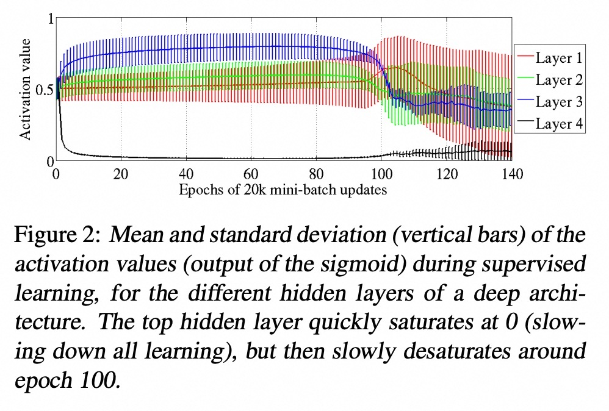
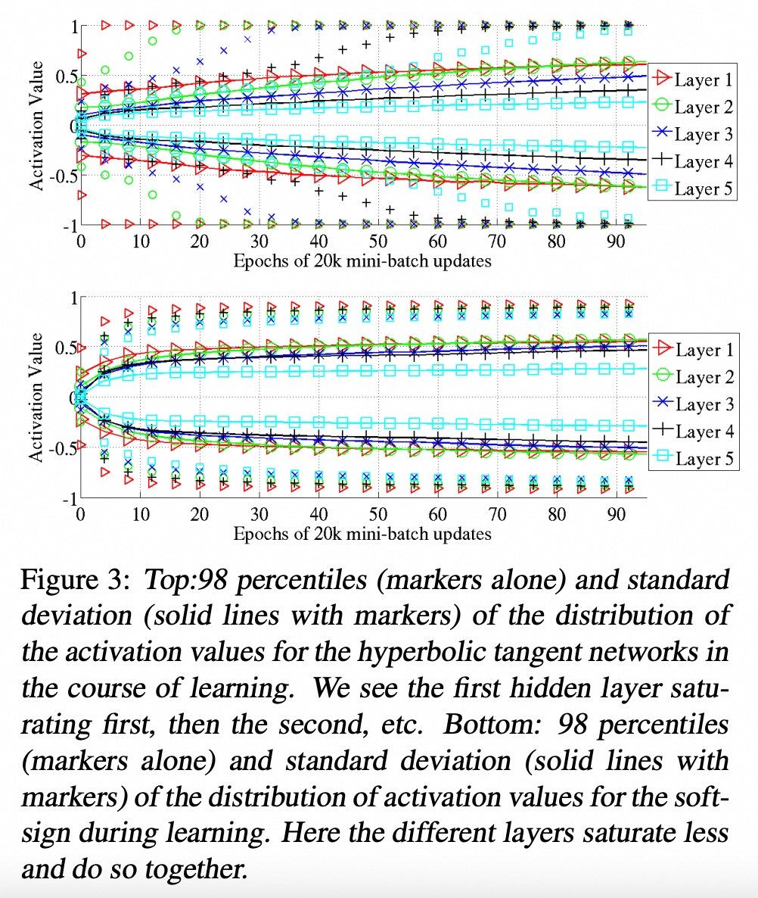
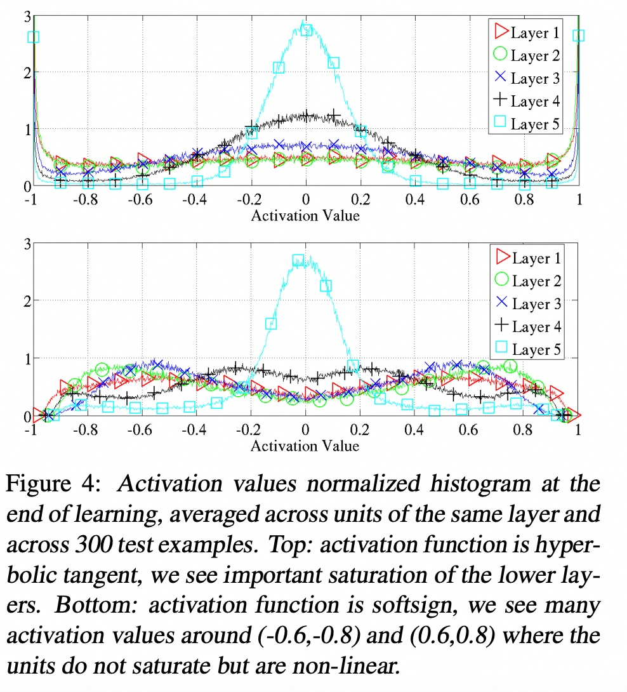
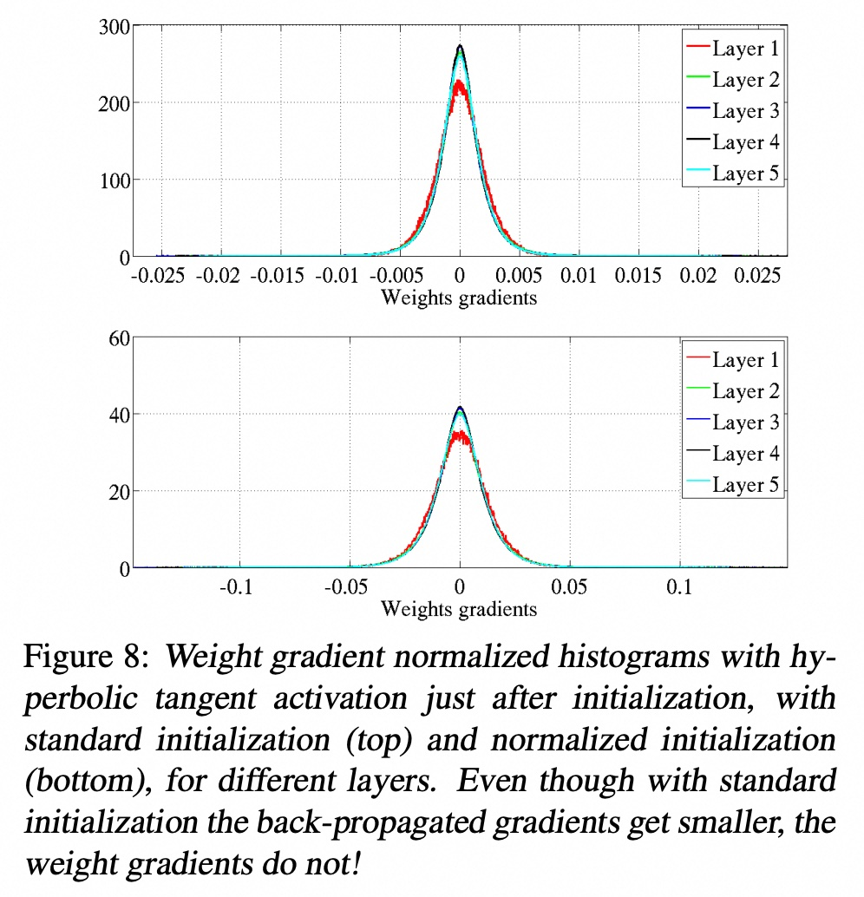
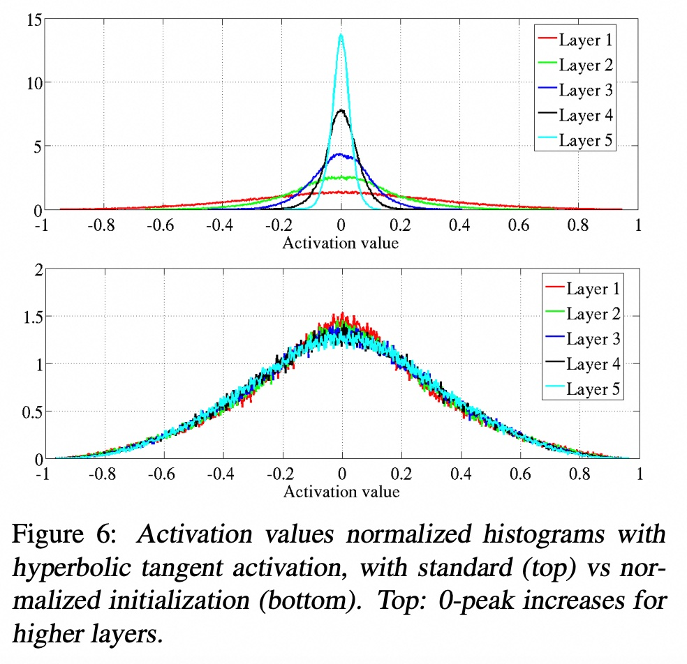
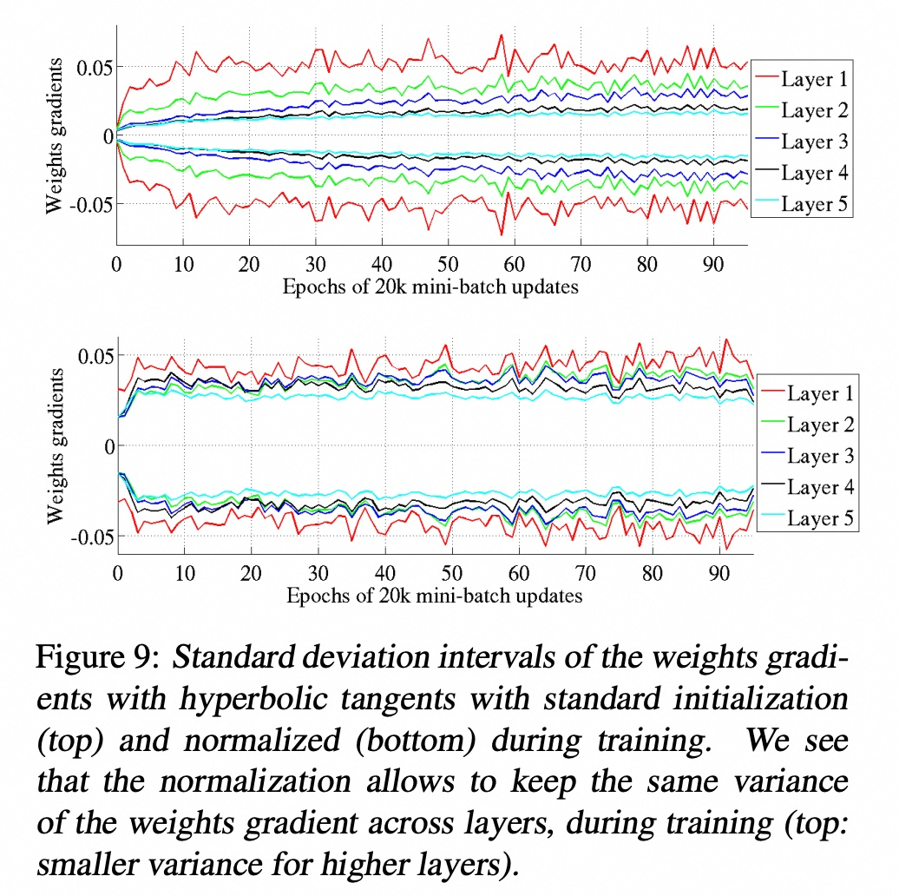
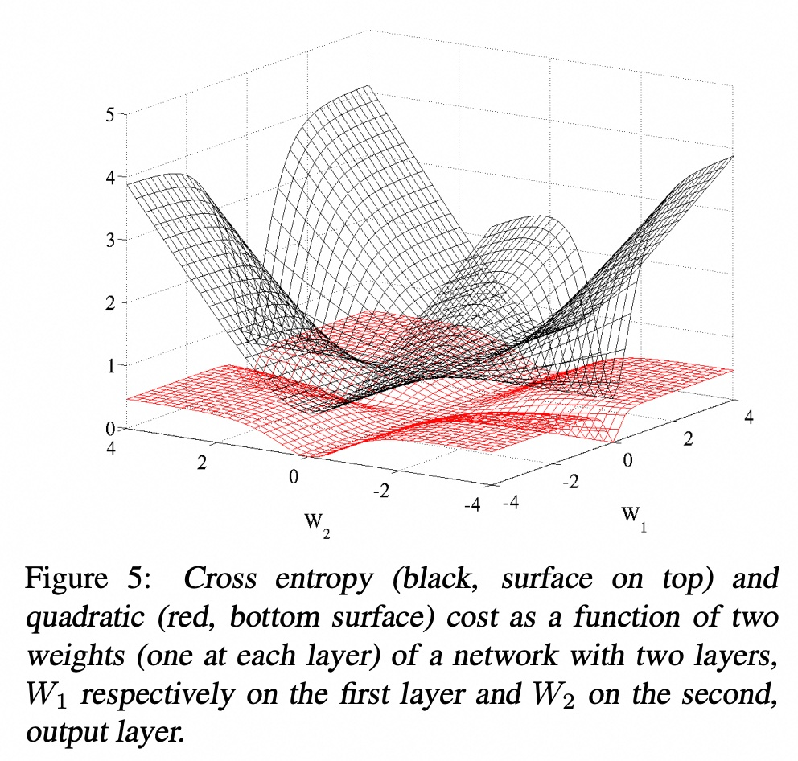

## AI论文解读 | Understanding the difficulty of training deep feedforward neural networks
        
### 作者        
digoal        
        
### 日期        
2025-07-18       
        
### 标签        
PostgreSQL , PolarDB , DuckDB , AI , 论文解读        
        
----        
        
## 背景  
      
https://proceedings.mlr.press/v9/glorot10a/glorot10a.pdf        
  
      
提示:        
```        
读懂《Understanding the difficulty of training deep feedforward neural networks》这篇论文需要提前掌握哪些基础知识, 请使用中文给我讲一下这些基础知识, 尽量通熟易懂, 可以使用markdown支持的图形增加解释性.        
        
使用中文通熟易懂的解读《Understanding the difficulty of training deep feedforward neural networks》这篇论文, 关键内容请深入讲解, 可以使用markdown支持的图形增加解释性.        
        
使用中文提取《Understanding the difficulty of training deep feedforward neural networks》论文中一些重要的术语并详细解释, 可以使用markdown支持的图形示增加解释性.        
```        
        
## 1 前置知识 
  
好的，为了能透彻理解这篇开创性的论文《Understanding the difficulty of training deep feedforward neural networks》（通常被称为“Glorot初始化”或“Xavier初始化”论文），你需要掌握一些关于神经网络的基础知识。

这篇论文的核心贡献在于分析了为什么传统的深度神经网络难以训练，并提出了一种非常有效的解决方案——一种新的权重初始化方法。

下面，我将用通俗易懂的中文为你讲解所需的基础知识，并辅以图表来帮助理解。

### 1\. 深度前馈神经网络 (Deep Feedforward Neural Network)

**这是什么？**
想象一下，你有一条信息处理流水线。信息从一端输入，经过流水线上一个个“处理站”的加工，最后在另一端输出结果。深度前馈神经网络就是这样一个模型。

  * **层 (Layer)**：每个“处理站”就是一层。它由许多“神经元” (neurons) 组成。
      * **输入层 (Input Layer)**：流水线的入口，负责接收最原始的数据（比如一张图片的像素值）。
      * **隐藏层 (Hidden Layers)**：中间的处理站。当隐藏层有很多时（比如超过2-3层），我们就称之为“深度”网络。这些层负责逐级提取和组合特征。例如，第一层可能识别边角，第二层将边角组合成眼睛、鼻子，第三层再将它们组合成一张脸。
      * **输出层 (Output Layer)**：流水线的出口，输出最终结果（比如判断图片里是“猫”还是“狗”）。
  * **前馈 (Feedforward)**：信息在这条流水线上是单向流动的，从输入层 -\> 隐藏层 -\> 输出层，不会倒流。

**Markdown 图示：**

```mermaid
graph TD
    A[输入层<br>(e.g., 图片像素)] --> B[隐藏层 1<br>(识别边缘、颜色)];
    B --> C[隐藏层 2<br>(组合成眼睛、鼻子)];
    C --> D[隐藏层 3<br>(组合成脸型)];
    D --> E[输出层<br>(判断是哪个人)];

    subgraph 深度神经网络
        A
        B
        C
        D
        E
    end
```

 这篇论文研究的就是为什么当这个流水线（网络）很“深”（有很多隐藏层）时，训练会变得异常困难  。

### 2\. 学习过程：反向传播与梯度下降

**网络如何学习？**
网络通过“学习”来调整每个神经元连接的“权重”(weights)。权重决定了信息在传递过程中的重要性。学习的目标是找到一套完美的权重，让网络的预测尽可能准确。

  *  **成本函数 (Cost Function)**：首先，我们需要一个“裁判”，它能衡量网络当前的预测有多差。这个裁判就是成本函数（或损失函数）。比如，网络把猫认成了狗，成本函数就会给出一个很高的“罚分”。论文中提到，使用**负对数似然 (negative log-likelihood)** 这个成本函数比传统的**二次代价 (quadratic cost)** 效果好得多  。

  * **梯度下降 (Gradient Descent)**：这是学习的核心策略。想象你在一个漆黑的山谷里，想走到谷底（成本函数的最低点）。你该怎么办？最直观的方法是，伸脚探探四周哪个方向坡度最陡峭向下，然后朝那个方向迈一小步。不断重复这个过程，你最终就能走到谷底。

      * **梯度 (Gradient)**：就是这个“最陡峭的坡度”。
      * **学习率 (Learning Rate)**：是你每一步迈多大。步子太小，下山太慢；步子太大，可能会一步跨到对面山坡上。

  * **反向传播 (Backpropagation)**：这是一个非常高效的算法，用来计算网络中成千上万个权重的“梯度”。它的思想是：

    1.  首先在输出层计算预测结果和真实标签之间的“误差”（即成本函数的罚分）。
    2.  然后将这个误差信号像涟漪一样，**从后往前**一层一层地传播回去。
    3.  在传播的过程中，根据每个权重对最终误差的“贡献度”，计算出它应该调整的方向和大小（即梯度）。

 这篇论文的核心就是分析在反向传播过程中，这个“梯度”信号在深层网络中传递时出了什么问题  。

### 3\. 激活函数 (Activation Function)

**这是什么？**
激活函数是神经元内部的一个小开关。它接收上一层传来的所有信号的总和，然后决定自己要不要“激活”（启动）并向下一层传递信号。

**为什么需要它？**
它的最重要作用是**引入非线性**。如果不用激活函数，无论神经网络有多少层，它本质上都只是一个简单的线性模型，无法学习复杂的关系。比如，你无法用一条直线去完美分割一个螺旋形的数据集。

 论文中重点讨论了以下几种激活函数  ：

  * **Sigmoid (S型函数)**：

      * 形状像一个拉长的“S”，输出值被挤压在 0 和 1 之间。
      *  **论文指出的核心问题**：它的输出**不是以0为中心的**。这会导致梯度更新效率低下，尤其是在深层网络中，它可能会让顶层隐藏层的神经元很快“饱和”  。

  * **Tanh (双曲正切函数)**：

      * 形状也像“S”，但输出值被挤压在 -1 和 1 之间。
      * **优点**：它的输出是**以0为中心的**，这在实践中通常比 Sigmoid 函数收敛更快。

  * **饱和 (Saturation)**：这是理解论文的关键！观察 Sigmoid 和 Tanh 函数的曲线，你会发现它们在两端都趋于水平。当神经元的输出落入这些“平坦”区域时，它的梯度（坡度）会变得极其微小，接近于0。我们称之为神经元“饱和”了。

**图示：**

```
      Sigmoid (输出: 0 to 1)               Tanh (输出: -1 to 1)
      |                                    |
  1 --|----------.                         |    .----------
      |         /                      1 --|---/
      |        /                           |  /
  0.5-|-------/                            0 -+-----------
      |      /                             | /
      |     /                              |/
  0 --|----'                          -1 --'------------
      |                                    |
      <-- 饱和区 (梯度≈0)           <-- 饱和区 (梯度≈0)
```

当神经元饱和时，梯度几乎为0，这意味着通过反向传播传递到这里的误差信号也就消失了，权重无法得到有效更新。这就是“学习停滞”的原因。

### 4\. 核心问题：梯度消失 (Vanishing Gradients)

现在，我们可以把所有知识点串起来了。
在**深层**网络中进行**反向传播**时，梯度需要从输出层一路乘到输入层。根据链式法则，每一层的梯度都会乘以该层激活函数的导数（坡度）。

  * 如果激活函数（如Sigmoid或Tanh）的导数总是小于1。
  * 或者很多神经元进入了**饱和**状态，导数接近于0。

 那么，当这个小于1的数字在很多层之间连乘时，梯度信号就会以指数级速度衰减。传到最开始的几层时，梯度已经小到几乎可以忽略不计了——我们称之为**梯度消失**  。

**后果**：靠近输入层的隐藏层几乎学不到东西，因为它们收不到有效的“反馈信号”。只有靠近输出层的几层在学习。这使得深度网络的效果甚至还不如浅层网络。

### 5\. 解决方案：权重初始化 (Weight Initialization)

既然问题出在信号（无论是前向传播的激活值还是反向传播的梯度）在层间传递时变得过大或过小，那么我们能不能在训练开始前，就给权重设置一个“聪明”的初始值，让信号能稳定地传递下去？

这就是这篇论文的**核心贡献**。

  *  **传统方法**：通常是从一个很小的范围内随机取值，比如 `Uniform(-1/√n, 1/√n)`，其中n是上一层的神经元数量  。

  *  **论文的分析**：这种传统方法会导致随着层数加深，激活值的方差（可以理解为信号的“能量”）逐层减小，而在反向传播中，梯度的方差也逐层减小，最终导致梯度消失  。

  * **论文提出的新方法（Glorot/Xavier 初始化）**：
     该方法旨在**保持每一层激活值的方差和反向传播中梯度的方差都能维持不变**  。为了同时满足这两个有些矛盾的条件，论文提出了一个折衷方案：

    $$W \sim U\left[-\frac{\sqrt{6}}{\sqrt{n_{in} + n_{out}}}, \frac{\sqrt{6}}{\sqrt{n_{in} + n_{out}}}\right]$$

    这里的 $n\_{in}$ 是输入神经元的数量， $n\_{out}$ 是输出神经元的数量。这个公式直观地告诉我们，权重的初始化范围应该同时考虑输入和输出的维度，这样才能更好地平衡前向和反向传播过程中的信号“能量”。

### 总结

要读懂这篇论文，你需要理解：

1.  **深度网络的基本结构**及其**逐层抽象**的思想。
2.  网络通过**反向传播**和**梯度下降**来学习，目标是最小化**成本函数**。
3.  **激活函数**引入非线性，但其**饱和**特性是潜在的麻烦。
4.  在深层网络中，梯度信号连乘可能导致**梯度消失**，使底层网络学不动。
5.  论文通过数学分析指出，不当的**权重初始化**是导致梯度消失的关键原因，并提出了一种新的 **“Xavier/Glorot初始化”** 方法，通过维持信号方差的稳定来解决这个问题。

掌握了这些概念，你就能轻松理解论文作者的整个思考过程、实验设计以及他们提出的解决方案为何有效了。
  
## 2 解读论文 
  
好的，这篇由 Xavier Glorot 和 Yoshua Bengio 在2010年发表的论文《Understanding the difficulty of training deep feedforward neural networks》，是深度学习领域的里程碑式著作。它深刻地剖析了为什么传统的深度神经网络难以训练，并提出了一个简单而极其有效的解决方案——**“Xavier/Glorot 初始化”**。

下面，我们将用通俗易懂的方式，结合论文内容和图示，来深入解读这篇论文。

### 核心目标：为什么深度网络训练这么难？

 在2010年之前，人们发现当神经网络的隐藏层越来越多（即网络变“深”）时，使用标准的训练方法（随机初始化权重 + 梯度下降）效果会变得非常差，甚至完全无法收敛   。这篇论文的研究目标就是搞清楚：**问题到底出在哪里？**  

作者通过一系列精心设计的实验，监控并分析了训练过程中网络内部的两个关键指标：

1.  **激活值（Activations）**：神经元的输出值。
2.  **梯度（Gradients）**：误差反向传播的信号。

### 发现的问题一：激活函数的陷阱

 作者首先研究了不同激活函数对深度网络训练的影响  。

#### 1\. Sigmoid 函数：非零均值带来的饱和问题

传统的 Sigmoid 函数（$f(x) = \\frac{1}{1+e^{-x}}$）会将输出值压缩到 `(0, 1)` 区间。作者发现，这个特性在深度网络中是致命的。

  *  **问题描述**：由于 Sigmoid 的输出恒为正数（非零均值），在网络初始化后，会导致一个奇怪的现象：最顶部的隐藏层会迅速进入**饱和状态**  。

  * **什么是饱和？**
    饱和指的是神经元的输出值落入了激活函数曲线的“平坦”区域（对于Sigmoid，就是输出接近0或1）。在这些区域，函数的导数（梯度）几乎为0。

    ```mermaid
    graph TD
        subgraph "Sigmoid 函数"
            direction LR
            A(输入值 x) --> B{f(x)};
            B --> C(输出值 y);
        end
        subgraph "输出曲线"
            direction LR
            D["饱和区 (梯度≈0)"] -- 输出接近 1 --> E{"非线性区 (梯度>0)"};
            E -- 输出接近 0 --> F["饱和区 (梯度≈0)"];
        end
    ```

  *  **后果**：一旦顶层神经元饱和，它们的梯度就变成了0。根据反向传播算法，梯度是从后向前逐层传递的，如果顶层的梯度是0，那么这个“0”信号就会被传到前面的所有层，导致整个网络的权重都无法更新，学习完全停滞   。作者观察到，这种饱和状态会持续很长时间，有时网络虽然能慢慢“解脱”出来，但过程极其缓慢，并且最终得到的模型效果也很差  。

  *  **结论**：**应当避免在深度网络中使用 Sigmoid 激活函数**，尤其是在采用随机初始化的情况下  。

#### 2\. Tanh 函数：虽有改进，但仍存问题

双曲正切函数 Tanh ($f(x) = tanh(x)$) 将输出值压缩到 `(-1, 1)` 区间，其输出是**以0为中心的**。这在一定程度上缓解了 Sigmoid 的问题。

  *  **问题描述**：然而，作者发现，在使用标准初始化方法时，Tanh 网络也存在饱和问题。不同的是，这种饱和是从第一层（最靠近输入的隐藏层）开始，然后逐层向上传播的  。最终，所有层的神经元都趋于饱和。

#### 3\. Softsign 函数：一种更优的选择

 作者还测试了一个当时较新的激活函数 Softsign ($f(x) = \\frac{x}{1+|x|}$)。它的形状和 Tanh 类似，但它接近饱和区（-1和1）的速度更慢（是多项式速度而非指数速度） 。

  *  **优点**：实验表明，使用 Softsign 的网络，神经元不会像 Tanh 那样急剧地饱和   。激活值更多地分布在非线性的“拐角”区域，这里既能提供非线性计算能力，又不会让梯度完全消失   。这使得 Softsign 对初始化方法不那么敏感  。

### 发现的问题二：梯度在传播中消失

这是论文最核心的发现。作者通过理论分析和实验验证，揭示了梯度消失的根本原因。

  *  **问题描述**：在网络刚初始化时，使用标准的初始化方法，反向传播的梯度信号在从后向前传递的过程中，其**方差（可以理解为信号的强度）会逐层递减**  。

    ```mermaid
    graph TD
        direction RL
        A[输入层<br>梯度 ≈ 0.01] --> B[隐藏层 1<br>梯度 ≈ 0.1];
        B --> C[隐藏层 2<br>梯度 ≈ 0.5];
        C --> D[隐藏层 3<br>梯度 ≈ 1.0];
        D --> E[输出层<br>梯度信号];

        subgraph "梯度反向传播"
            E -- 梯度信号强 --> D;
            D -- 信号衰减 --> C;
            C -- 信号严重衰减 --> B;
            B -- 信号几乎消失 --> A;
        end
    ```

    当网络很深时，传到最前面几层的梯度已经小到可以忽略不计，这就是著名的**梯度消失 (Vanishing Gradient)** 问题。这导致靠近输入的层学习极其缓慢，甚至完全不学习。

### 核心贡献：归一化初始化 (Normalized Initialization)

为了解决上述问题，作者提出了一个全新的权重初始化方案，现在被称为 **Xavier 初始化** 或 **Glorot 初始化**。

  *  **核心思想**：一个好的初始化应该让信息（无论是前向传播的激活值还是反向传播的梯度）在网络中顺畅地流动，其“强度”既不应该逐层放大（导致梯度爆炸），也不应该逐层缩小（导致梯度消失）  。具体来说，目标是让每一层输出的激活值的方差和输入梯度的方差保持不变  。

  * **推导与方案**：

    1.  要保持**前向传播**时激活值的方差不变，权重的方差需要满足：$Var(W) = \\frac{1}{n\_{in}}$
    2.  要保持**反向传播**时梯度的方差不变，权重的方差需要满足：$Var(W) = \\frac{1}{n\_{out}}$

    其中，$n\_{in}$ 是该层输入神经元的数量，$n\_{out}$ 是输出神经元的数量。

     这两个条件通常是矛盾的（除非$n\_{in} = n\_{out}$）。因此，作者提出了一个简单而有效的折衷方案  ：

    $$Var(W) = \frac{2}{n_{in} + n_{out}}$$

    如果使用均匀分布来初始化权重 $W \\sim U[-a, a]$，那么对应的初始化范围就是：

    $$W \sim U\left[-\frac{\sqrt{6}}{\sqrt{n_{in} + n_{out}}}, \frac{\sqrt{6}}{\sqrt{n_{in} + n_{out}}}\right]$$
     这就是**归一化初始化**的最终公式  。

### 实验结果与结论

作者在多个数据集（包括 MNIST、CIFAR-10 等）上验证了他们的方法，结果令人信服：

1.   **归一化初始化的巨大成功**：对于 Tanh 网络，使用归一化初始化后，训练速度和最终性能都得到了极大的提升，收敛更快，错误率更低   。它成功地让深层网络的训练不再那么困难。从图表中可以看出，使用归一化初始化（标记为 "N"）的 Tanh N 和 Softsign N 曲线，其测试错误率显著低于使用标准初始化的 Tanh 和 Sigmoid  。
2.   **激活函数的选择很重要**：实验证明，像 Tanh 和 Softsign 这样以0为中心的激活函数远优于 Sigmoid  。
3.   **Softsign 表现稳健**：Softsign 网络对初始化方法不那么敏感，表现一直很好  。
4.   **方法普适性**：作者验证了即使网络每层的神经元数量不同，归一化初始化方法依然有效  。

### 本文的关键启示

  *  **深入理解问题是关键**：通过监控网络内部的激活值和梯度，作者得以准确定位深度网络训练失败的根源  。
  *  **初始化至关重要**：一个好的初始化方案可以让梯度在深度网络中有效流动，这是成功训练的前提。归一化初始化极大地缩小了传统监督学习与复杂的无监督预训练方法之间的性能差距  。
  *  **告别 Sigmoid**：在深度网络中，应避免使用 Sigmoid 这样的非零均值激活函数  。选择以0为中心的激活函数（如 Tanh、Softsign，以及后来的 ReLU）是更好的实践。
  
## 3 术语  
  
以下是论文《Understanding the difficulty of training deep feedforward neural networks》中一些重要术语的提取和详细解释，并辅以图示（请注意，我无法直接生成图像，但我会详细描述图示内容）：

###  1. 深度前馈神经网络 (Deep Feedforward Neural Networks)  

  *  **解释**: 深度前馈神经网络是一种人工神经网络，其特点是包含多个隐藏层。数据在网络中从输入层向前传播，通过一个或多个隐藏层，最终到达输出层，但不会反向传播或形成循环。这种“深度”允许网络学习数据中更复杂、更高层次的特征表示。深度学习方法旨在学习特征层次结构，其中较高层次的特征由较低层次的特征组合而成  。

###  2. 梯度下降 (Gradient Descent)  

  *  **解释**: 梯度下降是一种优化算法，用于最小化损失函数。在神经网络训练中，它通过迭代地调整网络参数（权重和偏置）来沿着损失函数梯度的负方向移动，从而逐步减小损失。论文指出，标准的随机初始化梯度下降在深度神经网络中表现不佳  。

###  3. 非线性激活函数 (Non-linear Activation Functions)  

  * **解释**: 激活函数引入了非线性特性，使得神经网络能够学习和表示复杂的、非线性的关系。如果没有激活函数，即使是多层网络也只能学习线性函数。论文中讨论了以下几种激活函数：
      *  **Logistic Sigmoid (逻辑Sigmoid)**: $1/(1+e^{-x})$  。
          * **特点**: 输出范围在0到1之间。
          * **问题**: 论文发现它不适用于随机初始化的深度网络，因为其均值会导致顶层隐藏层饱和，从而减缓学习速度   。在图2中可以看到，最顶层隐藏层（Layer 4）的激活值在训练初期迅速饱和在0  。   
          * **图示描述**: 一个S形曲线，两端趋于0和1。当输入过大或过小时，导数接近0，导致梯度消失。
      *  **Hyperbolic Tangent (双曲正切, Tanh)**: $tanh(x)$  。
          * **特点**: 输出范围在-1到1之间，以0为中心对称。
          * **问题**: 尽管其对称性避免了Sigmoid的顶层饱和问题，但在标准权重初始化下，会出现从第一层开始并向上传播的顺序饱和现象   。图3（顶部）展示了层1首先饱和，然后是层2，以此类推  。    
          * **图示描述**: 一个S形曲线，与Sigmoid相似但中心在0，两端趋于-1和1。同样存在梯度消失问题。
      *  **Softsign**: $x/(1+|x|)$  。
          *  **特点**: 输出范围在-1到1之间，与Tanh类似，但其尾部是多项式而非指数形式，这意味着它接近渐近线的速度慢得多  。
          *  **优点**: 论文发现Softsign的饱和程度较低，所有层同时饱和，而不是像Tanh那样顺序饱和   。图3（底部）显示了所有层一起向更大权重移动   。    图4（底部）显示其激活值分布模式在“膝部”（0附近线性区域和-1、1附近平坦区域之间），这些区域既非饱和又非线性  。    
          * **图示描述**: 一个S形曲线，与Tanh相似，但曲线的“膝部”（非线性但未饱和区域）更宽缓。

###  4. 饱和 (Saturation)  

  *  **解释**: 饱和是指激活函数的输出达到其最大或最小可能值，导致该层神经元的梯度变得非常小（接近于零）。当神经元饱和时，通过该神经元反向传播的梯度会非常微弱，从而导致前一层甚至更深层的权重更新停滞，学习变得非常缓慢或停止  。
      *  **Sigmoid饱和**: 顶层隐藏层迅速饱和在0  。
      *  **Tanh饱和**: 从第一层开始顺序饱和  。

###  5. 随机初始化 (Random Initialization)  

  *  **解释**: 在训练神经网络之前，为其权重（和偏置）赋予随机初始值。论文研究了为什么标准的随机初始化梯度下降在深度神经网络中表现如此差劲   ，并指出Sigmoid激活函数在随机初始化下不适用  。

###  6. 梯度消失 (Vanishing Gradients)  

  *  **解释**: 梯度消失是指在深度神经网络中，通过反向传播算法计算的梯度在从输出层向输入层传播时变得越来越小，以至于低层网络的权重更新非常缓慢或停滞。论文提到了反向传播梯度从输出层向输入层移动时会变小   ，这与循环神经网络中提出的问题相似  。

###  7. 反向传播梯度 (Back-propagated Gradients)  

  *  **解释**: 反向传播梯度是指损失函数相对于每个神经元输入（或激活函数参数）的梯度，这些梯度从输出层向输入层逐层计算。它们用于更新网络中的权重和偏置。Bradley (2009) 发现，在初始化之后，反向传播梯度从输出层向输入层移动时会变小   。图7（顶部）也显示了标准初始化下，反向传播梯度向下层传播时方差会变小  。    

###  8. 权重梯度 (Weights Gradients)  

  *  **解释**: 权重梯度是指损失函数相对于网络中每个权重的梯度。这些梯度直接用于更新权重，以最小化损失。尽管反向传播梯度可能变小，但权重梯度的方差在不同层之间大致保持不变（在标准初始化下），这由理论分析（公式14）解释   。图8显示了不同初始化方法下权重梯度的归一化直方图  。    

###  9. 归一化初始化 (Normalized Initialization)  

  *  **解释**: 论文提出了一种新的初始化方案，旨在保持激活值和反向传播梯度的方差在网络层间保持一致，从而加快收敛   。其公式为 $W\\sim U[-\\frac{\\sqrt{6}}{\\sqrt{n\_{j}+n\_{j+1}}},\\frac{\\sqrt{6}}{\\sqrt{n\_{j}+n\_{j+1}}}]$，其中 $n\_j$ 是当前层的输入单元数，$n\_{j+1}$ 是当前层的输出单元数  。
      *  **优点**: 这种初始化方式可以消除部分纯监督深度网络与无监督预训练网络之间的差异   。图6（底部）显示了归一化初始化下激活值的分布更加集中且均匀      。图7（底部）显示了归一化初始化下反向传播梯度不会随着层数增加而减小   。图9（底部）表明，归一化初始化在训练过程中能够保持各层权重梯度方差的一致性  。    

###  10. 预训练 (Pre-training)  

  *  **解释**: 在深度学习中，预训练通常指在监督学习任务之前，使用无监督学习方法（如受限玻尔兹曼机 RBM 或去噪自编码器）对网络进行初始化。这有助于将参数初始化到一个“更好”的优化盆地，从而改善泛化能力和训练效果   。论文指出，与经典前馈神经网络的初始化或训练方案不同，近期深度架构的实验结果大多是通过不同的初始化或训练方案获得的  。

###  11. 损失函数 (Cost Function)  

  * **解释**: 损失函数（或成本函数）是衡量模型预测输出与真实目标之间差异的函数。在训练过程中，优化算法的目标是最小化这个函数。
      *  **负对数似然 (Negative Log-likelihood)**: $-log\~P(y|x)$，在分类问题中常与Softmax输出层结合使用  。
      *  **二次成本函数 (Quadratic Cost Function)**: 传统上用于训练前馈神经网络  。
      *  **比较**: 论文发现，负对数似然成本函数比二次成本函数更能减少训练过程中的平台期（plateaus）   。图5展示了负对数似然（黑色）相比二次成本函数（红色）具有更少的平台期  。   

###  12. 雅可比矩阵 (Jacobian Matrix)  

  *  **解释**: 雅可比矩阵是一个包含所有一阶偏导数的矩阵，描述了向量值函数在给定点的局部线性变换。在神经网络中，每一层的雅可比矩阵 $J^{i}=\\frac{\\partial z^{i+1}}{\\partial z^{i}}$ 描述了从一层激活值到下一层激活值的变化。论文认为，当与每层相关的雅可比矩阵的奇异值远离1时，训练可能更加困难   。归一化初始化后，该比率约为0.8，而标准初始化则降至0.5  。

### 总结图示 (Conceptual Diagram)

**深度前馈神经网络训练中的问题与解决方案**

```
             +---------------------+
             |  随机初始化训练   |
             +--------|------------+
                      |
                      v
             +---------------------+
             |  问题1: 激活函数饱和  |
             |  (Sigmoid: 顶层饱和)  |
             |  (Tanh: 顺序饱和)    |
             +--------|------------+
                      |
                      v
             +---------------------+
             |  问题2: 梯度消失/爆炸  |
             |  (反向传播梯度层间递减) |
             +--------|------------+
                      |
                      v
             +---------------------+
             |  训练困难 / 收敛慢   |
             |  效果差 (局部最优)   |
             +---------------------+

                      |
                      |  解决方案
                      v

             +---------------------+
             |  1. 选择合适的激活函数 |
             |  (Softsign: 饱和度低,   |
             |   各层同步变化, 膝部非线性) |
             +--------|------------+
                      |
                      v
             +---------------------+
             |  2. 归一化初始化      |
             |  (保持激活值和梯度方差) |
             |  (克服层间差异, 加速收敛) |
             +--------|------------+
                      |
                      v
             +---------------------+
             |  3. 合适的成本函数    |
             |  (负对数似然 vs 二次成本) |
             +--------|------------+
                      |
                      v
             +---------------------+
             |  训练效果提升 / 加速  |
             |  找到更好的局部最优   |
             +---------------------+
```

**图示解释**:
此流程图展示了深度前馈神经网络在随机初始化训练中遇到的主要困难（激活函数饱和、梯度消失/爆炸），以及论文提出的解决方案（选择Softsign激活函数、使用归一化初始化、选择合适的成本函数），最终达到提升训练效果和加速收敛的目的。
  
## 参考        
         
https://proceedings.mlr.press/v9/glorot10a/glorot10a.pdf  
        
        
<b> 以上内容基于DeepSeek、Qwen、Gemini及诸多AI生成, 轻微人工调整, 感谢杭州深度求索人工智能、阿里云、Google等公司. </b>        
        
<b> AI 生成的内容请自行辨别正确性, 当然也多了些许踩坑的乐趣, 毕竟冒险是每个男人的天性.  </b>        
    
  
